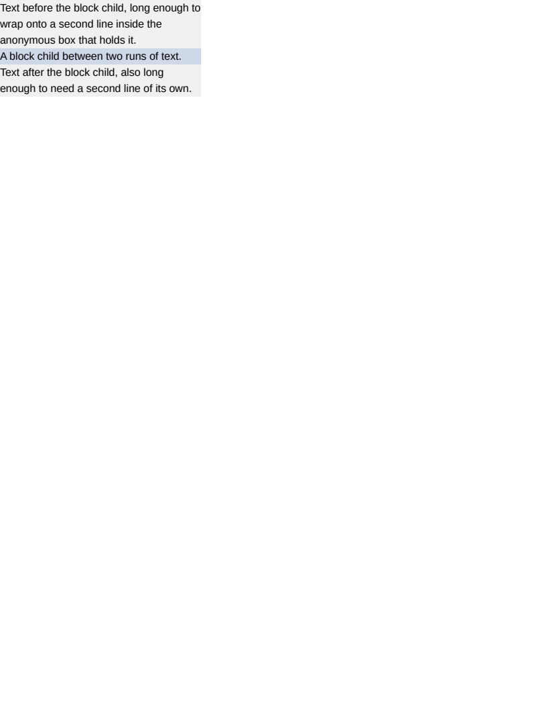

# block/anonymous

# block/anonymous

A block container is all-block or all-inline. When a document mixes the two — a text node beside a
block sibling, which `BoxBuilder` calls the formatting of every readable HTML document — the stray
inline content is wrapped in an anonymous block so ordering is preserved.

Nothing in the corpus contained that arrangement. Every container was one or the other:
`ua/acid1`'s `<li>` holds a bare `
`, and the text that looks adjacent to a block elsewhere is
collapsible whitespace that generates no box at all.

The anonymous boxes are not elements, so they do not appear in `getBoundingClientRect()` and the
geometry comparison sees only `#mixed` and `#inner`. The pixels are what measure them: the two
runs of text have to sit above and below the block child, in source order, at the line positions
an anonymous block would give them.

It found a defect immediately. `BoxBuilder` gathered ALL of a container's stray inline content
into a SINGLE anonymous block and inserted it at index 0, which is right only while the mixed case
is leading text before the first block child: the trailing run was hoisted above `#inner` along
with the leading one, putting it at y=120 where Chrome puts it at y=72. The container's height was
identical either way, which is why nothing else in the corpus could have shown it.

`BoxBuilder.CloseRun` now closes one anonymous block per contiguous run, appended in source order,
and the index bookkeeping that used to shift every float and positioned box by one went with it —
a run closes only at a block-level sibling, and an out-of-flow box declared inside a run belongs at
the top of the block that run becomes, which is the count it was already recorded against.

What to look at when it moves: `#inner` back at y=120 is the single-block behaviour returning.
Text overlapping `#inner` is an anonymous block contributing no height. `#mixed` taller or shorter
than 144px is a line count changing, which is a different bug from this one.

**Boxes**: 4 matched, worst offset 0.00px, worst size 0.00px.

| Reference (Chrome) | Krilla.Html |
| --- | --- |
| **Page 1** | **Page 1. AE 0.0002 · SSIM 1.0000** |
|  |  |

