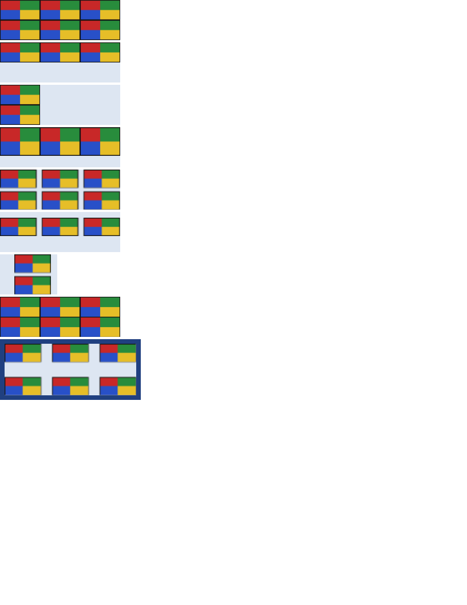

# block/background_repeat

# block/background_repeat

`round` and `space` were parsed as `repeat` and reported by nothing, so a document asking for either
got a clipped tile at the far edge where it had asked for the one thing that value exists to avoid.

They are the two repeat values that do something other than "tile it or don't", and they answer the
same question — what to do with the room a whole number of tiles does not fill — from opposite ends:
`round` rescales the tile so there is no room left, and `space` keeps the tile and shares the room
out between whole copies.

The swatch is 64x32 and every box is 210px wide, which is awkward on purpose: three tiles need 192
and four need 256, so `round` has to choose and `space` has 18px to distribute.

- `#round` rounds both axes. 210/64 is 3.28, which rounds to 3, so the tile becomes 70 wide; 70/32
  is 2.19, which rounds to 2, so it becomes 35 tall. The count is the NEAREST whole number and not
  the largest that fits, so the tile here is stretched rather than squeezed.
- `#roundx` and `#roundy` round one axis with the other left alone. The one that is not rounded is
  `auto`, so it rescales to restore the picture's proportions — CSS Backgrounds 3 §3.6's third step,
  and without it a rounded axis distorts the image, which is the one thing `round` is not for.
- `#roundsized` pins the free axis with a `background-size`, which stops the rounding dragging it
  along. It is what separates the third step from the second.
- `#space` fits three tiles across and two down and shares the leftovers between them. The first and
  last touch the edges of the positioning area, which is why `background-position` is ignored on a
  spaced axis — `#spacex` declares one and only the vertical half of it has any effect.
- `#spacetoobig` is the case that makes the fallback visible: a 100px box fits one 64px tile, and
  with one tile there is no gap to share, so the axis behaves as `no-repeat` and the position is
  honoured again. That is the specification's own rule and Chromium's, and it is the common case in
  practice — `space` is usually written for an image nobody measured against its box.
- `#mixed` takes one of each, which is what says the two are independent rather than two spellings
  of one thing.
- `#spacepadded` measures the spacing over the POSITIONING area rather than the painted one: the
  gaps are computed inside the padding box and the pattern then continues under the border, so the
  strip there carries the tail rather than the head of the pattern. The same asymmetry
  `block/background_image`'s `#padded` records for `repeat`.

The two-value form needed a change of its own. AngleSharp splits `background-repeat` into
`background-repeat-x` and `background-repeat-y` and reserialises the shorthand, so `repeat no-repeat`
comes back as `repeat-x` — but that folding only covers the pairs with a single-keyword spelling,
and `round no-repeat` has none. The longhands are read first for that reason, with the shorthand
used only when they say nothing.

## The residual

Geometry is exact on all nine rows and the four rounded ones are pixel-identical. The five spaced
ones are not, at SSIM 0.9842, and the cause is the BROWSER's: Chromium's printer draws a spaced
background through a filtered shader rather than as separate tile draws, so every tile edge in the
reference is smeared across two pixels where ours is crisp. The tile POSITIONS agree exactly —
quantise both images onto the swatch's own five colours and the runs line up to the pixel — so what
differs is the rasterisation and not the layout.

It was measured rather than assumed. A probe scenario 192px wide fits three 64px tiles with NO gap
to share out, and Chromium renders that one crisply; widening it to 200px, which leaves a 4px gap at
integer positions, blurs every edge. So the trigger is the spacing itself putting the paint on a
different code path, not a fractional position — which also means nothing this engine can do would
close it.

**Boxes**: 11 matched, worst offset 0.00px, worst size 0.00px.

| Reference (Chrome) | Krilla.Html |
| --- | --- |
| **Page 1** | **Page 1. AE 0.0167 · SSIM 0.9842** |
|  |  |

