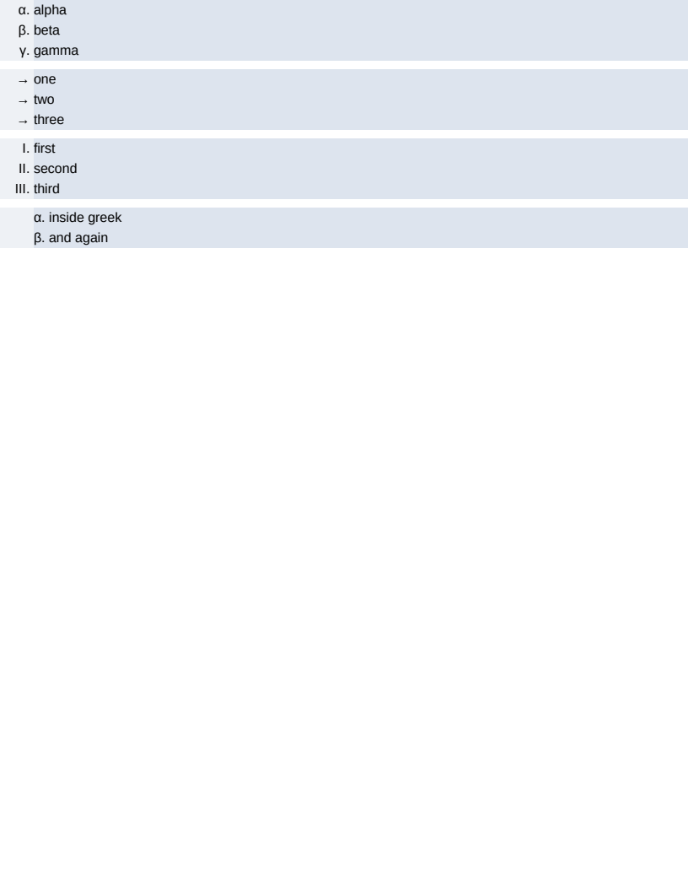

# block/counter_styles

# block/counter_styles

Two counter styles that were recognised, reported, and drawn as a disc: `lower-greek`, and a
literal string.

An unimplemented counter style still marks its items rather than losing them, on the reasoning that
a wrong marker is visible and a missing one is not — but the marker IS wrong, and a numbered list
coming out as bullets is a whole-document difference.

## The rows

- **`#greek`** counts in the classical alphabet: α, β, γ. Twenty-four letters and no final sigma,
  which is CSS's own list — the style is a counting alphabet rather than a transcription, and a
  numbered item is never at the end of a word. It counts bijectively like `lower-alpha`, so the
  twenty-fifth item is αα rather than the twenty-fifth code point.
- **`#string`** is `list-style-type: "→  "`, where every item shows the same text and there is
  nothing to count. It takes no SUFFIX either — measured: a numeric style is drawn as `N. ` with
  the trailing space that right-aligns it, and an arrow style draws the arrow and nothing else.
- **`#roman`** is the control, a style that already worked, so a change to the shared alignment
  arithmetic has somewhere to show.
- **`#inside`** puts a Greek marker in the line rather than beside it, which is the one place the
  marker's advance is measurable from an element's own rectangle rather than from its ink.

Pixel-identical to Chrome and exact on all 28 boxes — which is the point of the `` in every
item: a marker generates no box a browser reports, so what the geometry comparison measures is where
the marker left the text.

**Boxes**: 28 matched, worst offset 0.00px, worst size 0.00px.

| Reference (Chrome) | Krilla.Html |
| --- | --- |
| **Page 1** | **Page 1. AE 0.0000 · SSIM 1.0000** |
|  |  |

