# All scenarios (134)

The browser reference (left) beside the page Krilla.Html produced (right). `AE` is the fraction of pixels that differ and `SSIM` is structural similarity; neither is asserted. The worst offset is the largest positional disagreement in CSS pixels between the rendered element geometry and the browser's, and is the number to watch — it reaches zero exactly when the layout is right.

<details>
<summary>Contents</summary>

- [block/anonymous](#block-anonymous)
- [block/aspect_ratio](#block-aspect_ratio)
- [block/auto_margins](#block-auto_margins)
- [block/auto_width](#block-auto_width)
- [block/background_color](#block-background_color)
- [block/background_image](#block-background_image)
- [block/bevelled_borders](#block-bevelled_borders)
- [block/borders](#block-borders)
- [block/border_radius](#block-border_radius)
- [block/border_styles](#block-border_styles)
- [block/box_model](#block-box_model)
- [block/box_sizing](#block-box_sizing)
- [block/calc](#block-calc)
- [block/counters](#block-counters)
- [block/generated](#block-generated)
- [block/gradients](#block-gradients)
- [block/inset_shadow](#block-inset_shadow)
- [block/list_image](#block-list_image)
- [block/list_position](#block-list_position)
- [block/margin_collapse](#block-margin_collapse)
- [block/margin_collapse_blocked](#block-margin_collapse_blocked)
- [block/margin_collapse_parent](#block-margin_collapse_parent)
- [block/max_width](#block-max_width)
- [block/min_height](#block-min_height)
- [block/min_width](#block-min_width)
- [block/nested_blocks](#block-nested_blocks)
- [block/opacity](#block-opacity)
- [block/outline](#block-outline)
- [block/overflow_hidden](#block-overflow_hidden)
- [block/overflow_paint](#block-overflow_paint)
- [block/percentage_width](#block-percentage_width)
- [block/percent_height](#block-percent_height)
- [block/pseudo_block](#block-pseudo_block)
- [block/shadows](#block-shadows)
- [block/transform](#block-transform)
- [block/translucent](#block-translucent)
- [block/viewport_units](#block-viewport_units)
- [block/visibility](#block-visibility)
- [float/basic](#float-basic)
- [float/clear](#float-clear)
- [float/clearance](#float-clearance)
- [float/margins](#float-margins)
- [float/mid_line](#float-mid_line)
- [float/overflow_bfc](#float-overflow_bfc)
- [float/shrink_to_fit](#float-shrink_to_fit)
- [float/stacking](#float-stacking)
- [image/block_centred](#image-block_centred)
- [image/data_uri](#image-data_uri)
- [image/inline_flow](#image-inline_flow)
- [image/intrinsic](#image-intrinsic)
- [image/max_width](#image-max_width)
- [image/object_fit](#image-object_fit)
- [image/object_position](#image-object_position)
- [image/percent_width](#image-percent_width)
- [image/sized](#image-sized)
- [image/svg](#image-svg)
- [inline/backgrounds](#inline-backgrounds)
- [inline/font_size_em](#inline-font_size_em)
- [inline/font_style](#inline-font_style)
- [inline/font_weight](#inline-font_weight)
- [inline/hyphen_breaks](#inline-hyphen_breaks)
- [inline/inline_block](#inline-inline_block)
- [inline/inline_block_sizing](#inline-inline_block_sizing)
- [inline/justify](#inline-justify)
- [inline/line_height](#inline-line_height)
- [inline/line_height_normal](#inline-line_height_normal)
- [inline/nested_inline](#inline-nested_inline)
- [inline/padded](#inline-padded)
- [inline/simple_text](#inline-simple_text)
- [inline/text_align](#inline-text_align)
- [inline/text_indent](#inline-text_indent)
- [inline/vertical_align](#inline-vertical_align)
- [inline/vertical_align_length](#inline-vertical_align_length)
- [inline/white_space](#inline-white_space)
- [inline/white_space_pre](#inline-white_space_pre)
- [inline/word_joins](#inline-word_joins)
- [inline/wrapping](#inline-wrapping)
- [link/external](#link-external)
- [link/fragment](#link-fragment)
- [link/wrapped](#link-wrapped)
- [page/absolute_break](#page-absolute_break)
- [page/break_after](#page-break_after)
- [page/break_avoid](#page-break_avoid)
- [page/break_before](#page-break_before)
- [page/break_between_lines](#page-break_between_lines)
- [page/break_inside](#page-break_inside)
- [page/fixed_repeat](#page-fixed_repeat)
- [page/float_break](#page-float_break)
- [page/multi_page_flow](#page-multi_page_flow)
- [page/orphans_widows](#page-orphans_widows)
- [page/page_size](#page-page_size)
- [page/table_break](#page-table_break)
- [page/table_footer](#page-table_footer)
- [page/table_header](#page-table_header)
- [page/tall_block](#page-tall_block)
- [position/absolute](#position-absolute)
- [position/anchors](#position-anchors)
- [position/auto_margins](#position-auto_margins)
- [position/fixed](#position-fixed)
- [position/relative](#position-relative)
- [position/z_index](#position-z_index)
- [table/anonymous](#table-anonymous)
- [table/auto_widths](#table-auto_widths)
- [table/caption_side](#table-caption_side)
- [table/cell_baseline](#table-cell_baseline)
- [table/collapse](#table-collapse)
- [table/columns](#table-columns)
- [table/empty](#table-empty)
- [table/empty_cells](#table-empty_cells)
- [table/fixed_layout](#table-fixed_layout)
- [table/hyphen_columns](#table-hyphen_columns)
- [table/sections](#table-sections)
- [table/spacing_borders](#table-spacing_borders)
- [table/spans](#table-spans)
- [text/decorations](#text-decorations)
- [text/decoration_style](#text-decoration_style)
- [text/ex_ch](#text-ex_ch)
- [text/font_size_keywords](#text-font_size_keywords)
- [text/kerning](#text-kerning)
- [text/letter_spacing](#text-letter_spacing)
- [text/ligatures](#text-ligatures)
- [text/soft_hyphen](#text-soft_hyphen)
- [text/tabs](#text-tabs)
- [text/text_transform](#text-text_transform)
- [text/underline_offset](#text-underline_offset)
- [text/word_break](#text-word_break)
- [text/word_spacing](#text-word_spacing)
- [ua/acid1](#ua-acid1)
- [ua/blockquote_pre](#ua-blockquote_pre)
- [ua/headings](#ua-headings)
- [ua/hr](#ua-hr)
- [ua/lists](#ua-lists)
- [ua/list_markers](#ua-list_markers)
- [ua/paragraphs](#ua-paragraphs)

</details>

## block/anonymous

# block/anonymous

A block container is all-block or all-inline. When a document mixes the two — a text node beside a
block sibling, which `BoxBuilder` calls the formatting of every readable HTML document — the stray
inline content is wrapped in an anonymous block so ordering is preserved.

Nothing in the corpus contained that arrangement. Every container was one or the other:
`ua/acid1`'s `<li>` holds a bare `<p>`, and the text that looks adjacent to a block elsewhere is
collapsible whitespace that generates no box at all.

The anonymous boxes are not elements, so they do not appear in `getBoundingClientRect()` and the
geometry comparison sees only `#mixed` and `#inner`. The pixels are what measure them: the two
runs of text have to sit above and below the block child, in source order, at the line positions
an anonymous block would give them.

It found a defect immediately. `BoxBuilder` gathered ALL of a container's stray inline content
into a SINGLE anonymous block and inserted it at index 0, which is right only while the mixed case
is leading text before the first block child: the trailing run was hoisted above `#inner` along
with the leading one, putting it at y=120 where Chrome puts it at y=72. The container's height was
identical either way, which is why nothing else in the corpus could have shown it.

`BoxBuilder.CloseRun` now closes one anonymous block per contiguous run, appended in source order,
and the index bookkeeping that used to shift every float and positioned box by one went with it —
a run closes only at a block-level sibling, and an out-of-flow box declared inside a run belongs at
the top of the block that run becomes, which is the count it was already recorded against.

What to look at when it moves: `#inner` back at y=120 is the single-block behaviour returning.
Text overlapping `#inner` is an anonymous block contributing no height. `#mixed` taller or shorter
than 144px is a line count changing, which is a different bug from this one.

**Boxes**: 4 matched, worst offset 0.00px, worst size 0.00px.

| Reference (Chrome) | Krilla.Html |
| --- | --- |
| **Page 1** | **Page 1. AE 0.0002 · SSIM 1.0000** |
|  |  |


## block/aspect_ratio

# block/aspect_ratio

Pixel-identical to Chrome, and geometry-exact.

`aspect-ratio` supplies the height a box was not given: 200px at `4 / 1` is 50px tall. It goes
through the same `box-sizing` deflation a declared height does rather than beside it, and a declared
height wins outright — `#overridden` keeps its 30px, which is what makes the property safe to put on
a rule that some elements also size explicitly. `#proportional` shows the width may itself be
proportional, the ratio applying to the used value rather than the declared one.

Two things this scenario found that had nothing to do with the property.

**A box sized by its ratio is not self-collapsing**, which is the trap CLAUDE.md already records for
images, reached by a second route and costing the same debugging round. `IsSelfCollapsing` tests for
a zero height, and a ratio-sized box has `height: auto` and no content — so every test passed and the
box read as having nothing in it while being fifty pixels tall. Its own bottom margin then collapsed
through it and became a leading margin for the whole run, putting the entire page six pixels low.

**A block background fill has to be SNAPPED to whole pixels.** `#overridden` sits at y=786.5 and
Chrome paints rows 787 to 816, where the fractional rectangle covered 786 to 816 with half coverage
at each end. This is the third place the same construction argument has come up — after the inline
background fill and the background image — and it was the first thing in the corpus to produce a
fractional box height on purpose. Applying it improved eight existing scenarios and regressed none,
taking four of them to pixel-identical, including `inline/vertical_align`, whose documented residual
was Chrome's 1/64-pixel quantisation showing through exactly this edge.

The `#square` row is written `1 / 1` rather than `1`. AngleSharp's grammar for the property requires
both parts and DROPS a single number, so `aspect-ratio: 1` reaches the cascade as nothing at all — a
gap that cannot even be reported, the declaration being gone before the engine sees it.

What to look at: the heights — 50, 200, 400, 112.5, 30, 51 — and the top edge of the page, which is
where the self-collapsing bug showed.

**Boxes**: 8 matched, worst offset 0.00px, worst size 0.00px.

| Reference (Chrome) | Krilla.Html |
| --- | --- |
| **Page 1** | **Page 1. AE 0.0000 · SSIM 1.0000** |
| 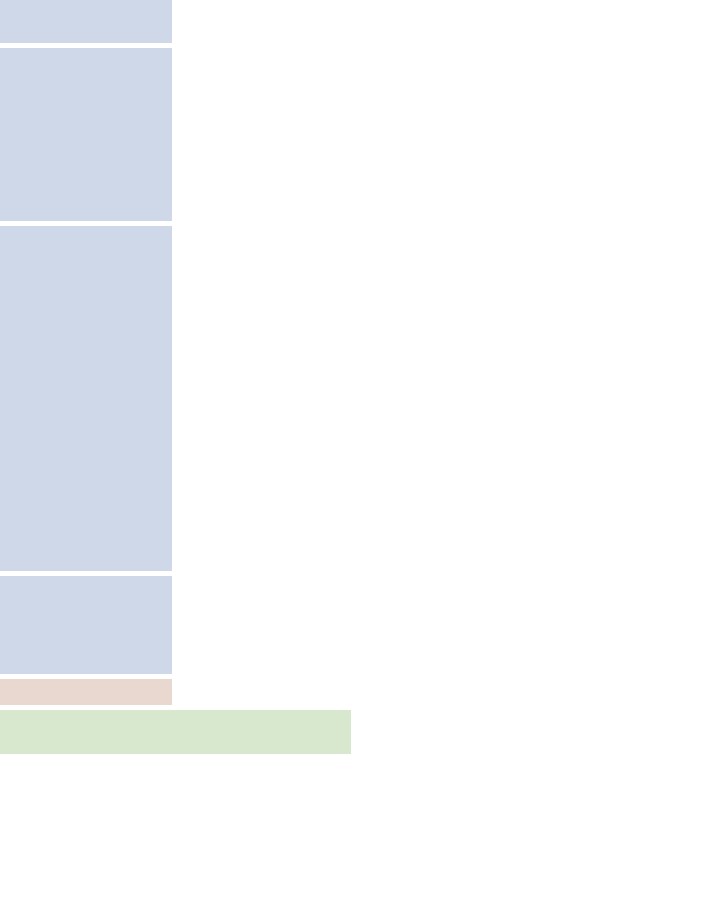 |  |


## block/auto_margins

Two auto margins centre; one auto margin absorbs. The first box sits at x=208, the second flush to
the right edge.

**Boxes**: 4 matched, worst offset 0.00px, worst size 0.00px.

| Reference (Chrome) | Krilla.Html |
| --- | --- |
| **Page 1** | **Page 1. AE 0.0000 · SSIM 1.0000** |
| 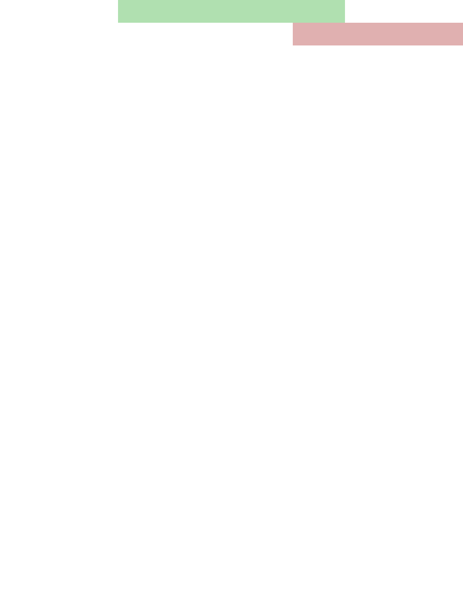 |  |


## block/auto_width

An auto width takes whatever the margins leave. The first box fills the page; the second is
816 - 100 - 250 = 466 wide.

**Boxes**: 4 matched, worst offset 0.00px, worst size 0.00px.

| Reference (Chrome) | Krilla.Html |
| --- | --- |
| **Page 1** | **Page 1. AE 0.0000 · SSIM 1.0000** |
|  |  |


## block/background_color

A background paints the border box, and a child paints over its parent. Flat fills with hard edges,
so this scenario should reach near-identical pixels. If it does not, the units or the DPI are
misaligned and no text scenario's numbers can be trusted yet.

**Boxes**: 5 matched, worst offset 0.00px, worst size 0.00px.

| Reference (Chrome) | Krilla.Html |
| --- | --- |
| **Page 1** | **Page 1. AE 0.0000 · SSIM 1.0000** |
|  |  |


## block/background_image

# block/background_image

Pixel-identical to Chrome across all sixteen rows.

A raster `background-image` was reported and not painted, so every panel, watermark and texture in
a converted document came out as flat colour. The gradient machinery was already here; what was
missing was the image, and the five properties that decide where it goes.

The load goes through the same `ImageStore` an `` goes through, which is the point rather
than a convenience: a `url()` in a stylesheet is bound by `LocalImages` and `WebImages` exactly as
one in the markup is. It would be a poor place to leave a hole, a stylesheet being the part of a
document a reader is least likely to have read. Two elements naming one file also share a decode.

Two rectangles are in play and they are not the same one:

- The **positioning area** is the PADDING box by default (`background-origin`), and
- the **painting area** is the BORDER box (`background-clip`).

`#padded` is the row that separates them: its first tile starts inside the border, and the strip
under the border carries the tail of the previous tile rather than the head of the first. That is
the same asymmetry `block/gradients` records, reached from the other direction — and it is why a
repeated background has to be backed up to the last tile that still reaches into the painted area
rather than started at the positioned one.

The four rows at the end pin the two properties independently, all with the same border and padding
so a difference between them is attributable:

- `#cliptopadding` fills only the padding box, `#cliptocontent` only the content box — and the
  latter also **clips the image**, whose position still came from the padding box, so it appears cut
  along the content edge rather than moved.
- `#fromborder` positions the first tile at the border box's own corner, where the border then
  covers the first eight pixels of it. `#fromcontent` positions it at the content corner while the
  colour still fills the whole border box.

`background-position` was the one measured rule worth having. A percentage does NOT offset by a
fraction of the box: it aligns that fraction of the IMAGE with the same fraction of the box, so
`25%` on a 64px image in a 200px box lands at 34px rather than at 50. `center` is exactly `50%` by
the same rule, and `right` exactly `100%`, which is what puts an image's far edge on the box's far
edge rather than off it.

`#proportional` is also what found the snapping. `75%` of the 12px left over is 9 exactly here, but
at the original 70px height it was 28.5 — and Chrome starts the tile on whole row 29 rather than
straddling two rows at half coverage. Rounding the origin was the last pixel between 0.9991 and
1.0000, and it is the same construction argument the inline background fill records: match how the
browser builds the shape, not how the specification describes it.

`#layered` states the thing most often got backwards: the colour and the image are two layers
of one background rather than alternatives, so the colour goes down first and a translucent image
shows it through.

The tile count is bounded at 512 per axis. A `background-size` resolving to a fraction of a pixel
would otherwise ask for hundreds of thousands of draws, and a page that takes a minute to write is
a worse answer than one whose pathological background stops early.

What to look at: the left edge of `#proportional` and `#centred`, and whether `#cliptocontent`'s
image looks cut or moved. Moved means the origin is being clipped along with the paint.

**Boxes**: 18 matched, worst offset 0.00px, worst size 0.00px.

| Reference (Chrome) | Krilla.Html |
| --- | --- |
| **Page 1** | **Page 1. AE 0.0000 · SSIM 1.0000** |
| 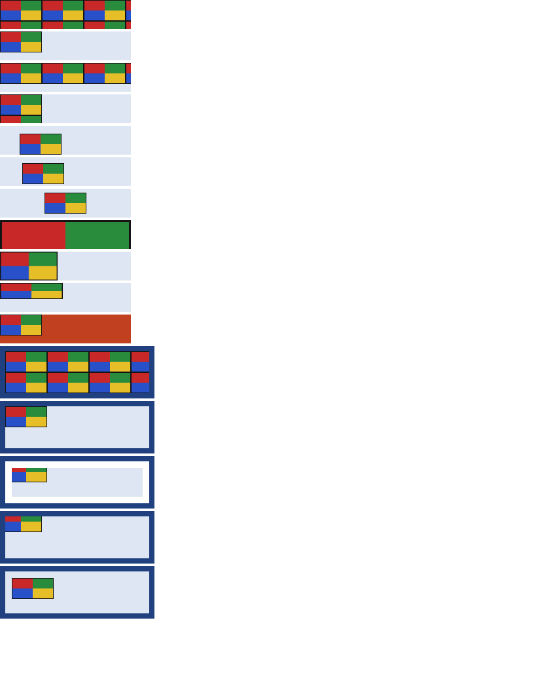 |  |


## block/bevelled_borders

# block/bevelled_borders

`inset`, `outset`, `groove` and `ridge` — the four border styles drawn in two derived shades of the
declared colour.

They were reported rather than implemented, because they "need two derived shades", and painted
solid. CSS specifies none of the shading: it says the box should look carved into or
raised out of the canvas and leaves every colour to the user agent. So — as with
`line-height: normal` and every number in `ListMarkers` — there is no correct value to compute, and
agreeing with the reference browser is the only useful target. Everything below was measured.

## The two shades

Both scale the colour by a factor taken from its BRIGHTEST channel, which is what moves the
lightness while keeping the hue, and both truncate through a scale of 255.99998 rather than
rounding. Verified against Chromium at five bases and three border widths:

| Base | Dark | Light |
| --- | --- | --- |
| `#3366cc` | `#1e3c78` | `#3f7fff` |
| `#808080` | `#2c2c2c` | `#d4d4d4` |
| `#cccccc` | `#787878` | `#ffffff` |
| `#dddddd` | `#898989` | `#ffffff` |
| `#ffffff` | `#ababab` | `#ffffff` |

White is hardcoded in Chromium rather than computed, and so is black — one has no brightest channel
to scale down and the other none to scale up at all.

## The rule no derivation predicts

**An undeclared border colour does not use the element's colour.** `border-color: currentColor` —
declared, or left at its initial value, which is what `border: 1px inset` produces — is drawn in a
fixed pair, `#9a9a9a` over `#eeeeee`, whatever `color` says. Four arrangements were measured and all
four agree: `color: gray`, `color: black`, an explicit `border-color: currentColor`, and a plain
`<hr>`. A box that DECLARES `border-color: gray` gets the derivation instead, at `#2c2c2c` and
`#d4d4d4`.

`#current` is the row that pins it, and its `color` is red on purpose: a reading that derived the
shades from `currentColor` would be visibly wrong there rather than subtly so.

That rule is also the whole of what `ua/hr` was missing. It sat at 0.9911 with the note saying the
residual was "the shading of Chrome's `inset` against a solid line" — and the truth was worse and
simpler: `border: 1px inset` sets `border-color: initial`, `initial` was not read as
`currentColor`, so the colour parsed to nothing, `HasBorder` went false, and **the rule was not
drawn at all**. It is pixel-identical now.

## Groove and ridge are not one bevel in two shades

The outer half of a groove is an `inset` edge and the inner half an `outset` one — which puts dark
over light on the top and light over dark on the bottom, and is what makes the carving read. A ridge
is those two exchanged. Shading a single band from light to dark is the plausible reading and gives
a different picture on every side.

## Residual

SSIM 0.9990, and every differing pixel is on a mitre diagonal — two per row, at the corners where
two colours meet. That is the general property of the mitred trapezium path that `PaintUniformBorder`
exists to avoid for a uniform border and cannot avoid here: two antialiased edges meeting on a
diagonal do not composite to full coverage, so a little of the page shows through. Chromium fully
covers the same pixel with a 50/50 blend of the two colours. `#mixed` is where it is most visible,
and it is the same cause `block/border_styles` records for its own mixed row.

**Boxes**: 11 matched, worst offset 0.00px, worst size 0.00px.

| Reference (Chrome) | Krilla.Html |
| --- | --- |
| **Page 1** | **Page 1. AE 0.0009 · SSIM 0.9990** |
| 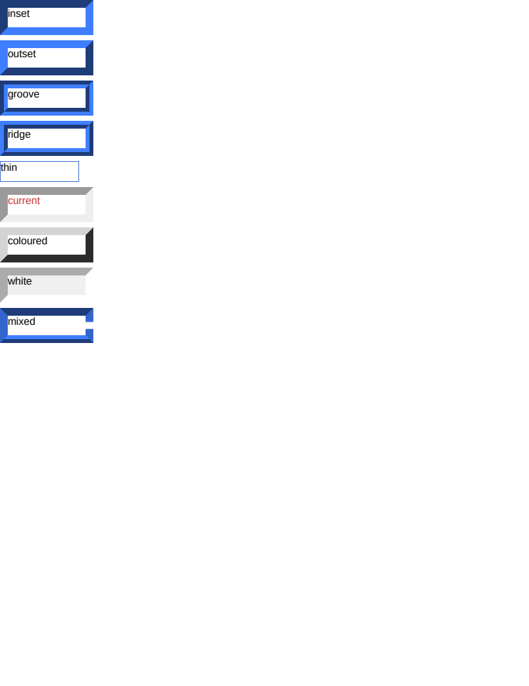 |  |


## block/borders

Four edges, four widths, four colours. Deliberately mismatched: with a uniform border a corner
mitre is invisible, and this renderer paints corners as overlapping rectangles rather than mitring
them. The corners are where that difference shows.

**Boxes**: 3 matched, worst offset 0.00px, worst size 0.00px.

| Reference (Chrome) | Krilla.Html |
| --- | --- |
| **Page 1** | **Page 1. AE 0.0001 · SSIM 1.0000** |
| 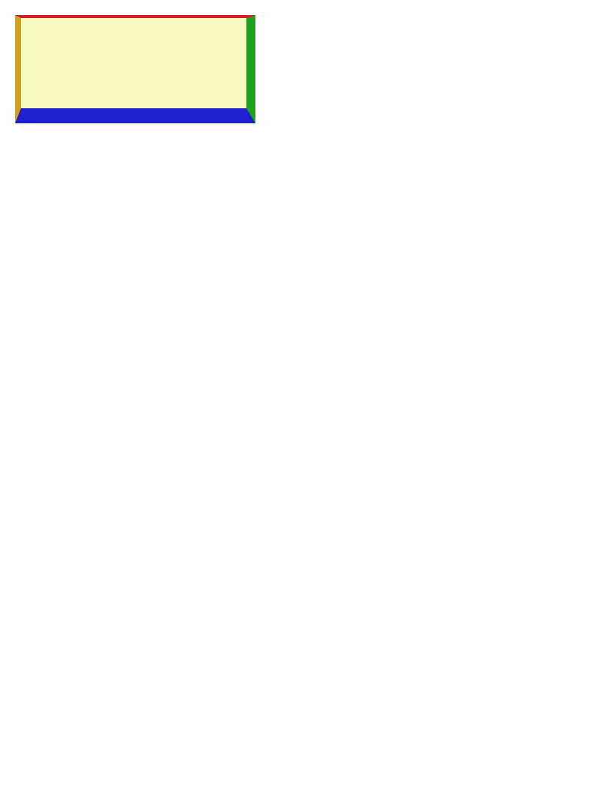 |  |


## block/border_radius

# block/border_radius

Rounded corners, on a background alone and on a border, circular and elliptical, per corner and
clamped. They were painted square before, which is one of the more visible gaps left — a rounded
card is ordinary markup rather than a flourish.

Pixel-identical to Chrome, and that is a consequence of one decision. A quarter arc is drawn as a
cubic bezier with its control points 0.5522847498 of the way along each tangent, which is the
standard circle constant and what every renderer uses, browsers included. Matching the browser's
CONSTRUCTION is what makes the pixels agree; a more accurate arc would agree less. That is the same
lesson `ListMarkers` records about stroking a circle rather than filling an annulus.

Five rows, each measuring something the others cannot:

- **`#background`** is a radius with no border, so the shape is the fill alone.
- **`#bordered`** adds a 4px border, so the ring has to be an outer rounded rect with an inner one
  cut out of it. Each inner radius is the outer one less the edge it runs along, floored at zero —
  which is what makes a thick rounded border read as a ring rather than a tube.
- **`#elliptical`** uses the slash form, `30px / 12px`. A corner carries two radii rather than one
  for this reason: treating a corner as a single radius is right for almost every document and
  wrong the moment anyone writes the slash.
- **`#corners`** rounds two corners and leaves two square, which is what says the four longhands
  are read independently rather than one value being applied to all of them.
- **`#pill`** asks for 999px on a box 40px tall. CSS scales EVERY radius on the box by the same
  factor — the smallest that makes each side fit — rather than clamping each corner on its own.
  Scaling per side gives a rectangle with mismatched circular ends; scaling uniformly gives the
  pill, which is what a browser draws.

Radii are read from the four longhands rather than from the shorthand, because the cascade expands
the shorthand into them — which also means the shorthand's own syntax, up to eight values split by
a slash, never has to be parsed here.

One limit, and it is reported rather than silent: a radius is honoured on the background always,
and on a border only where the border is painted as one ring, which needs every edge solid and
every edge the same colour. Anything else falls back to four mitred trapezia, which have square
corners — so the fill underneath is rounded and the frame over it is not, and `UnsupportedCss` says
so.

What to look at: the corners of `#pill` and `#bordered`. A `#pill` with circular ends of different
sizes is the clamp applied per side rather than to the box.

**Boxes**: 7 matched, worst offset 0.00px, worst size 0.00px.

| Reference (Chrome) | Krilla.Html |
| --- | --- |
| **Page 1** | **Page 1. AE 0.0005 · SSIM 1.0000** |
| 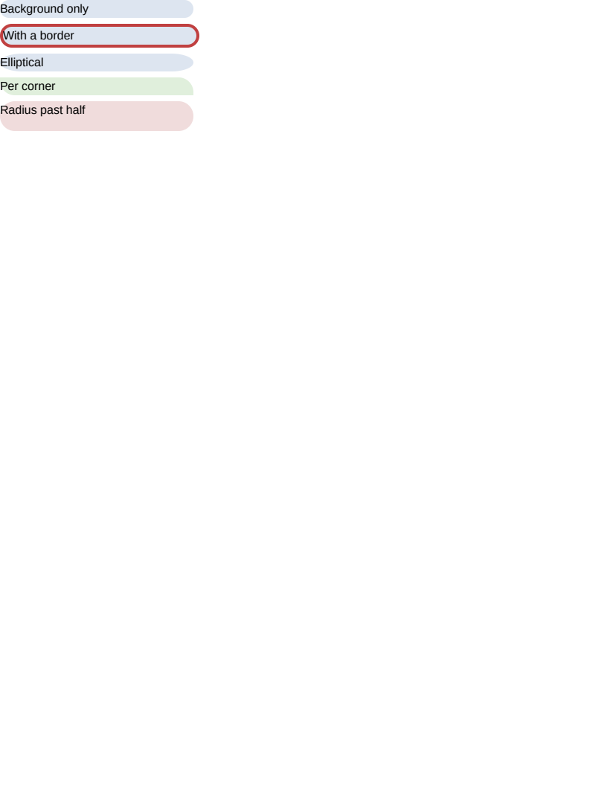 |  |


## block/border_styles

# block/border_styles

Dashed, dotted and double, per side and at two widths. All three were recognised and painted solid,
which is a quietly wrong render: the box is in the right place with the right colour, and only the
character of the frame is gone.

None of the geometry is specified. CSS says a dashed border is "a series of square-ended dashes"
and leaves every length to the user agent, so the numbers were measured out of Chrome:

- A **dash** is twice the border's width, with a gap of its width — a period of three times the
  width. An 8px border repeats every 24 pixels, 16 on and 8 off; a 3px border every 9. But that
  period is only what the pattern ASKS for: the gap is then adjusted so that a whole number of
  dashes fits the side and the last one ends on the corner. Two counts bracket the side — the most
  dashes that fit at the requested gap, and one more — and whichever leaves a gap closer to the one
  asked for wins. `#dashed`'s 266px side takes 30 dashes at a gap of 2.97 rather than 29 at 3.29,
  and `#thick-dashed`'s 276px side takes 12 at 7.64 rather than 11 at 10.
- A **dot** is the border's width across and repeats at twice it, and its SHAPE follows its size. At
  three pixels and below Chromium draws a crisp square snapped to the pixel grid — measured at ten
  widths, a 1, 2 or 3px dot comes back with no antialiased pixel anywhere in it — and from four
  upward it draws a genuine antialiased circle. Neither approximates the other, so both are drawn.
  `#dotted` is 3px and `#thick-dashed` is 8px so that the width-dependent half of both rules is
  exercised rather than assumed.
- A **double** border is two bands each a third of the width with a third-width gap, which is why
  6px reads 2-2-2 down a column of pixels and why `border: 1px double` is indistinguishable from
  solid.

A patterned edge is drawn along its own centre line rather than as a mitred trapezium. A browser
does not mitre these — dashes run past the corner and a double border's two bands span the whole
side — so the trapezium's purpose, joining two colours cleanly on a diagonal, does not apply.
`#mixed` is what keeps the two paths honest: three patterned edges and one solid on the same box,
so the solid edge still mitres while the others do not.

**Residual**: SSIM 0.9995, and it is confined to the VERTICAL dotted edges. Every horizontal edge in
the scenario is exact — dashes and dots alike, corner to corner, at both widths — and the dots on
`#dotted`'s left and right sides are not.

A horizontal dotted edge fits its pattern into the whole side, corner to corner, and the flush rule
above reproduces it exactly. A vertical one does not: on a 30px box Chromium's left edge carries
five dots at a pitch of 6.25 starting a pixel below the top corner, where the same rule applied to
the full side gives six at 5.4. It is a different construction rather than an offset — probed at
four heights, with and without adjacent horizontal borders, and no inset of the side reproduces it.
The end of such an edge carries a solid square that no dot in the sequence accounts for, which is
the shape of Blink filling a rect at each endpoint of a dashed line and dashing between them.

What to look at: dash and dot SIZE and spacing along the HORIZONTAL edges, which should match
exactly. A difference there is a real regression; a difference on a left or right dotted edge is
the residual above.

**Boxes**: 7 matched, worst offset 0.00px, worst size 0.00px.

| Reference (Chrome) | Krilla.Html |
| --- | --- |
| **Page 1** | **Page 1. AE 0.0002 · SSIM 0.9995** |
| 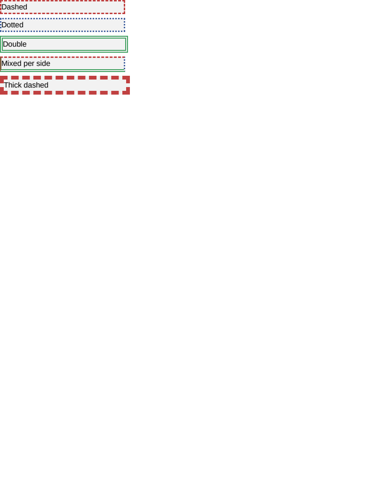 |  |


## block/box_model

The box model in one box. The border box is 200+40+10 wide and 100+20+10 tall; the margin moves it
without growing it. Everything downstream assumes this is right, so it is the first thing to check
when a whole category goes wrong at once.

**Boxes**: 3 matched, worst offset 0.00px, worst size 0.00px.

| Reference (Chrome) | Krilla.Html |
| --- | --- |
| **Page 1** | **Page 1. AE 0.0000 · SSIM 1.0000** |
| 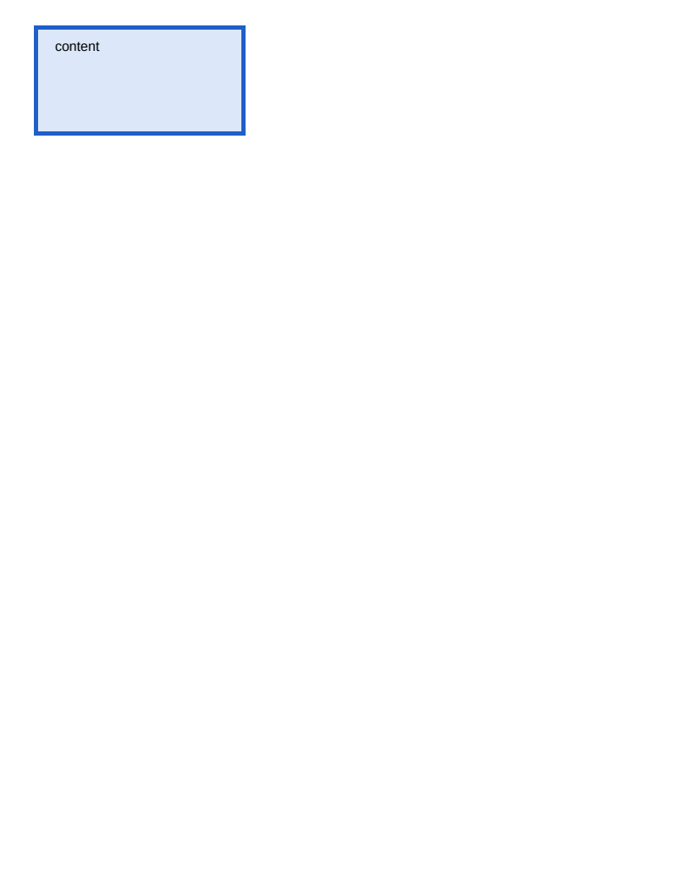 |  |


## block/box_sizing

# block/box_sizing

`box-sizing`, which decides whether a declared `width` or `height` measures the content box or the
border box. Every real stylesheet sets `border-box` and until this landed every one of them was
laid out a padding and a border too wide.

The first two boxes carry the same three numbers — 300px of width, 20px of padding, a 5px border —
so the only difference between them is which box the 300 measures. `#content` is 350 wide and
`#border` is 300.

What the rest are for:

- **`#floor`** declares 30px against 50px of padding and border. The content floors at zero and the
  box is as narrow as its own surround allows, rather than going negative. Chrome agrees at 50.
- **`#half`** is `width: 50%`. The percentage resolves against the containing block first and is
  the border box after that, so the box is exactly half the page however thick its border — 408px,
  not 408 plus 60.
- **`#tall`** and **`#least`** are the vertical pair: `height` and `min-height` both measure what
  `box-sizing` says, so a 100px box holds 50px of content and an 80px minimum holds 30px.
- **`#capped`** is `max-width` with auto margins, the standard centring idiom. The maximum clamps
  the BORDER box to 400 and the leftover 416 splits into two 208px margins. It matters that the
  clamp happens before the margins are resolved: clamping a content width instead centres a box
  that is 450 wide.
- **`#atomic`** and **`#floated`** are the two boxes sized outside `ResolveHorizontal` — an
  inline-block is given an assigned width by `InlineLayout`, and a float's width is decided by
  `ShrinkToFit` before it is placed. Both are separate code paths and both had to be told.
- **`#picture`** is a replaced box, where the declared width covers the surround and the aspect
  ratio applies to what is LEFT of it: 120px on the page is 90px of picture, and the 64x32 swatch
  makes that 45px tall for 75px of box.

The float block is last in the source on purpose. A block-level replaced element must not overlap
a float (CSS 2.1 §9.5), so an `` after a float that is still hanging gets pushed to its right
edge in Chrome — and this engine does not push anything aside for a float yet. Written the other
way round the scenario measured that gap instead of this feature, by exactly the float's 240px.

`html` is 801 tall against `body`'s 761 because the root contains the float and `body` does not,
which is the same asymmetry `float/basic` measures.

**Residual**: SSIM 0.9999 on one line — the text beside the float, whose glyph ink differs by a
tenth of a pixel of centroid and 0.16% of total coverage. Sub-pixel glyph positioning, the same
cause as `text/kerning`, and not a geometry difference: every one of the fourteen boxes is exact.

**Boxes**: 14 matched, worst offset 0.00px, worst size 0.00px.

| Reference (Chrome) | Krilla.Html |
| --- | --- |
| **Page 1** | **Page 1. AE 0.0004 · SSIM 0.9999** |
| 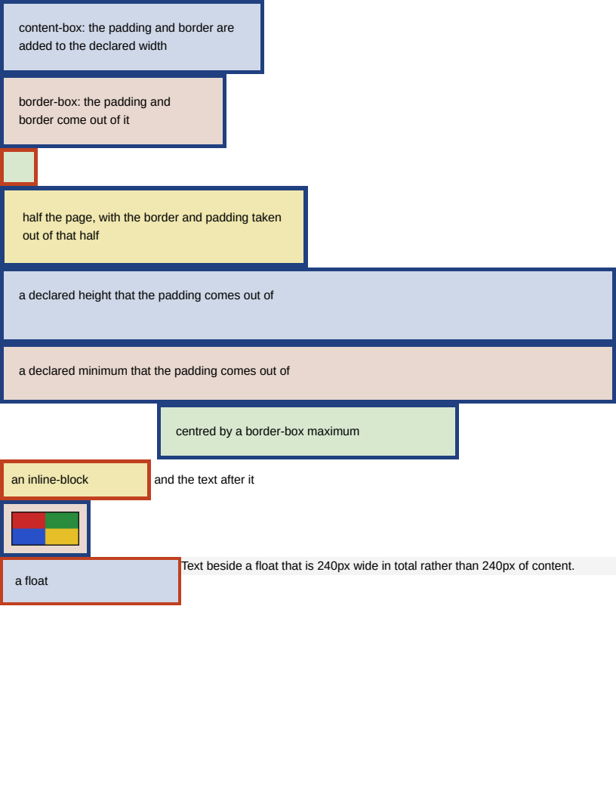 |  |


## block/calc

# block/calc

`calc()` reaches this engine verbatim. AngleSharp.Css hands it back exactly as written, the same
way it hands back a bare percentage, so evaluating it is this engine's job — and before this it
fell through to the "unparseable" fallback and the property silently took its default. For a
`width` that means the box fills its container, which is a whole-page difference that no diagnostic
reported, because a value nothing recognises is a value nothing can report.

The eight rows are chosen to separate the cases that fold from the one that cannot:

- `#absolute` is `calc(10em + 12px)`, which is 172px before layout starts. Nothing downstream ever
  sees a calc, and the twenty-odd places that decide whether a length is definite by testing for an
  absolute one keep answering correctly without knowing the syntax exists.
- `#proportion` is `calc(50% / 2)`, which folds the other way — to a plain 25%.
- `#mixed` is `calc(100% - 120px)`, the case that needs both halves at once, and `CssLength` grew a
  kind for exactly this one. It resolves against the containing block like a percentage, which is
  why the sites testing for a definite length treat it as indefinite and why that is right rather
  than an omission.
- `#nested` proves the recursion and the product with the number on the left.
- `#clamped` is `calc(50% - 400px)` in a 600px frame, so it resolves to -100px. Chrome floors the
  used width at zero rather than at the declared value, and the row is 144px tall because six words
  each wrap onto a line of their own.
- `#padded`, `#tall` and `#shifted` put a calc on the three other properties that take one, since a
  value resolved correctly for `width` and forgotten for `padding-left` is how this defect
  usually presents.

Whitespace around `+` and `-` is required, which is CSS's own rule and not a shortcut here. Without
it `calc(2e-5px)` and `calc(10px -5px)` cannot be told apart.

Geometry is exact against Chrome on all eleven boxes.

What to look at: `#mixed` at 480px. A frame-wide box there is the calc falling back to `auto`.

**Boxes**: 11 matched, worst offset 0.00px, worst size 0.00px.

| Reference (Chrome) | Krilla.Html |
| --- | --- |
| **Page 1** | **Page 1. AE 0.0001 · SSIM 1.0000** |
| 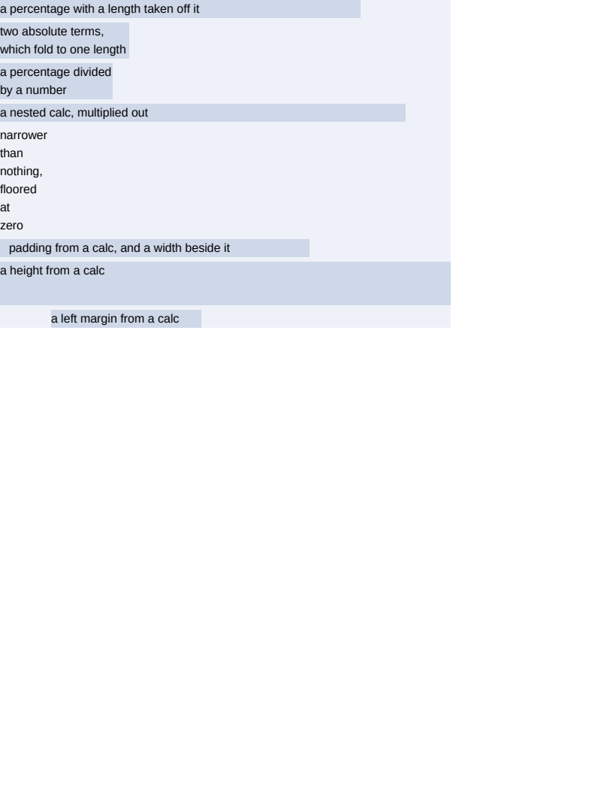 |  |


## block/counters

# block/counters

CSS counters: `counter-reset`, `counter-increment`, `counter()` and `counters()`. Geometry is exact
and the page reads SSIM 0.9999, the residual being glyph edges.

The counters are held by the box builder and mutated as it walks, for the same reason
`ListNumbering` is: a counter's value depends on which elements were VISITED before it, which is a
property of the walk rather than of the element. Deriving it from the DOM afterwards would have to
redo the walk, and would have to redo it identically or the numbers would disagree with the boxes.

**Scoping is the whole of the difficulty.** A `counter-reset` creates a NEW counter that lives until
the declaring element's subtree ends, nested inside any counter of the same name outside it — so
`counter()` reads the innermost and `counters()` reads all of them. `#outer` is the idiom that needs
it: reset on each list, increment on each item, and `counters(section, ".")` to join every level,
giving `1`, `1.1`, `1.2`, `2`. Popping the scope when the subtree ends is what stops a second list
continuing the first one's numbering.

Three smaller rules, each with a row:

- **The reset applies before the increment**, which is CSS's order and observable: an element doing
  both to one counter gives 1 rather than 0. That is how a numbered heading restarts its own
  subsection numbering.
- **`counter(chapter, upper-roman)` has to produce the numeral a list marker of that style would.**
  `#roman` resets to 7 and reads `VII`, through the same formatter `ListMarkers` uses — two
  formatters would eventually disagree and number one document two ways.
- **A counter never reset and never incremented reads zero.** `#absent` shows `[0]`, which CSS
  requires and which is what makes `li { counter-increment: item }` work with no reset anywhere.

What this does NOT model is the specification's rule that a sibling's reset REPLACES rather than
nests at the same depth. The difference shows on a document that resets one counter twice at one
level and reads it with `counters()`, where this produces an extra level. Nesting by subtree is what
the common structures — a list of lists, a document of sections — actually want.

The scenario sets its margins by ID rather than by element name, which is the AngleSharp origin trap
rather than a preference: a bare `ol` selector loses to the user-agent `ol ol { margin: 0 }` that a
nested list matches, because AngleSharp compares specificity across cascade origins. Written as
element selectors, the nested list lost its bottom margin here and kept it in Chrome, and every box
below came out 8px high.

What to look at: the `1.1` and `1.2` prefixes. A flat `1` there is `counters()` reading only the
innermost scope; nothing at all is the comma being lost in the argument split.

**Boxes**: 14 matched, worst offset 0.00px, worst size 0.00px.

| Reference (Chrome) | Krilla.Html |
| --- | --- |
| **Page 1** | **Page 1. AE 0.0005 · SSIM 0.9999** |
| 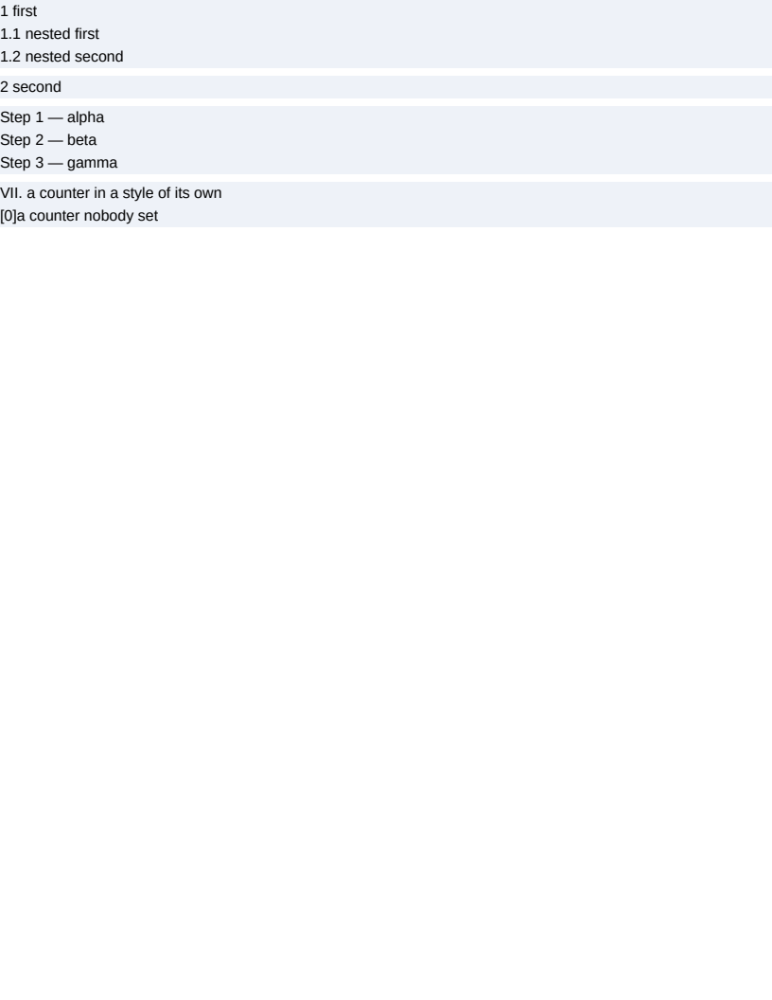 |  |


## block/generated

# block/generated

Pixel-identical to Chrome. `::before` and `::after` with a `content` value, which is the property
most stylesheets reach for after the box model and which this engine read as nothing at all.

Generated content is INLINE CONTENT OF THE HOST rather than a box beside it. That is what makes a
`::before` share the host's first line, and it is why the items go into the same list the host's own
text goes into — the run-closing that turns mixed content into anonymous blocks then applies to it
without knowing it is generated.

AngleSharp gives the whole grammar back verbatim, which was the pleasant surprise: strings,
`attr()`, `counter()`, `counters()`, `url()`, the quote keywords, and concatenations of several. Two
things about its serialisation had to be worked around, and both were found here rather than
reasoned about:

- **The pseudo cascade INCLUDES the host's own declarations.** Ask a `::before` for its `display` and
  the host's comes back. So a property counts as the pseudo's only when it differs from what the
  host's own cascade says — sound, because a `::before` selector does not match the element. Without
  that test, `p { content: "x" }` — a declaration CSS ignores, `content` not applying to an ordinary
  element — generated a pseudo-element on every paragraph in the document.
- **`counters(section, ".")` comes back as `counters(section .)`**, comma gone, while
  `counter(chapter, upper-roman)` keeps its. Splitting arguments on commas alone therefore read the
  whole of the first as one argument and silently dropped every nested counter. `block/counters` is
  where that showed.

Two more things the scenario pins:

- **`#styled` gives the pseudo a background, a colour and padding**, and it gets all three, because
  a pseudo-element is a real inline box rather than text spliced into the host. The background is
  what made the painter's test wrong: it filled a run's own background only when the run had a
  SELECTOR, and generated content has no element to name one. A `Generated` flag says so instead.
  Testing the style INSTANCE against the block's — the reference identity `InlineAlign` uses — looks
  equivalent and is wrong inside an anonymous block, whose style is a fresh instance while the text
  keeps its parent's, so every anonymous run would paint its parent's background twice.
- **`#quoted` puts the content on an INLINE element**, which reaches none of this by the obvious
  route: an inline element contributes runs to the line being built rather than a box of its own, so
  it never passes through the method that generates content. `<q>` had no quotation marks at all
  until that branch got its own call — and `q::before` is exactly where a browser's quotes come from.

`#empty` declares `content: ""`, which still generates a box and still shows nothing. It is here
because the natural shortcut — treat an empty result as no pseudo — is indistinguishable until the
pseudo carries a background or a border, and then it is a missing rectangle.

What to look at: the red `note` chip in `#styled`, and the quotation marks in `#quoted`.

**Boxes**: 10 matched, worst offset 0.00px, worst size 0.00px.

| Reference (Chrome) | Krilla.Html |
| --- | --- |
| **Page 1** | **Page 1. AE 0.0000 · SSIM 1.0000** |
|  |  |


## block/gradients

# block/gradients

`linear-gradient()` and `radial-gradient()`, which were parsed by the cascade and then dropped —
so a box designed as a ramp came out as bare paper.

Nine rows, and every number in them was checked arithmetically rather than by eye. A colour sampled
at a known pixel is a linear function of the gradient's geometry, so one sample pins the gradient
line exactly: the 45° row's left edge reads 177 where the line running through the box centre at
`|W·sin A| + |H·cos A|` long predicts 177.2, and the ellipse's left edge reads 102 where a curve
through the farthest corner predicts 101.5. That is why the rows are flat colour ramps with no text
— the measurement is the pixel values, not the look.

What the rows pin:

- **`#to-right`** and **`#default`** together say the default direction is `to bottom`, not
  `to right`, and that interpolation is plain linear sRGB — the midpoint of `#c04040` and `#4060a0`
  comes back as exactly `(128, 80, 112)`.
- **`#angle`** puts the start colour exactly on the bottom-left corner and the end exactly on the
  top-right, which is the signature of the gradient-line length above and is what makes a 45°
  gradient in a box that is not square different from one that merely runs corner to corner.
- **`#stops`** places a stop off centre; **`#hard`** puts two at the same position.
- **`#radial`** and **`#ellipse`** say the default shape is an ELLIPSE, sized `farthest-corner` —
  which works out at exactly √2 times the half-width and half-height, so the left edge of a 200×60
  box sits at 0.7071 along the ramp rather than at 1.
- **`#padded`** is where the gradient's box stops being the box it is painted into.
- **`#over-colour`** is a translucent ramp over a background COLOUR, which says the two are layers
  of one background rather than alternatives.

Three things came out of the measurements that a reading would not have given.

**A browser TILES the gradient.** `background-repeat` defaults to `repeat`, and the gradient's box
is the PADDING box while the paint reaches the BORDER box — so the strip under a border carries the
end of the previous tile rather than the edge colour. `#padded` is bluish at its left border and
reddish at its right, which is the opposite of what padding the ramp gives. An axis-aligned ramp is
uniform perpendicular to its own axis, so repeating it along that axis IS the two-dimensional
tiling, and that is what the implementation does — but only where the paint actually reaches past
the gradient's box, since repeating inside it wraps the last column back to the start colour.

**A hard stop cannot be expressed directly.** A PDF shading's stitching function needs strictly
increasing bounds, so two stops at the same offset leave a zero-width step that is dropped, and the
edge becomes a ramp across the whole box. Nudging the second onto the next representable float
keeps the edge within a sub-pixel. `#hard` is pixel-identical with the nudge and unrecognisable
without it.

**A corner keyword never arrives.** AngleSharp rewrites `to top right` as `45deg` before this
engine sees it, which is right only for a square box — the real angle is perpendicular to the
diagonal joining the other two corners, so in a wide, short box `to top right` is nearly `to top`.
It is indistinguishable from an angle the author wrote, so it cannot even be reported. The row that
measured it was removed for that reason and the limitation is recorded in the readme;
`GradientPaint.Resolve` still holds the correct resolution, against the day the value survives.

**Residual**: SSIM 0.9999, and every differing pixel is within one or two of 255. That is
quantisation along the ramp rather than a difference in geometry — `#stops` and `#hard` are exactly
identical, and no pixel anywhere differs by more than two. The `AE` figure is high for the same
reason: it counts any nonzero difference, and a smooth ramp has thousands of pixels a shade apart.

What to look at: the corners of `#angle`, which are where the gradient line's length shows, and the
border strips of `#padded`, which are where the tiling does.

**Boxes**: 11 matched, worst offset 0.00px, worst size 0.00px.

| Reference (Chrome) | Krilla.Html |
| --- | --- |
| **Page 1** | **Page 1. AE 0.0500 · SSIM 0.9999** |
| 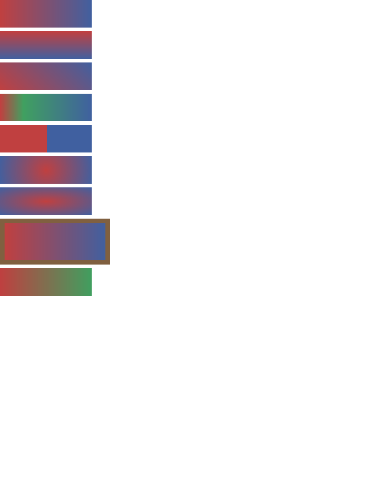 |  |


## block/inset_shadow

# block/inset_shadow

`box-shadow` with `inset`, which shades the inside of the box rather than casting outside it. Every
layer carrying the keyword was dropped and reported.

It is the one thing in the shadow grammar that needed no Gaussian. A blurred shadow cannot be drawn
at all here — a PDF content stream cannot express a Gaussian for an arbitrary shape, and a blurred
shadow drawn sharp is a hard dark copy where a soft halo belongs — but an inset one with no blur is
a SUBTRACTION: the padding box, less the same rectangle moved by the offset. A positive offset
therefore leaves a band along the top and the left, which is what makes a box look pressed in.

## The rows

- **`#both`** offsets on both axes: a band across the top and down the left. Measured, and the
  edge it starts at is the finding — the shadow begins at the inside of the box's 4px border rather
  than at the box's own edge, so it is the PADDING box being subtracted from and not the border box.
- **`#negative`** is the same with negative offsets, which puts the bands on the bottom and the
  right. It exists because a subtraction implemented as "fill the top and left bands" passes
  `#both` and gets this backwards.
- **`#one-axis`** offsets vertically alone, leaving one band and no corner.
- **`#padded`** has padding, and shows that the padding box is the padding box: the shadow reaches
  across the padding rather than starting at the content edge.
- **`#layers`** stacks two inset shadows. They paint farthest-first like any other shadow list, so
  the one written FIRST ends up on top — which two overlapping bands are what makes visible.
- **`#mixed`** carries an inset layer and an outer one on the same box, which is what pins where
  each goes in the paint order: the outer one is behind the background and the inset one over it,
  so a box with both is shaded inside and casts outside at once.

Pixel-identical to Chrome, and exact on all 8 boxes — which is expected rather than lucky, since
nothing here moves a box.

The clip is doing real work rather than tidying up: the offset copy of the padding box hangs OUT of
it on the far side, and under the non-zero winding rule the region outside the outer contour but
inside the inner one comes out filled. Without the clip the shadow leaks past the box's own edge in
exactly the direction it was offset.

What to look at: which EDGES carry a band, and whether the band starts at the border's inner edge.
Bands on the wrong sides is the offset's sign; a band starting at the box's outer edge is the border
box being used where the padding box belongs.

**Boxes**: 8 matched, worst offset 0.00px, worst size 0.00px.

| Reference (Chrome) | Krilla.Html |
| --- | --- |
| **Page 1** | **Page 1. AE 0.0000 · SSIM 1.0000** |
| 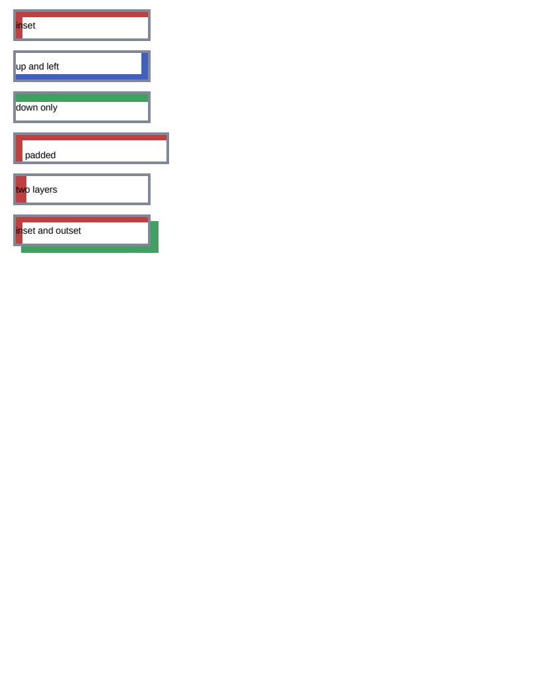 |  |


## block/list_image

# block/list_image

`list-style-image` was in the table of properties the engine does not read at all, and closing it
turned out to be a layout change rather than a painting one. The measurement said so immediately:
an item whose marker is a 32px image is **39px tall**, not 24. The marker is an atomic inline on the
item's first line, bottom edge on the baseline, so it grows the line exactly as an inline image of
that height does — 32 above the baseline plus the strut's 7 below.

That is why the image is prepended to the item's own inline content rather than handed to
`ListMarkers` like a symbol or a counter. A marker drawn beside the item could not have grown it.

The two placements differ only in the advance they take, and both numbers were measured:

- **`outside`** takes none. The line starts where it would have with no marker, and the image is
  drawn back beyond that, its right edge held clear of the item's border edge by the same **seven
  pixels** a symbol marker leaves. It is the same constant, because it is the same gap — checked by
  putting `#symbol` in the scenario and finding its bullet's right edge at the same place.
- **`inside`** takes its own width PLUS that gap. Reading it as the width alone is off by seven
  pixels, and the pixels invite that mistake: the item's background becomes visible
  exactly at the image's right edge, so the image looks like the whole advance until the text is
  measured instead of the fill.

`#missing` names an image that does not resolve, and Chrome draws the `list-style-type` behind it —
a square here. So the fallback is on the RESOLVED image rather than on the declaration, which is
also what makes the counter style worth keeping in the box tree at all.

An item whose entire content is a block has no line here to hang a marker from, and keeps the
counter marker it would have had. That is a limitation rather than a rule: a browser puts the marker
on the first line wherever it is, including inside a nested block.

**Residual**: SSIM 0.9999, and every differing pixel is a glyph edge or the antialiasing of the
disc in `#symbol` — the marker positions and the item heights are exact.

What to look at: the item heights, which the geometry comparison pins at 39px, and where the text
starts in `#inside`.

**Boxes**: 11 matched, worst offset 0.00px, worst size 0.00px.

| Reference (Chrome) | Krilla.Html |
| --- | --- |
| **Page 1** | **Page 1. AE 0.0006 · SSIM 0.9999** |
| 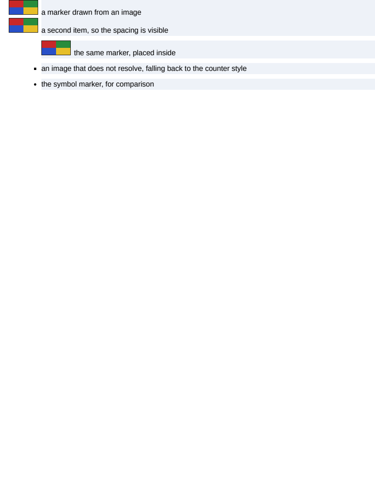 |  |


## block/list_position

# block/list_position

`list-style-position: inside` moves the marker onto the item's first line, where `outside` hangs it
before the item's border edge. The box geometry is identical either way — Chrome reports the same
300x24 item for both — so this is a scenario the pixels have to carry, and the geometry comparison
is here to confirm that nothing moved rather than that something did.

The marker's advance is the whole measurement, and it took two attempts to get. Detecting where the
text starts from the INK is confounded by the first glyph's left side bearing, which grows with the
font size and made a clean rule look like a drifting one. Wrapping the text in a span and reading
its own rectangle gives the origin exactly, and then two rules fall out:

- A **counter** takes the advance of `N. ` with its trailing space — the same string the outside
  marker is right-aligned by. It agrees to a hundredth of a pixel at every size because both sides
  shape the string rather than summing raw advances.
- A **symbol** takes `side + font-size + 1`, in whole pixels off the whole-pixel ascent. That is
  not derivable from anything and was measured at six sizes from 12px to 40px, exact at every one.
  No fraction of the em fits: the ratio drifts from 1.375 down to 1.325 across that range, because
  the symbol's own side moves in the uneven steps `SymbolSize` produces. Fitting the 1.375 that
  16px and 24px both give would be a pixel out at 32px and two out at 40px.

The reserved space reuses `text-indent`'s mechanism, which already narrows a block's first line
from its start edge, and the two ADD rather than one winning — an indented inside list item starts
its text past both, which is what a browser does.

`#inside-wrap` is the row that shows what inside really means: a long item's second line starts
under the MARKER rather than under the text above it, because the marker took inline space on the
first line and nothing reserves it on the rest.

`#inside-number` is here because the two marker kinds take their advance from different places, so
a rule that is right for one can be wrong for the other.

Geometry is exact and the page reads SSIM 1.0000.

What to look at: where the text starts on each first line, and where the second line of
`#inside-wrap` begins. Text starting at the content edge is the marker not reserving its space.

**Boxes**: 13 matched, worst offset 0.00px, worst size 0.00px.

| Reference (Chrome) | Krilla.Html |
| --- | --- |
| **Page 1** | **Page 1. AE 0.0002 · SSIM 1.0000** |
| 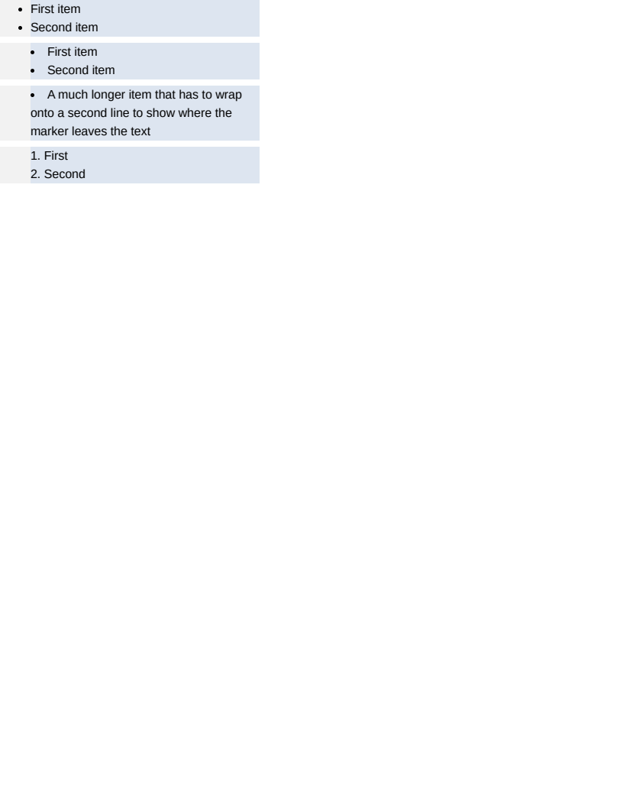 |  |


## block/margin_collapse

Adjacent siblings. The 30px below the first box meets the 50px above the second and collapses to
50, not 80. The first box's own top margin collapses out through body and html, so it starts at 30
rather than 0.

**Boxes**: 5 matched, worst offset 0.00px, worst size 0.00px.

| Reference (Chrome) | Krilla.Html |
| --- | --- |
| **Page 1** | **Page 1. AE 0.0000 · SSIM 1.0000** |
|  |  |


## block/margin_collapse_blocked

The other half of margin_collapse_parent. A single pixel of top padding and a bottom border are
enough to stop the collapse in both directions, so both inner margins stay inside and the outer box
grows by 80px. The pair is what proves the rule rather than a coincidence.

**Boxes**: 4 matched, worst offset 0.00px, worst size 0.00px.

| Reference (Chrome) | Krilla.Html |
| --- | --- |
| **Page 1** | **Page 1. AE 0.0000 · SSIM 1.0000** |
|  |  |


## block/margin_collapse_parent

Collapse through a parent with no border or padding to stop it. The inner top margin escapes
through the outer top edge, so the outer box starts 40px down and does NOT include that margin in
its own height. The bottom margin escapes the same way.

**Boxes**: 5 matched, worst offset 0.00px, worst size 0.00px.

| Reference (Chrome) | Krilla.Html |
| --- | --- |
| **Page 1** | **Page 1. AE 0.0000 · SSIM 1.0000** |
| 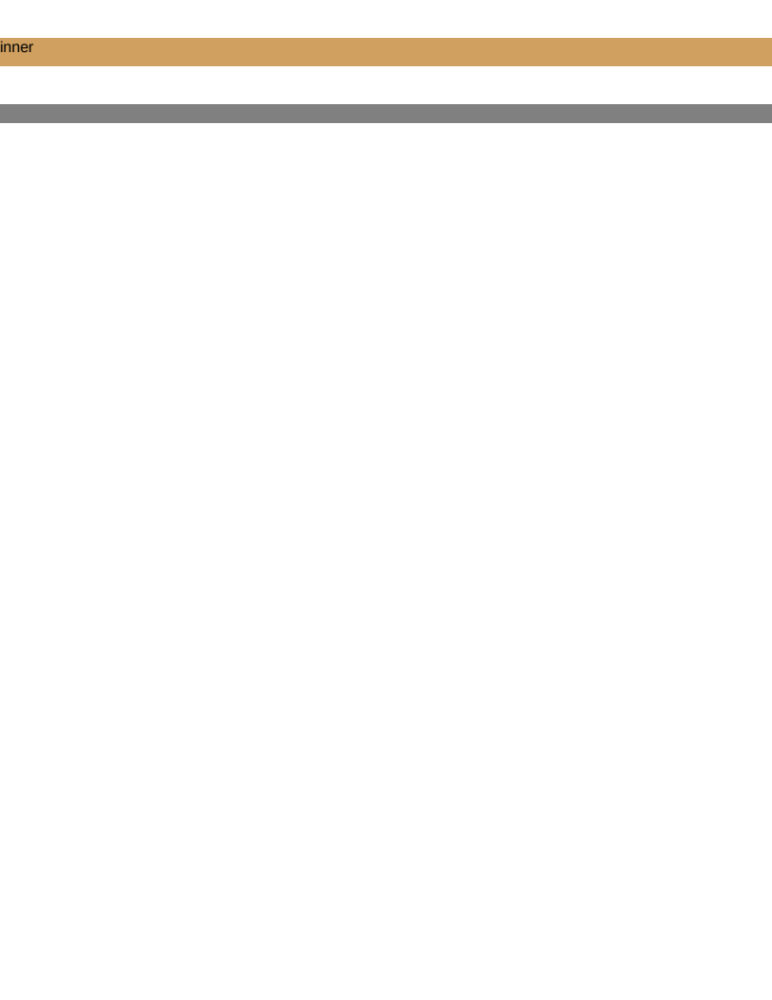 |  |


## block/max_width

max-width with auto margins, the commonest centring idiom there is. It only works because CSS
re-runs the width algorithm once max-width has clamped an auto width, handing the leftover space
back to the margins. A naive clamp leaves the box at the left edge.

**Boxes**: 3 matched, worst offset 0.00px, worst size 0.00px.

| Reference (Chrome) | Krilla.Html |
| --- | --- |
| **Page 1** | **Page 1. AE 0.0000 · SSIM 1.0000** |
|  |  |


## block/min_height

# block/min_height

`min-height` and `max-height` were read by nothing and reported by nothing, so a box carrying
either was laid out at its content height and the document was silently wrong below it. They now
resolve alongside the width pair they mirror, and this measures all three ways they can fail.

- **`#held`** — one line of content in a box with an 80px minimum. The simplest case, and the one
  that survives if the property is read and then dropped.
- **`#cut`** — four lines in a box with a 40px maximum. Nothing is clipped: `overflow` is not
  implemented and is reported, so the content runs past the bottom edge and over what follows,
  which is exactly what `overflow: visible` asks for. A box that swallowed its overflow would look
  tidier and be wrong. That the overflowing text stays visible over the next box is a separate
  property, and `block/overflow_paint` is where it is measured.
- **`#both`** — a minimum taller than the maximum. `ClampHeight` applies the maximum first, so the
  minimum wins at 90px, the same order `Clamp` uses horizontally.

Percentages are deliberately absent: a percentage height resolves against a containing height that
is indefinite throughout a paginated document, and CSS says such a percentage behaves as though it
were not there — the same rule `height` itself follows here.

What to look at when it moves: `#held` at one line tall is `min-height` unread. `#cut` at four
lines is `max-height` unread, and `#cut` with its text cut off at 40px is overflow being clipped
where nothing should clip it. `#both` at 30px is the two clamps in the wrong order.

**Boxes**: 9 matched, worst offset 0.00px, worst size 0.00px.

| Reference (Chrome) | Krilla.Html |
| --- | --- |
| **Page 1** | **Page 1. AE 0.0002 · SSIM 1.0000** |
| 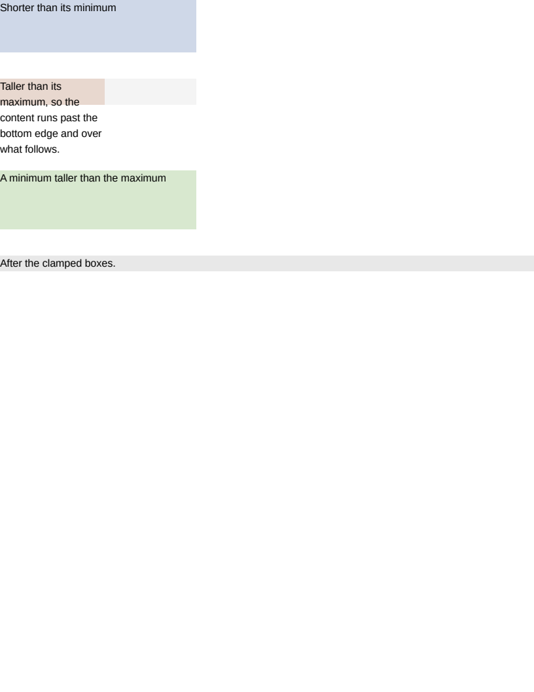 |  |


## block/min_width

# block/min_width

`min-width` is implemented, with an explicit precedence rule — applied after `max-width`, so a
minimum wider than the maximum wins, which is the order CSS specifies — and it appeared in no
scenario at all. `block/max_width` measures only the other half of the pair.

Three arrangements, because the property fails in three different ways:

- **`#held`** — a declared width below the minimum. The simplest case, and the one that would
  survive if `min-width` were read and then dropped.
- **`#both`** — a minimum wider than the maximum. This is the one the precedence rule exists for:
  clamping to the maximum last gives 100px, which looks correct until it is compared.
- **`#relative`** — a percentage, resolved against the containing block rather than the viewport,
  which is the distinction `StyleResolver` reads the cascaded style for.

What to look at when it moves: `#held` at 50px is `min-width` unread. `#both` at 100px is the two
clamps applied in the wrong order, and at 300px is neither applied. `#relative` at any width other
than 240px is a percentage resolved against the wrong box.

**Boxes**: 8 matched, worst offset 0.00px, worst size 0.00px.

| Reference (Chrome) | Krilla.Html |
| --- | --- |
| **Page 1** | **Page 1. AE 0.0009 · SSIM 0.9998** |
| 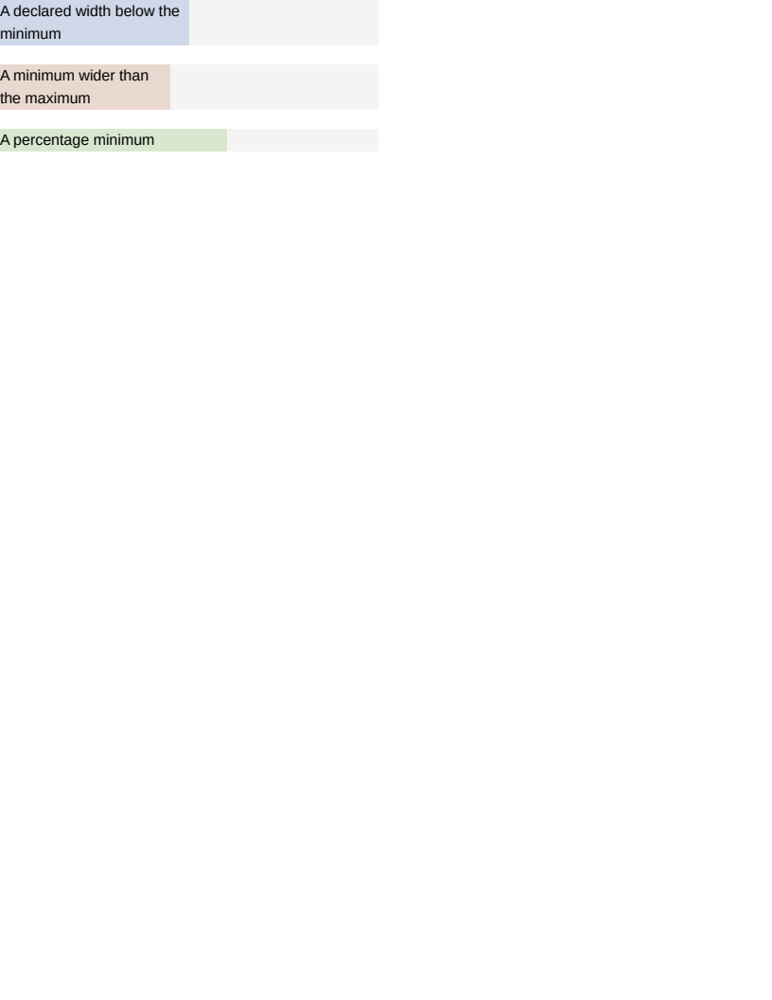 |  |


## block/nested_blocks

Containing widths through three levels. Each auto width is its parent content width, so an error in
the border or padding subtraction compounds visibly rather than staying hidden at one level.

**Boxes**: 5 matched, worst offset 0.00px, worst size 0.00px.

| Reference (Chrome) | Krilla.Html |
| --- | --- |
| **Page 1** | **Page 1. AE 0.0000 · SSIM 1.0000** |
| 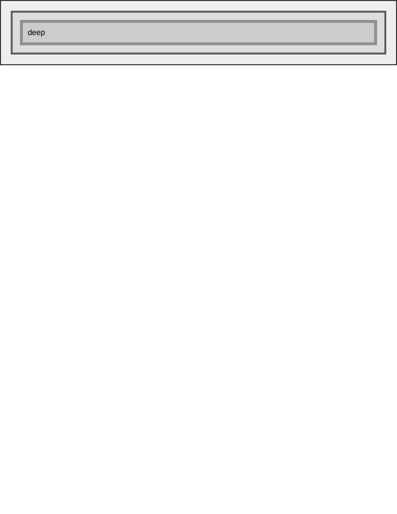 |  |


## block/opacity

# block/opacity

Pixel-identical to Chrome, and the five rows are five different reasons that is harder than it
looks. `opacity` is not a fill alpha, and every row here is a case where treating it as one gives a
different answer.

- **`#single`** is the row a fill alpha would also get right, and it is here so the rest have
  something to be compared against.
- **`#group`** is the one that settles the model. Two tiles of the same colour overlap inside one
  half-opaque parent, and the overlap comes out the SAME shade as the rest. Fading each fill on its
  own darkens it. So the box and everything under it are drawn into a group and the group is faded,
  which is what a stacking context is for.
- **`#nested`** multiplies: half of a half is a quarter, which follows from the groups nesting
  rather than from any arithmetic written here.
- **`#zero`** is invisible and still occupies its line, the same distinction `block/visibility`
  draws — `opacity: 0` is not `display: none`.
- **`#order`** measures the consequence nobody expects. A box with opacity below 1 leaves its
  parent's phases and paints with the positioned content, after every in-flow background and line
  on the page. So the faded red, written FIRST, covers the opaque green written after it, and the
  overlap is red-over-green rather than plain green. Document order gives the opposite answer and
  looks entirely reasonable until this row is rendered.

Two things in the implementation follow from the measurements rather than from a reading.

The group has to be ISOLATED as well as faded. Without the isolation the alpha applies to each
drawing operation as it goes down instead of to the finished group, and `#group`'s overlap darkens
— which is exactly the difference the row exists to catch, so it would have failed loudly rather
than quietly.

And `PaintContext` recurses only for a box that establishes a context. A positioned box's own
positioned descendants are flattened to the page by the walk that found it, which is Appendix E's
rule and what the corpus already relied on; recursing there paints every one of them twice. That is
how this first ran, and `position/absolute`, `position/anchors`, `position/fixed` and
`page/absolute_break` all reported it at once — a useful reminder that the existing scenarios are
the safety net for a change to the painter's spine.

A float or an inline-block carrying opacity is faded where it is painted rather than hoisted to the
positioned layer. CSS puts it in the same step as the boxes here, so the two differ only when
something overlaps such a float, which no scenario measures.

What to look at: `#group`'s overlap and `#order`'s. A darker band across `#group` is the isolation
gone; a plain green overlap in `#order` is the box painting in document order.

**Boxes**: 12 matched, worst offset 0.00px, worst size 0.00px.

| Reference (Chrome) | Krilla.Html |
| --- | --- |
| **Page 1** | **Page 1. AE 0.0000 · SSIM 1.0000** |
|  |  |


## block/outline

# block/outline

An outline is a border that takes no space. It is drawn outside the border edge and moves nothing,
which is what makes it the usual choice for a focus ring — a border there would shift the page
every time focus moved.

That is the whole of what the first and last rows measure together: `#plain` carries a 3px outline
and `#neighbour` sits exactly where it would have without one. The geometry comparison is what
catches a regression there, since an outline that took space would move every box below it.

`#offset` pins the offset's meaning. A 3px outline at an offset of 4 on a box starting at y=38
paints rows 31 to 33 — so the gap between the box and the ink is the offset, and the ink is
entirely outside it. Reading the offset as moving the ring's centre rather than its inner edge is
off by half the width, which is a pixel and a half here and invisible until it is measured.

`#both` puts an outline against a real border, so the two rings are distinguishable and their order
is visible: red at 73-75, green at 76-79, background from 80.

The ring is drawn as one path rather than four edges, for the reason a uniform border is: two
antialiased edges meeting on a mitre diagonal do not composite to full coverage. An outline is
uniform by construction — one width and one colour on all four sides — so the question never
arises.

Only `solid` is drawn. The other styles zero the width and report, rather than painting solid the
way an unsupported BORDER style does. The two differ because an outline is decoration with no
layout consequence: drawing the wrong ring is a worse answer than drawing none, where for a border
the box has already reserved the space and something has to fill it.

**Residual**: SSIM 0.9999, and every differing pixel is in a row of text rather than in a ring —
the corpus's usual sub-pixel glyph positioning. The outlines themselves are exact.

What to look at: the position of `#neighbour`. If it has moved, the outline is taking space.

**Boxes**: 6 matched, worst offset 0.00px, worst size 0.00px.

| Reference (Chrome) | Krilla.Html |
| --- | --- |
| **Page 1** | **Page 1. AE 0.0006 · SSIM 0.9999** |
| 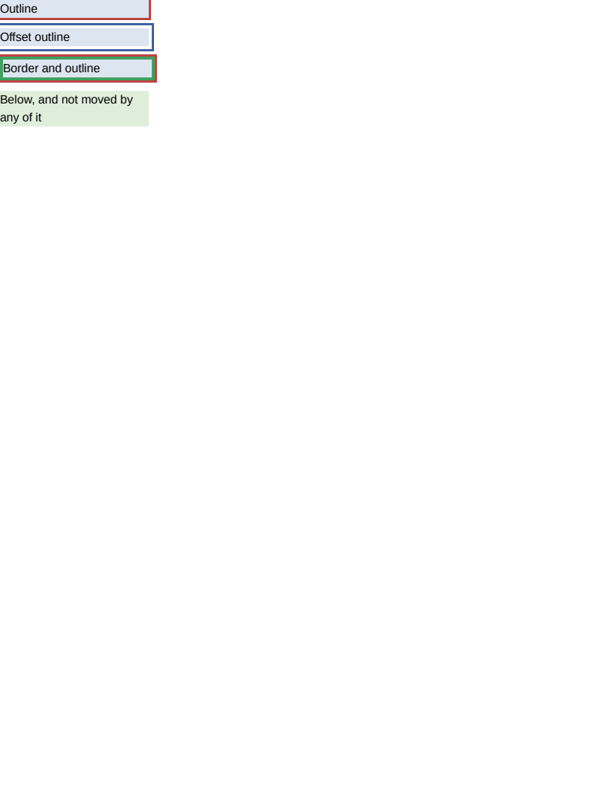 |  |


## block/overflow_hidden

# block/overflow_hidden

Clipping, measured as a pair. `#clipped` and `#visible` hold the same 96px of content in the same
48px box, and differ only in the property — so the scenario reports the effect of `overflow` rather
than the effect of a short box, and a version with only the clipped half would pass against an
engine that had lost the overflowing text.

`#wide-parent` is the horizontal case, one unbreakable line in a 200px box. Worth having on its own
because the vertical clip could be produced by accident: a paginator that stopped at the box bottom
would clip downward and not sideways.

The clip is to the PADDING box (CSS 2.1 §11.1.1), not the content box and not the border box — so a
box with padding shows its content inside that padding and cuts at the inner edge of its border.
None of the boxes here has a border, which the scenario is honest about: what it measures is that
clipping happens and where the bottom edge falls, not which of the three rectangles was used.

The implementation is the part worth knowing. The clip is pushed inside each of Appendix E's
PHASES, for the duration of that phase's walk over the box's subtree, rather than once around the
box. Painting an `overflow` box's subtree as one unit under a single clip is what a stacking context
would do, and this is not one: it would put the box's text down during the background phase, where
a later sibling's background could cover it — the defect `block/overflow_paint` exists to catch.
Each phase visits a subtree as one contiguous stretch, so a clip held across that stretch covers
exactly the right boxes and the global phase order survives.

Geometry is exact and pixels read SSIM 1.0000.

What to look at: the boundary between the third and fourth line of `#clipped`. Four lines means the
clip is not being pushed; two lines in `#visible` means it is being pushed for every box.

**Boxes**: 8 matched, worst offset 0.00px, worst size 0.00px.

| Reference (Chrome) | Krilla.Html |
| --- | --- |
| **Page 1** | **Page 1. AE 0.0001 · SSIM 1.0000** |
|  |  |


## block/overflow_paint

# block/overflow_paint

CSS 2.1 Appendix E is a set of phases over a whole stacking context, not an order within one box:
every in-flow block background and border goes down in tree order (step 3), then the floats (step
4), then all the inline content (step 7). Applying the same sequence box by box instead is
indistinguishable while nothing overlaps, and this is what it looks like when something does.

- **`#cut`** overflows its own box by three lines, and those lines land on `#under`. Painted per
  box, `#under`'s background arrives after them and hides them; painted in phases, the text is on
  top, which is what a browser does.
- **`#hang`** is a float taller than the box that declared it, and a block does not grow to
  contain its floats — so it hangs over `#below` entirely. Same defect, reached the other way: a
  float belongs to the layer rather than to the box that declared it, so it goes down after every
  background in the layer and before every line.

Nothing else in the corpus overlaps two boxes without positioning one of them, which is why the
whole restructure it measures is invisible everywhere else: all 69 other scenarios came out
pixel-identical across it, and only the order of the operators in their PDFs changed.

What to look at when it moves: either coloured block covering what should be over it. `#cut`'s
last three lines disappearing is the background phase losing its reach; `#hang` disappearing is the
float phase losing its.

**Boxes**: 8 matched, worst offset 0.00px, worst size 0.00px.

| Reference (Chrome) | Krilla.Html |
| --- | --- |
| **Page 1** | **Page 1. AE 0.0003 · SSIM 1.0000** |
| 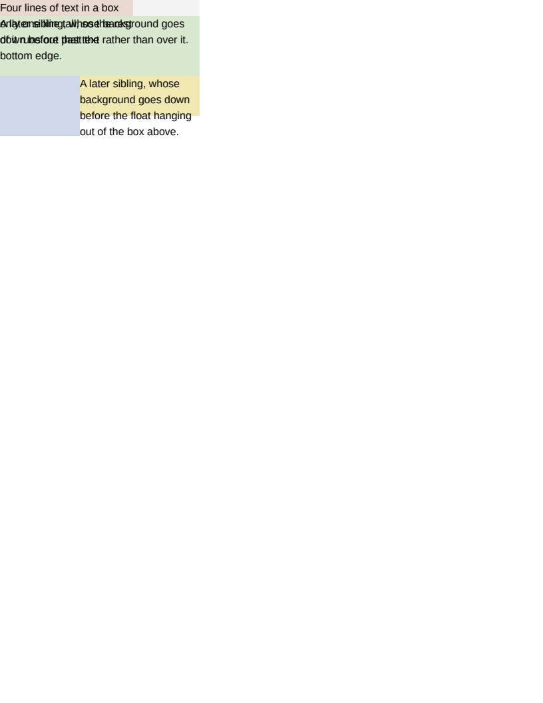 |  |


## block/percentage_width

Percentages resolve against the containing block CONTENT width, which is 600 here and not 640.
Percentage margins resolve against that same width, not against the height.

**Boxes**: 5 matched, worst offset 0.00px, worst size 0.00px.

| Reference (Chrome) | Krilla.Html |
| --- | --- |
| **Page 1** | **Page 1. AE 0.0000 · SSIM 1.0000** |
|  |  |


## block/percent_height

# block/percent_height

A percentage `height`, `min-height` or `max-height`, which resolved as `auto` however definite the
containing block was. That was correct whenever the containing height is indefinite — which it is
throughout a paginated document, and which is why it survived — and wrong the moment a box declares
a height and something inside it asks for a share of it.

CSS 2.1 §10.5 makes the percentage resolve against the containing block's height when that height is
*explicitly specified*, and behave as `auto` when it is not. Both halves are measured here.

## The rows

- **`#fixed`** is the plain case: a 200px frame, a child at `50%`, and 100px of it.
- **`#loose`** is the control, and the reason the property could be left unimplemented for so long:
  its frame has an auto height, so the child's `50%` behaves as `auto` and it is one line tall. An
  implementation resolving the percentage against something — the page, the content, the viewport —
  gives a different answer here and the same answer as this one everywhere else.
- **`#nested`** chains it. The middle box's height came from a percentage, which makes it definite
  in turn, so its own child gets a quarter of the frame. Resolving only against a DECLARED length
  stops at the first link and leaves the inner box one line tall.
- **`#padded`** and **`#bordered`** resolve against the frame's CONTENT height. The frame's border
  box is 240 and 230, and the child is 100 in both — a percentage of the border box would give 120
  and 115.
- **`#clamped`** and **`#floored`** are `max-height` and `min-height`, which take a percentage the
  same way and are resolved in the same place. 300% capped at 40% is 80px; 10px floored at 30% is
  60px.
- **`#absolute`** is the case that is definite even when nothing declared a height: an absolutely
  positioned box's containing block is a rectangle that has already been laid out, so a percentage
  height on one always has a basis. Its frame declares 200 here, but the rule does not depend on
  that.

- **`#atomic`** and **`#celled`** put the percentage inside an inline-block and inside a table cell,
  both with a definite height of their own. Neither needed anything: a box with a DECLARED height
  settles its own before its subtree is laid out, so what it passes down does not depend on what was
  passed to it.
- **`#atomic-half`** and **`#floated`** are the two that did. An inline-block and a float each resolve
  their OWN percentage height against the block that holds them, and both are laid out through paths
  that threaded no containing height — so both came out one line tall where 100px belongs. They are
  the reason the height goes down alongside the width in `InlineLayout` and `PlaceFloat` rather than
  only through `LayoutChildren`.

The answer has to exist BEFORE the subtree is laid out, which is the whole shape of the change: a
definite height is one the box was told — declared, resolved against its own containing block, or
handed down by an absolute box's offsets — rather than one its content came to, so it can be settled
early and passed down.

Exact on all 32 boxes, and all three pages are pixel-identical.

**Boxes**: 32 matched, worst offset 0.00px, worst size 0.00px.

| Reference (Chrome) | Krilla.Html |
| --- | --- |
| **Page 1** | **Page 1. AE 0.0000 · SSIM 1.0000** |
| 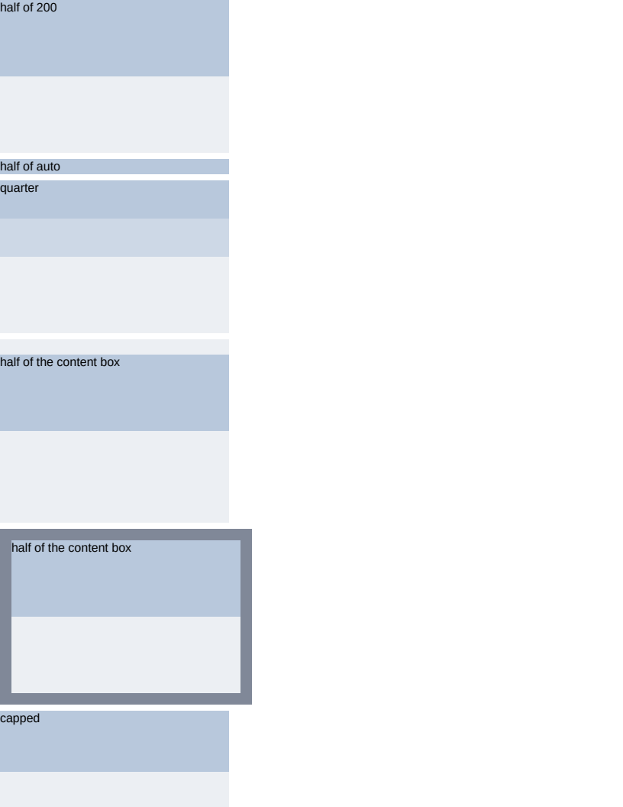 |  |
| **Page 2** | **Page 2. AE 0.0000 · SSIM 1.0000** |
| 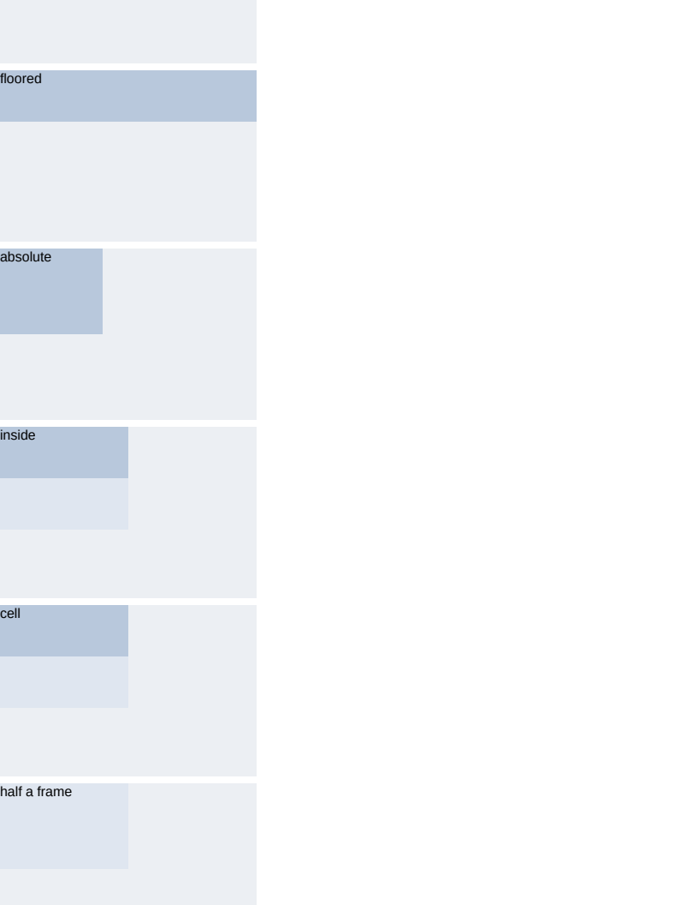 |  |
| **Page 3** | **Page 3. AE 0.0000 · SSIM 1.0000** |
|  |  |


## block/pseudo_block

# block/pseudo_block

`display: block` on a `::before` or `::after`, which was laid out as inline content of the host and
reported. It is the oldest idiom in CSS — `content: ""; display: block; clear: both` on an `::after`
is how a container was made to enclose its floats before `overflow` was used for it — and it
rendered as nothing at all, because an inline pseudo with empty content generates no box to clear
with.

## What made it hard

Not the layout. A block pseudo is a box appended to the host's block children, with the run closed
first so a `::before` lands above the host's own text and an `::after` below it.

What made it hard is that **the cascade cannot say whether the pseudo declared `display` at all.** A
pseudo-element's cascaded style carries the HOST's declarations too, and measured: a `<div>` whose
`::before` declares nothing but `content` comes back with `display: block`, leaked from the
user-agent rule for `div`. So the value the pseudo reports is the value the host has, and `block` is
exactly what they agree on for every block host — which is every host anyone writes a block pseudo
for. Reading it would make every `::before` on every `<div>` a block.

So `display` is recovered from the RULES instead: the stylesheets are scanned for style rules whose
selector names `::before` or `::after`, and the last one matching the element wins. The same shape
as the `@page` recovery, bounded the same way, and with the same caveats — specificity is not
compared and media queries are not evaluated.

The leak is not confined to `display` either. A host with `width: 400px` was handing that width to
its `::before`, which then ignored its own margins because it had been told how wide to be — so the
pseudo's own declarations are now separated out and re-parsed through an element that is never added
to the document, the same route a page margin box takes. That improves an inline pseudo too, which
was silently taking its host's horizontal padding and border.

**No host in this scenario carries a margin**, deliberately: a margin on a host arrives on its pseudo
as well, and the separation above treats a value the two agree on as the host's. The gaps between
the rows are boxes of their own with no pseudo-element on them.

## The rows

- **`#clearfix`** is the idiom itself. Its float is 70px tall and its text is one line, so the
  container encloses the float only if the `::after` exists, is a block, and clears.
- **`#ruled`** has a block pseudo at each end, which is what makes source order observable: the two
  rules bracket the host's text rather than both landing above it.
- **`#mixed`** gives its pseudo margins, padding and a border. They are the BOX's now rather than an
  inline element's — the vertical margins apply where an inline element's would be dropped, and the
  width is what the margins leave rather than the host's.
- **`#sized`** is empty with a height, which is what a spacer pseudo is and what an inline one
  cannot be.
- **`#inline-host`** is the control. Its host is a `<span>`, which contributes runs to a line rather
  than a list of boxes, so a block pseudo inside one has nowhere to go — those stay inline, and are
  still reported.

Exact on all 14 boxes and SSIM 1.0000. The box comparison cannot see a pseudo-element directly —
a browser reports no rectangle for one either — so what it measures is the effect: every host's
height, and the position of everything below.

**Boxes**: 14 matched, worst offset 0.00px, worst size 0.00px.

| Reference (Chrome) | Krilla.Html |
| --- | --- |
| **Page 1** | **Page 1. AE 0.0003 · SSIM 1.0000** |
| 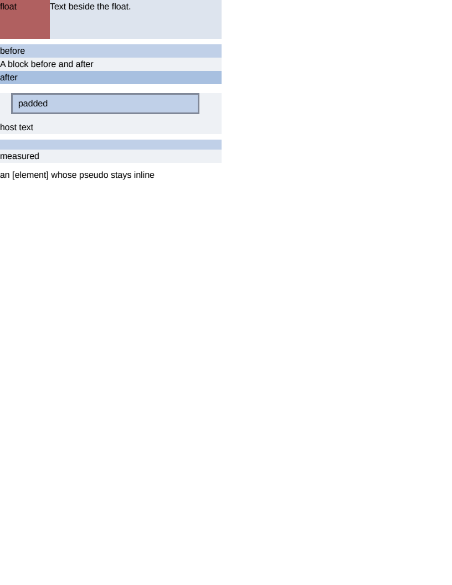 |  |


## block/shadows

# block/shadows

`text-shadow` and `box-shadow`, both of which were reported and neither painted. Geometry is exact —
a shadow changes no box — and the page reads SSIM 0.9985 with no pixel differing by more than two of
255, the residual being antialiasing on the rounded corner of `#rounded`.

**Offsets only. No blur, and no spread.** Those are two different limits with two different causes,
and the second was found here rather than reasoned about:

- A **blur** needs a Gaussian, which a PDF content stream does not express for an arbitrary shape —
  and a text shadow's blur follows glyph outlines, so no gradient can stand in for it. A blurred
  shadow drawn SHARP is a hard dark copy where a soft halo belongs, so it is not drawn at all. That
  is the rule an unsupported outline style already follows: for decoration with no layout
  consequence, wrong ink is worse than none.
- A **spread** is unreachable rather than unimplementable. AngleSharp ELIDES A ZERO BLUR when it
  serialises the value, so `6px 6px 0 4px` — offset, no blur, spread four — comes back as
  `6px 6px 4px`, which is byte-for-byte what a real four-pixel blur comes back as. The first version
  of this scenario had spread rows and they measured wrong for exactly that reason. A three-length
  value therefore has to be read as a blur: reading it as a spread would draw a hard shadow wherever
  an author asked for a soft one, which is much the worse of the two mistakes.

`#several` is the row that pins the order. Two shadows are painted FARTHEST FIRST, so the layer
written first ends up on top — the reverse of the order they appear in, and invisible until two of
them overlap, which is the only time anyone writes two.

`#translucent` is why this scenario found a second feature. A shadow is behind the box that casts it
INCLUDING behind its own background, so a translucent background shows the shadow through — and
`rgba()` was not honoured at all. `background-color` and `color` now carry their alpha, which
`Krilla.Color` cannot hold: krilla models opacity as a fill property rather than as a fourth channel,
so the alpha travels alongside. Every other colour property is still drawn opaque and is reported.

What to look at: the green band under `#translucent`, which should show through the panel rather than
stopping at its edge.

**Boxes**: 8 matched, worst offset 0.00px, worst size 0.00px.

| Reference (Chrome) | Krilla.Html |
| --- | --- |
| **Page 1** | **Page 1. AE 0.0057 · SSIM 0.9985** |
| 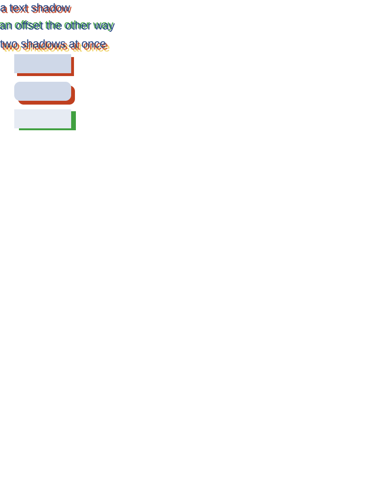 |  |


## block/transform

# block/transform

Pixel-identical to Chrome, and — the part worth more — geometry-exact as well, which for this
property is a stronger statement than it usually is.

A browser's `getBoundingClientRect()` returns the VISUAL rectangle, so a rotated 60×40 tile comes
back as the 71.96×64.6 box that encloses it. The corpus compares against that rect, so a transformed
element had two possible treatments: exempt it, or compute the same visual box on this side. The
second was taken, so `BoxDump` reports transformed rectangles and the geometry comparison becomes a
real check of the matrix arithmetic — composition order, the origin conjugation and each function's
own matrix are all pinned by numbers rather than by pixels alone.

That is also why `BoxDump.Collect` walks recursively rather than over `Descendants()`. A transform
applies to a box AND everything under it, so a transformed box inside another carries both, and a
flat walk has nowhere to keep the matrix that says so. The painter gets the same composition free
by nesting its pushes.

Seven rows:

- **`#translate`**, **`#scale`**, **`#rotate`** and **`#skew`** are one function each, so a wrong
  matrix for any of them is localised rather than mixed into a product.
- **`#composed`** pins the ORDER. `translate(30px, 0) rotate(15deg)` composes left to right, which
  for column vectors means the product in written order and so the rightmost function reaching a
  point first — the box is rotated about its origin and then moved, not moved and then rotated
  about where it started. The two differ by where the pivot ends up, and both look reasonable.
- **`#origin`** pins the pivot. The default is the centre of the border box, not its top-left, so
  naming a corner is a visible change rather than a no-op.
- **`#untransformed`** with **`#after`** pins that a transform changes PAINTING and not layout:
  the scaled tile reports 84×56 where its layout box is 60×40, and its sibling sits exactly where
  it would have without the transform. Nothing measured against a transformed box moves, which is
  the same bargain `position: relative` strikes.

A transform creates a stacking context, so a transformed box leaves its parent's paint phases and
goes down with the positioned content — which cost nothing to add here because `opacity` had
already built that machinery. The transform is pushed OUTSIDE the fade, so a box carrying both is
faded and then drawn through the transform rather than the other way round.

The three-dimensional functions are left unparsed rather than flattened. `rotate3d` has a
two-dimensional shadow that would put the box somewhere plausible and wrong, so the whole transform
is dropped and `UnsupportedCss` says so.

What to look at: `#composed` and `#origin`, the two rows whose answers are not forced by a single
function. A `#composed` that matches while `#origin` does not means the origin conjugation is
missing; both wrong together means the composition order is reversed.

**Boxes**: 17 matched, worst offset 0.00px, worst size 0.00px.

| Reference (Chrome) | Krilla.Html |
| --- | --- |
| **Page 1** | **Page 1. AE 0.0000 · SSIM 1.0000** |
| 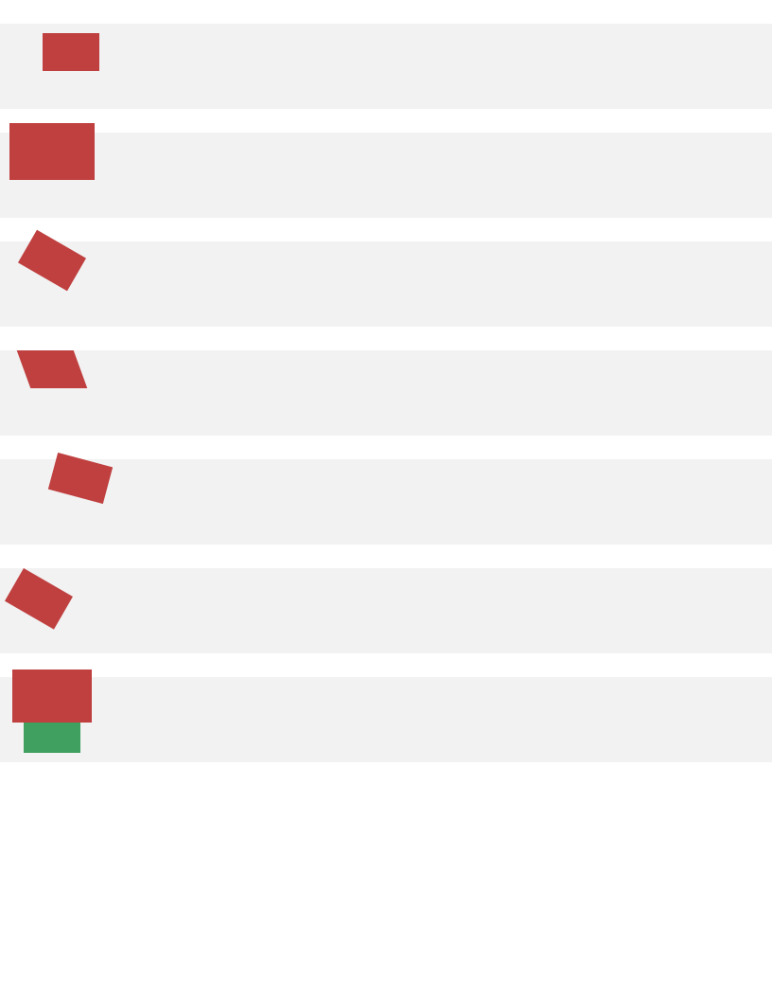 |  |


## block/translucent

# block/translucent

`rgba()` on the colour properties that were drawn fully opaque: the four border sides, the outline,
a collapsed table's grid lines, and a text decoration. `color` and `background-color` already
honoured their alpha, and the rest were reported through `OnDiagnostic` instead.

The reason they were all opaque is one line of the interop: `Krilla.Color` has no fourth channel,
because krilla models opacity as a property of the FILL rather than of the paint — which is the
right model, since it lets one colour be drawn at two opacities without allocating a second paint.
So the alpha has to travel beside the colour, and every property that carries one needs somewhere
to put it.

The backdrop is a saturated yellow rather than white, deliberately. Over white a translucent colour
is merely a lighter version of itself and an opaque render looks like a slightly wrong shade; over
this it is a different colour entirely, so a property that lost its alpha is unmistakable.

## The rows

- **`#border`** is a uniform translucent border, which takes the one-ring shortcut — four mitred
  trapezia would each antialias against their neighbours on the diagonal and composite to more than
  the alpha asked for.
- **`#dashed`** is a patterned edge, whose ink comes from a STROKE rather than a fill. One side
  only: a patterned edge runs corner to corner instead of mitring, so four of them overlap where
  they cross and a translucent one doubles its own alpha at each corner. That is a fact about the
  construction rather than about the colour, and giving the row one side keeps this scenario
  measuring the colour.
- **`#sides`** gives the four sides four DIFFERENT alphas, which is what forces the mitred path:
  the ring shortcut is only available when all four agree, and it now has to agree about the
  opacity as well as the colour. Without this row an implementation that read one alpha and applied
  it to all four would pass.
- **`#ring`** is an outline, which is drawn as a single wound path and so has no seam at all.
- **`#rule`** is a decoration with its own `text-decoration-color`, and **`#current`** is one with
  none — so its rule takes the element's `color` AND that colour's alpha. The two are separate rows
  because the decoration's opacity follows the DECORATION rather than the text: an element
  declaring a translucent underline and then a different `color` for its words draws the rule at the
  opacity the rule was given.
- **`#grid`** is a collapsed table, whose rules belong to the table rather than to the cells either
  side of them and are painted from a list of their own. They needed the alpha carried through that
  list as well as through the cells' styles.

**Residual**: SSIM 1.0000, and the `AE` is high and means nothing — the same situation
`block/gradients` records. Almost every pixel in the scenario is a translucent colour composited
over a backdrop, and this engine and the browser round that composite differently by ONE of 255
across large flat areas. `AE` counts any nonzero difference, so a scenario that is visually exact
reports a large one.

Two places differ by more than that, both of them constructions rather than colours: twenty-four
pixels on `#sides`' corner diagonals, where two antialiased trapezia meet and composite to more
than either alpha — the same shortfall `block/bevelled_borders` records — and the junctions of the
table's grid lines, where the crossing lines deliberately overlap so that no corner is left
unpainted.

What to look at: whether each row's colour is the browser's colour at all. A row that comes out
saturated is its alpha being dropped; a row that comes out too dark is an alpha applied twice.

**Boxes**: 18 matched, worst offset 0.00px, worst size 0.00px.

| Reference (Chrome) | Krilla.Html |
| --- | --- |
| **Page 1** | **Page 1. AE 0.0112 · SSIM 1.0000** |
| 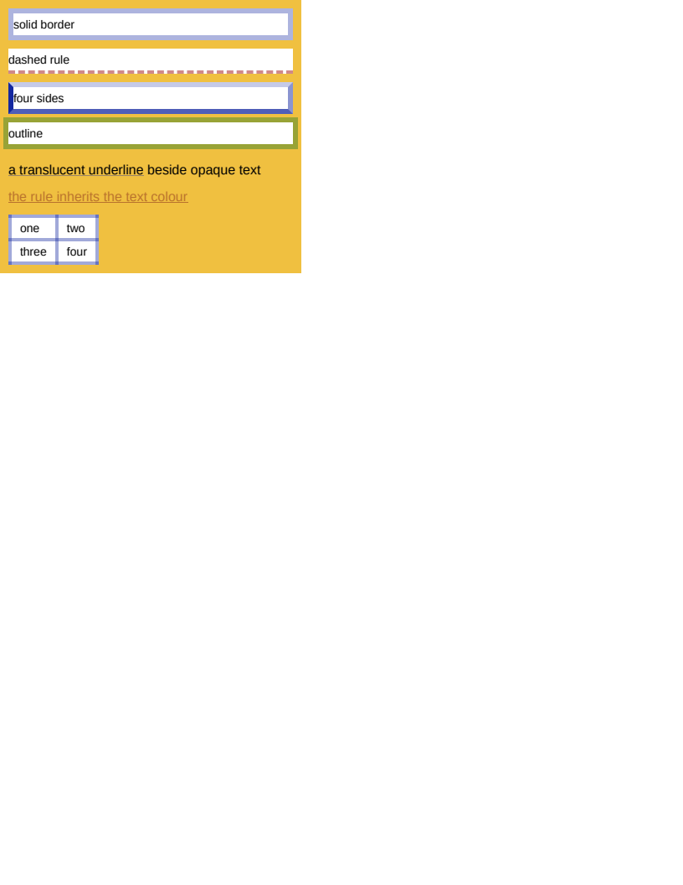 |  |


## block/viewport_units

# block/viewport_units

The four viewport units, which were parsed as unrecognised and fell back to the property's default.

In paged media the viewport is the page's CONTENT box rather than a window, so `100vh` is one page
tall. That is what a browser printing to PDF resolves against, and it is what makes this scenario
possible at all: the corpus uses zero page margins, so the page content box and the browser's
screen viewport are the same 816 by 1056 rectangle and both sides of the comparison mean the same
thing by `vw`.

Unlike a percentage, a viewport unit does NOT depend on the containing block — `50vw` is half the
page wherever the box sits — so it resolves during parsing and never reaches layout as anything but
an absolute length.

`#least` and `#most` are the rows worth having. `10vmin` and `10vmax` are 81.59 and 105.59 rather
than 81.6 and 105.6, because Chrome holds every layout length on a 1/64 pixel grid and truncates
onto it. Both sides agree at two decimals regardless, which is what the comparison reads.

`#mixed` puts a viewport unit inside a `calc()`, since the two features were written together and a
unit table consulted by only one of the two parsers is the obvious way for them to disagree.

Geometry is exact against Chrome.

What to look at: `#half` at 408px. Anything else means the viewport is not the page.

**Boxes**: 7 matched, worst offset 0.00px, worst size 0.00px.

| Reference (Chrome) | Krilla.Html |
| --- | --- |
| **Page 1** | **Page 1. AE 0.0000 · SSIM 1.0000** |
| 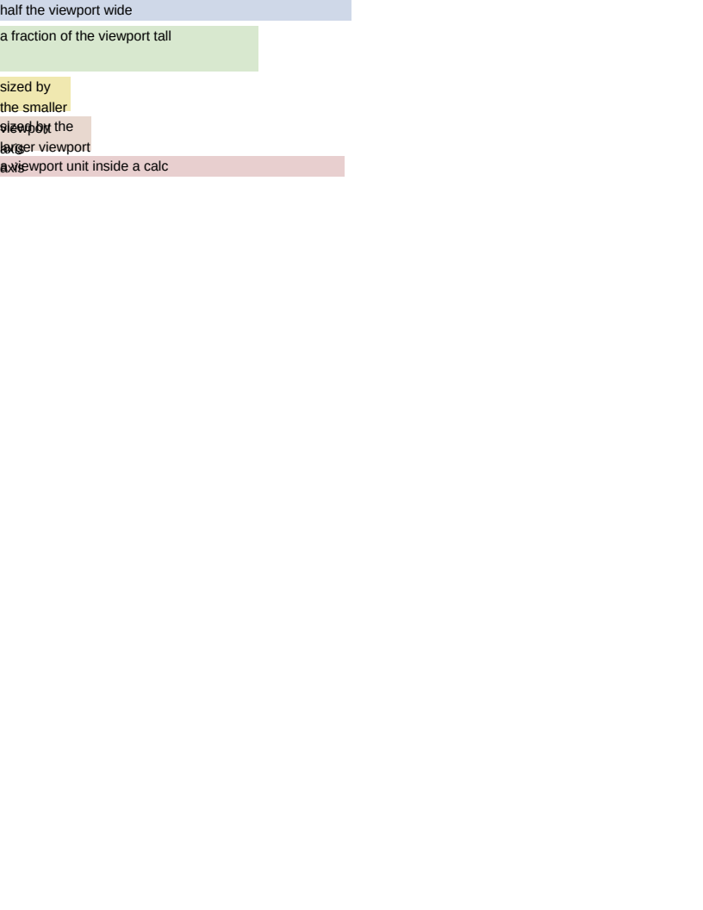 |  |


## block/visibility

# block/visibility

`visibility: hidden` is not `display: none`, and the difference is the whole scenario. The hidden
box is laid out, occupies its 24px line and holds `#after` down at y=48 exactly as a painted one
would. Only the ink is missing.

Getting that backwards is the shape this defect takes: treating the property as removing the box
closes the gap it left, and every box below it moves up by its height. The geometry comparison
catches it immediately, which is why the scenario leads with a plain hidden box between two visible
ones rather than with anything more interesting.

The second half is that a descendant can bring itself back. The property inherits and hiding is
nothing more than not painting, so `#child` with `visibility: visible` inside a hidden parent is
drawn while the parent's background and the text either side of it are not. That is what forces
the check to be per RUN rather than per box: one line here carries hidden and visible text at once,
and a box-level test paints all of it or none.

A link annotation is still queued for a hidden run. It carries no appearance stream, so a browser
does not hide the clickable rectangle either, and neither corpus measurement can see one — this is
recorded because it is a decision rather than an oversight.

Geometry is exact. Pixels read SSIM 1.0000 with a scattering of antialiased pixels on the one line
that does paint.

What to look at: whether `#after` sits at y=48. If it has moved to y=24 the property is being read
as `display: none`. If `#child` disappears, the check has been put on the box instead of the run.

**Boxes**: 8 matched, worst offset 0.00px, worst size 0.00px.

| Reference (Chrome) | Krilla.Html |
| --- | --- |
| **Page 1** | **Page 1. AE 0.0001 · SSIM 1.0000** |
|  |  |


## float/basic

What a float does to the text beside it, and what it deliberately does not do to the boxes.

Three things are measured here, and the third is the one that catches an implementation out:

- `#left` and `#right` shorten the line boxes of the paragraph beside them. The paragraph's own
  border box is unchanged and still spans the full 400px — a fact readily missed, because the text
  inside it moves and the box does not.
- `#tall` is taller than the single line beside it, so it hangs out of the bottom of `#wrap3`. A
  block does not grow to contain a float, and a document relying on that will overlap whatever
  follows. That is correct rather than a defect, and `#wrap3` records how far it overflows.
- `#block` sits beside the same float and is NOT moved or narrowed. CSS shortens line boxes, not
  block boxes, so an ordinary block overlaps the float. An implementation that narrowed the
  block instead would look plausible on this page and be wrong everywhere.

The backgrounds are what makes the difference between the second and third points visible in the
pixels rather than only in the geometry.

**Boxes**: 12 matched, worst offset 0.00px, worst size 0.00px.

| Reference (Chrome) | Krilla.Html |
| --- | --- |
| **Page 1** | **Page 1. AE 0.0001 · SSIM 1.0000** |
| 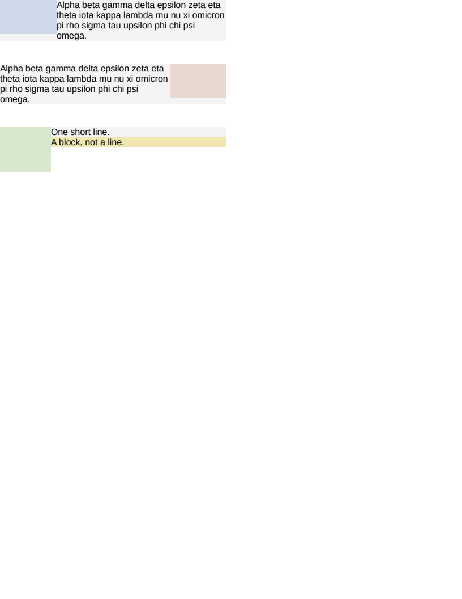 |  |


## float/clear

`clear`, in the three forms that behave differently.

- `#sides` has floats of different heights on either side. `#cl` clears only the left one, so it
  drops to 40px and still has the right float beside it, shortening its line. `#cr` clears the
  right one, which is lower, so it drops further. Treating `clear` as "below every float" would put
  both at the same place and pass a scenario with only one float in it.
- `#chain` puts `clear: left` on a FLOAT. `#f2` has room beside `#f1` and descends anyway, because
  clearance applies before the sideways search rather than instead of it.
- `#margins` clears a float whose bottom margin is larger than its height. Clearance measures to the
  margin box, so `#cm` lands 40px below the visible box rather than against it — which is also the
  check that the float context stores margin boxes rather than border boxes.

What is deliberately NOT measured here is clearance interacting with a large collapsed margin.
CSS 2.1 §9.5.2 makes clearance a separate quantity that also stops the margin collapsing through,
and the engine applies clearance after the collapsed margin instead. The difference appears only
when the cleared box has a margin big enough to clear the float unaided; `src/todo.md` records it.

**Boxes**: 14 matched, worst offset 0.00px, worst size 0.00px.

| Reference (Chrome) | Krilla.Html |
| --- | --- |
| **Page 1** | **Page 1. AE 0.0002 · SSIM 1.0000** |
| 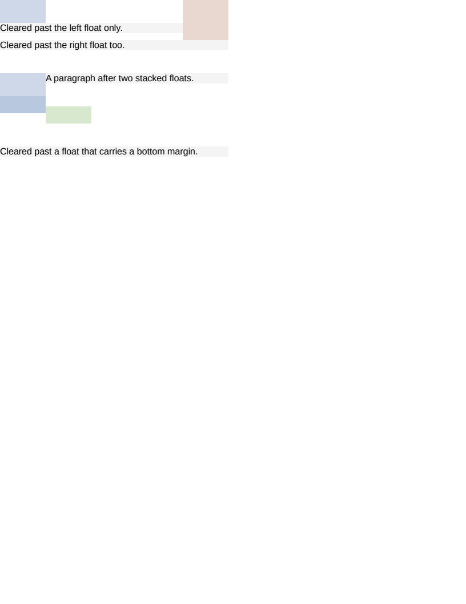 |  |


## float/clearance

# float/clearance

`clear` in the arrangements where clearance and margin collapsing interact, and the defect one of
them found — which turned out not to be about `clear` at all.

`float/clear` measures where a cleared box lands. This measures what happens to the MARGINS around
it, which CSS 2.1 §9.5.2 and §8.3.1 settle between them.

## The rows

- **`#collapsed`** is the ordinary case: a 40px bottom margin and a 20px top margin collapse to 40,
  which would put the box 64px down, and the float's bottom at 100 wins. Clearance is the 36px
  difference and the border edge lands exactly on the float's bottom edge — the collapsed margin is
  absorbed rather than added to it.
- **`#unaided`** is the row the engine was suspected of getting wrong: a cleared box whose own
  150px top margin already carries it past the float. Clearance is then ZERO and the margin stands
  in full, so the box sits at 174 rather than being pulled back to the float's bottom at 100.
  Measured, and it already agreed — which is the useful half of the result.
- **`#through`** has a float short enough that the collapsed margin clears it unaided, so nothing is
  introduced and the box after it collapses normally.
- **`#nofloat`** is the control with nothing to clear at all.
- **`#selfcollapsing`** and **`#plain`** are the two that found something, and only the second
  mentions `clear`.

## What they found

An EMPTY box between two boxes with margins had its margins applied TWICE. With a 40px margin above
it and a 50px margin of its own, everything after it sat 90px down where 50 belongs.

CSS 2.1 §8.3.1 calls this collapsing *through*: a box with no height, no border and no padding does
not SEPARATE the margin above it from the margin below, so the two join one collapsed set that is
applied once. The box itself keeps the position the partial collapse gave it — which is what a
browser reports for it, and what `#plain`'s middle row pins at 64 — and the flow position returns to
where the margin started, so the box after it lands at 74 rather than 114.

`#selfcollapsing` is the same box carrying `clear`, which matters because **clearance takes a box
out of that rule**: §8.3.1's own wording is that two margins are adjoining only when no clearance
separates them, so a box that took any keeps its margins apart the way a box with a border does.
Here the float is short enough that no clearance is introduced, so it collapses through like any
other empty box — and an implementation that keyed the rule on the DECLARATION rather than on the
clearance actually taken would get this row wrong.

Nothing in the corpus held an empty box between two boxes with margins until this scenario did,
which is why a defect this plain survived: it needs a box with nothing in it, and every scenario
written before this one had something in every box.

Exact on all 27 boxes and pixel-identical.

## What is still not done

A cleared box that is its parent's FIRST child still collapses its top margin out through the
parent's top edge, where CSS 2.1 §8.3.1 stops it — "the top margin of an in-flow block element
collapses with its first in-flow block-level child's top margin if the element has no top border, no
top padding, **and the child has no clearance**". Measured at 8px on a frame whose first child clears
a float inside it, and left out of this scenario rather than committed failing.

It is a two-pass problem rather than an oversight. Whether that child HAS clearance depends on where
the float ends, the float is placed while the parent is laid out, and the parent's position is
already settled by the margin this rule would change — which is exactly why §9.5.2 is written in
terms of a *hypothetical* position.

**Boxes**: 27 matched, worst offset 0.00px, worst size 0.00px.

| Reference (Chrome) | Krilla.Html |
| --- | --- |
| **Page 1** | **Page 1. AE 0.0000 · SSIM 1.0000** |
| 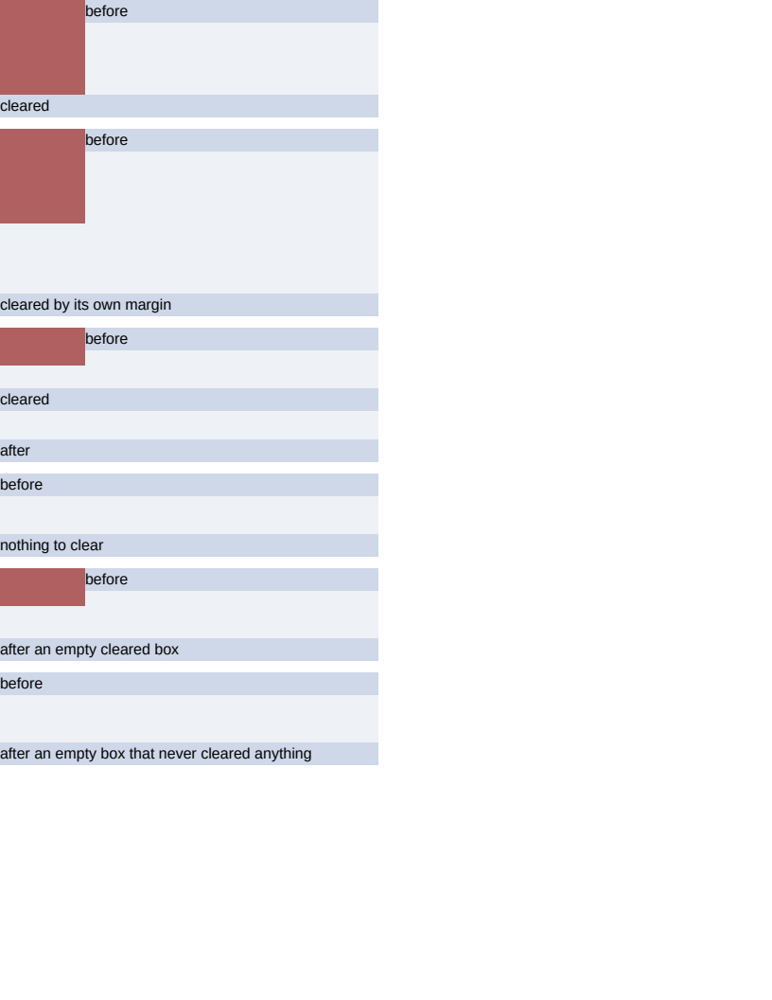 |  |


## float/margins

# float/margins

Every float rule is stated against the MARGIN box, and no other float scenario has a float with
margins on it — `float/basic` has none at all, and `float/clear`'s `#m` carries a bottom margin
only, to measure clearance. So the three places the margin box matters were unmeasured in pixels:

- **`#spaced`** — line shortening. The paragraph's lines start 20px past the float's border edge,
  and the float sits 12px in from the container's left edge rather than against it.
- **`#low`** — the flow position. A float with `margin-top: 24px` puts its MARGIN box at the flow
  position, so the border box lands 24px down. Adding the margin when choosing the position and
  again when translating the box into place lands it at 48px, which is a bug that was fixed once
  and that nothing in the corpus could have caught.
- **`#a`/`#b`** — float-against-float placement. Two 170px floats fit side by side in 400px; two
  210px margin boxes do not, so the second descends.

All three are exact, and the page reads SSIM 1.0000.

What to look at when it moves: a horizontal shift of exactly one margin on `#spaced`'s text is
line shortening reverting to the border box. `#low` at y=48 rather than y=24 is the double
application. `#b` beside `#a` rather than below it is the fit test reading border boxes.

**Boxes**: 12 matched, worst offset 0.00px, worst size 0.00px.

| Reference (Chrome) | Krilla.Html |
| --- | --- |
| **Page 1** | **Page 1. AE 0.0001 · SSIM 1.0000** |
| 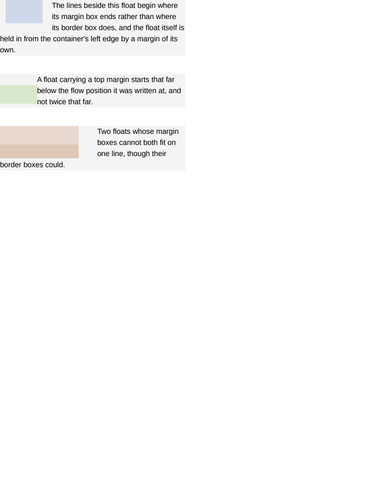 |  |


## float/mid_line

# float/mid_line

A line is shortened by the floats its box OVERLAPS, not by those under its top edge. The two
readings agree on every arrangement where floats begin and end on line boundaries, which is nearly
all of them, and this is the arrangement where they do not.

`#early` occupies y=0..10 and is 60 wide. `#late` clears it, so it starts at y=10 — inside the
first line box, which runs y=0..24 — and it is 220 wide. The first line therefore has 180px to
work with, from x=220 to the container's right edge. Sampling the band at the line's top edge
alone sees only `#early` and reports 340px, which fits roughly twice as many words.

This is the case `FloatGeometryTests` keeps as `e1`, which is the only one of its nineteen
arrangements that distinguishes the two readings. It had no pixel measurement until now: this
scenario is that case as a rendered page, so the word count on the first line reports it directly.

Measured, the page is pixel-identical to the reference: the band reading is right, and this is
now the confirmation of it in pixels rather than in a probe case.

What to look at when it moves: the first line carrying more words than the second is the top-edge
reading. The lines below the float are unaffected either way, which is what makes the first line
the whole signal.

**Boxes**: 6 matched, worst offset 0.00px, worst size 0.00px.

| Reference (Chrome) | Krilla.Html |
| --- | --- |
| **Page 1** | **Page 1. AE 0.0000 · SSIM 1.0000** |
| 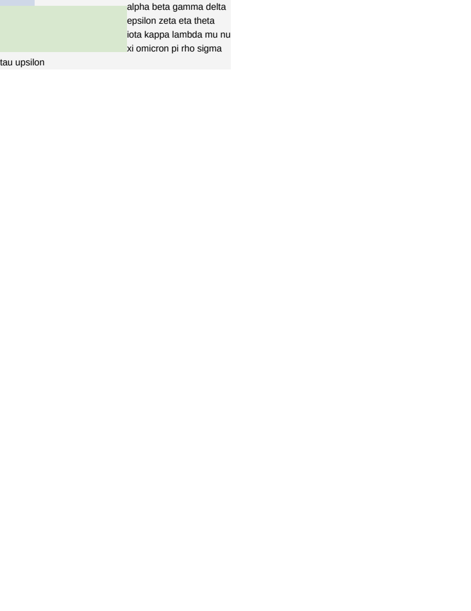 |  |


## float/overflow_bfc

# float/overflow_bfc

The other half of `overflow`, and the reason anyone writes it. A box with `overflow` other than
`visible` establishes a block formatting context, which has two consequences and this measures
both.

**It is placed BESIDE an outside float rather than overlapping it.** `#beside` is a 120px float and
`#container` comes back from Chrome at x=120 with a width of 696 — its border box narrowed and
shifted, not merely its lines shortened. That is the exception to the most surprising rule about
floats: an ordinary block keeps its full width and lets the float overlap it, which is what
`float/basic` pins with `#block`. A float with a text block beside it is the pre-flexbox way to lay
out a media object, and `overflow: hidden` on the text block is how it was done — so this is the
common case rather than a corner one.

**It grows to contain its own float.** `#inner` is 60px tall and the container comes out 60px tall,
where a container that shared its parent's float context would collapse to the height of its text
and let the float hang out.

Three things were measured rather than assumed:

- The band is sampled at the container's TOP EDGE alone, and the box keeps that width for its whole
  height. The container is 60px tall beside a 90px float and stays 696px wide, so nothing re-widens
  it below the float's bottom.
- `#after`, an ordinary block, is back at x=0 with the full 816px width even though the float still
  extends 30px below the container. Only a box establishing a context avoids a float.
- The probe has to be an infinitesimally thin slice at the top edge rather than a zero-height one.
  `FloatContext.Band` treats its range as half-open, so a zero-height query overlaps nothing and
  every box comes back full width — which is exactly how this scenario failed first time.

Only an AUTO width is narrowed. A declared width is honoured as declared and the box is left where
it is, where a browser shifts it sideways as well. Nothing here measures that, and it is recorded
as a limit rather than as a decision.

Geometry is exact. Pixels read SSIM 0.9999, from glyph positioning on the container's one line.

What to look at: `#container`'s x and width. Back at x=0 with 816px means the formatting context is
not being established; a height of 24 rather than 60 means it is not containing its float.

**Boxes**: 6 matched, worst offset 0.00px, worst size 0.00px.

| Reference (Chrome) | Krilla.Html |
| --- | --- |
| **Page 1** | **Page 1. AE 0.0005 · SSIM 0.9999** |
| 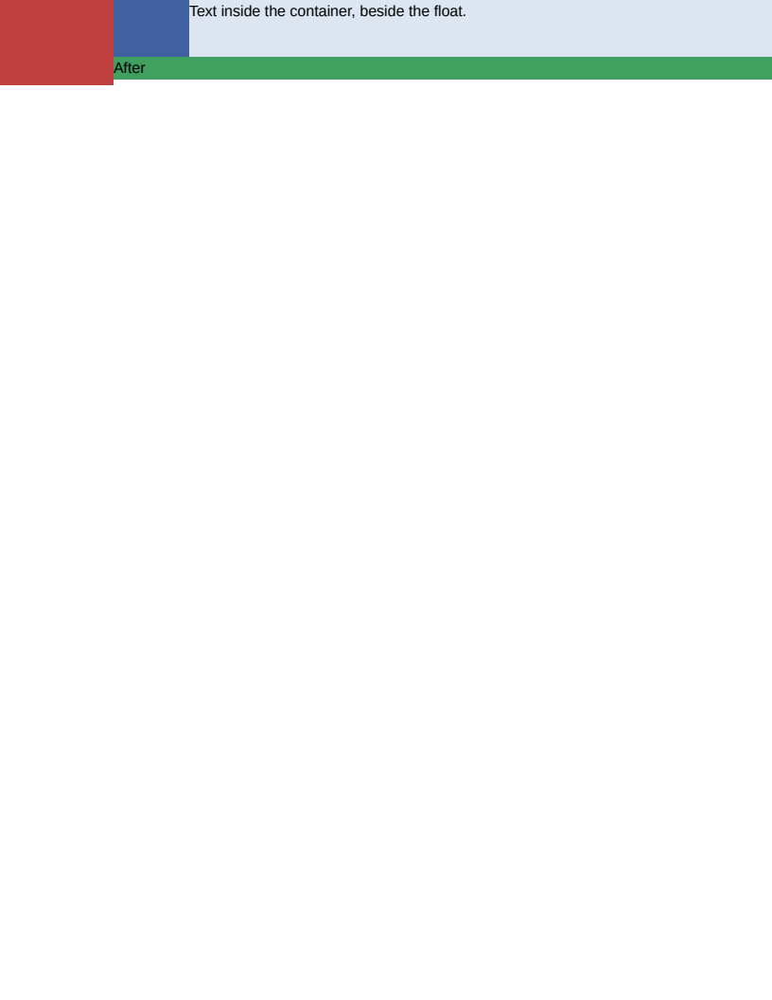 |  |


## float/shrink_to_fit

How wide a float with no declared width becomes, which CSS 2.1 §10.3.5 gives as
`min(max(min-content, available), max-content)`.

The three terms of that formula each need a case to be distinguishable, and this has one for each:

- `#short` is narrower than the container, so it takes its max-content width — the width of its
  text with no wrapping at all. This measures the text advance itself, not merely the algorithm.
- `#long` wants more than 400px, so it takes what is available and wraps inside itself. An
  implementation using max-content unconditionally overflows here.
- `#word` is a single unbreakable word inside a 120px container. Neither term of the outer minimum
  can go below min-content, so the float overflows its parent rather than breaking the word.
- `#overflow` is wider than the container outright, so it hangs out to the right AND leaves the
  paragraph beside it no band at all. That paragraph descends below the float instead of drawing
  its line in zero width, which is the CSS 2.1 §9.5 rule for a line box shortened to nothing.

The last is worth the scenario on its own: a shortened line and a line with nowhere to go are
different code paths, and only one of them is exercised by every other case here.

**Boxes**: 14 matched, worst offset 0.00px, worst size 0.00px.

| Reference (Chrome) | Krilla.Html |
| --- | --- |
| **Page 1** | **Page 1. AE 0.0000 · SSIM 1.0000** |
| 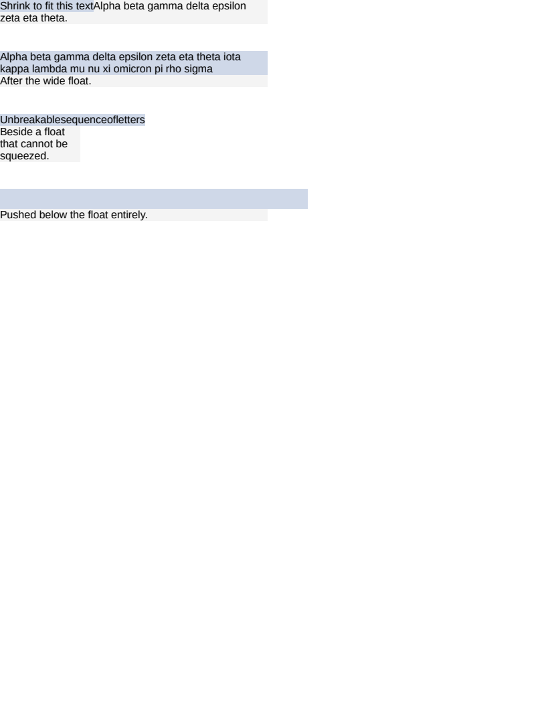 |  |


## float/stacking

Where a second float goes when a first is already there. Four arrangements, because the rule is not
one rule.

- `#fit` places two left floats side by side, the second starting where the first ends.
- `#drop` makes them 450px between them in a 400px container, so the second cannot fit beside the
  first. It descends to the first float's bottom edge and returns to the left edge — it does not
  shrink, and it does not overlap.
- `#rights` stacks two right floats, and the order is the one that surprises: the float written
  FIRST sits furthest right. Reading the source left to right gives the painted order right to
  left.
- `#both` puts one on each side and leaves the paragraph the band between them.

`#drop` is the case that decides whether the placement search is a search at all. Handing each float
the next free position along one axis gets `#fit` right and `#drop` wrong, and a single scenario
covering only `#fit` would never notice.

**Boxes**: 18 matched, worst offset 0.00px, worst size 0.00px.

| Reference (Chrome) | Krilla.Html |
| --- | --- |
| **Page 1** | **Page 1. AE 0.0000 · SSIM 1.0000** |
| 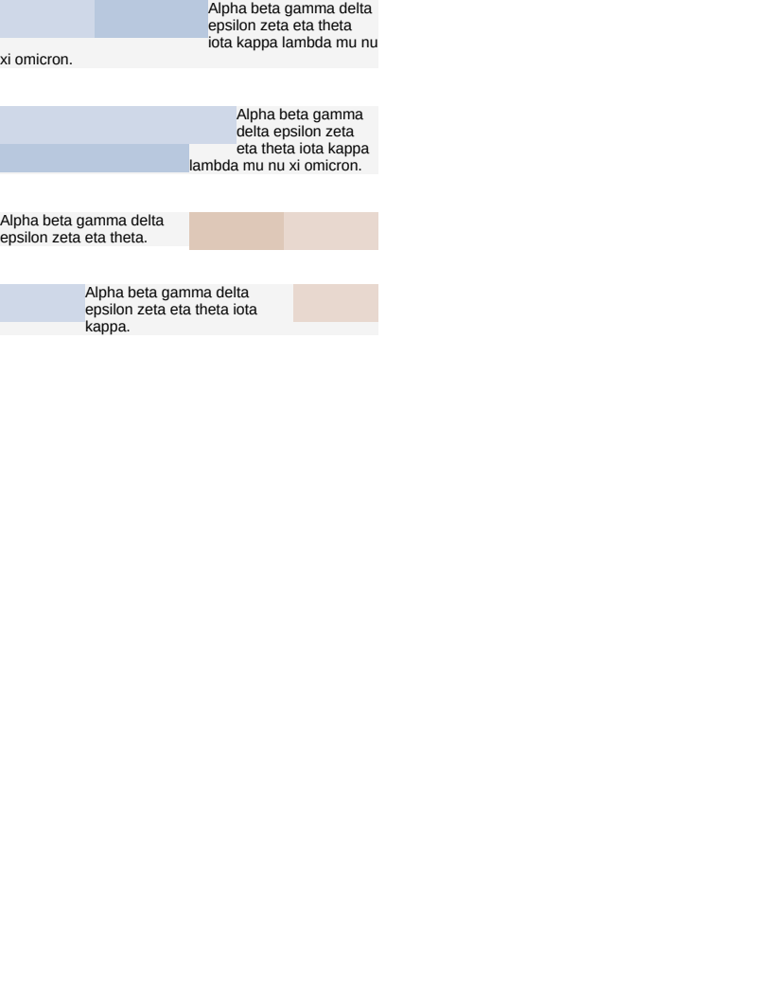 |  |


## image/block_centred

A block-level image centred by auto margins. The width comes from the image rather than from the
container, and the leftover space is then split between the margins exactly as it would be for a
div of the same width.

**Boxes**: 3 matched, worst offset 0.00px, worst size 0.00px.

| Reference (Chrome) | Krilla.Html |
| --- | --- |
| **Page 1** | **Page 1. AE 0.0000 · SSIM 1.0000** |
| 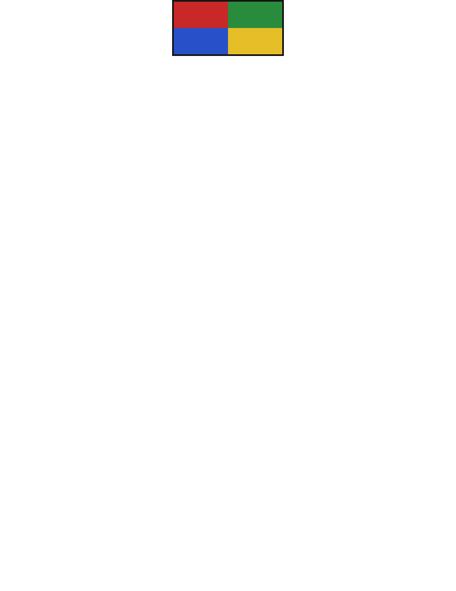 |  |


## image/data_uri

A data URI, the one image source that carries its own bytes and needs no file access at all. Sizing
is otherwise identical to a file source, so this measures the decoding path rather than the layout.

**Boxes**: 3 matched, worst offset 0.00px, worst size 0.00px.

| Reference (Chrome) | Krilla.Html |
| --- | --- |
| **Page 1** | **Page 1. AE 0.0000 · SSIM 1.0000** |
|  |  |


## image/inline_flow

An image is an atomic inline: it flows on the line like a word, breaks before or after but never
inside, and sits its bottom edge on the baseline. Because it is 32px tall in a 24px line, it pushes
the line's top upward rather than growing it downward, which is what baseline alignment means for a
replaced element.

**Boxes**: 4 matched, worst offset 0.00px, worst size 0.00px.

| Reference (Chrome) | Krilla.Html |
| --- | --- |
| **Page 1** | **Page 1. AE 0.0006 · SSIM 0.9999** |
|  |  |


## image/intrinsic

An image with no width or height takes its intrinsic size: 64x32 CSS pixels, one per image pixel.
The wrapper exists so the image's own box is visible against a background rather than against the
page.

**Boxes**: 4 matched, worst offset 0.00px, worst size 0.00px.

| Reference (Chrome) | Krilla.Html |
| --- | --- |
| **Page 1** | **Page 1. AE 0.0000 · SSIM 1.0000** |
|  |  |


## image/max_width

max-width clamping with the height left auto. The declared 600px width is clamped to the 150px
container, and the height must be rescaled by the same factor to 75px. Skipping that rescale is how
images end up distorted inside responsive containers, so this scenario exists to catch it.

**Boxes**: 4 matched, worst offset 0.00px, worst size 0.00px.

| Reference (Chrome) | Krilla.Html |
| --- | --- |
| **Page 1** | **Page 1. AE 0.0000 · SSIM 1.0000** |
| 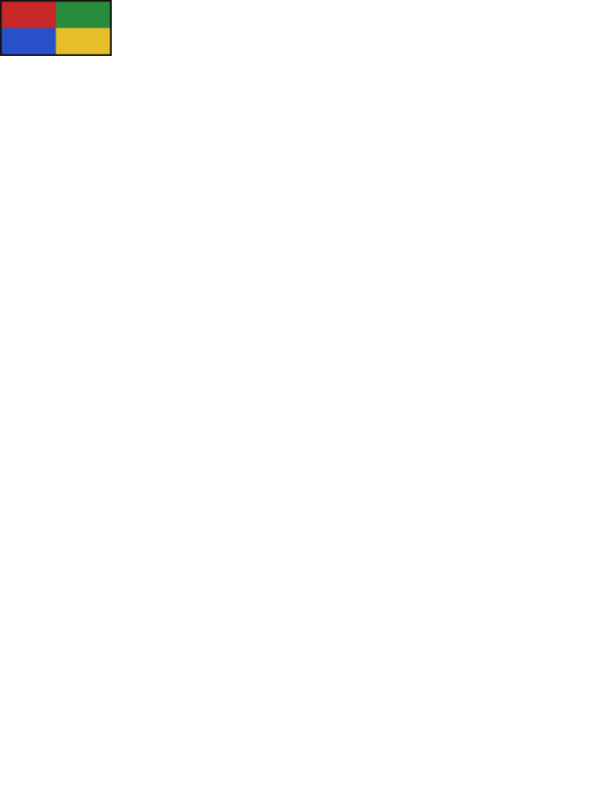 |  |


## image/object_fit

# image/object_fit

Pixel-identical to Chrome. Four values, one image, one box — and the box is the same 160x60 in all
four rows, which is the point: `object-fit` changes what is drawn INSIDE a replaced element's box
and never the box itself. The geometry comparison confirms that for free.

The swatch is 64x32 and the box is 160x60, deliberately a different aspect ratio, because the four
values are indistinguishable when the two agree. Measured against Chrome:

- **`fill`** stretches to the whole 160x60, ignoring the image's proportions. It is what this
  engine already did, so it is here as the control.
- **`contain`** scales to fit inside: 120x60, centred, leaving 20px of frame either side.
- **`cover`** scales to cover: 160x80, clipped to the box's height.
- **`none`** draws at the intrinsic 64x32, centred, at x=48 and y=14.

The centring is `object-position`'s initial value and is not separately implemented — a document
naming a different position gets the centre, which the diagnostic table does not yet cover.

A clip is pushed only where the content can reach outside the box, which is `cover` and an
oversized `none`. Every clip is a graphics state push in the PDF, and `fill` and `contain` never
need one.

The frame carries a background so the letterboxing `contain` leaves reads as itself rather than as
blank paper — without it, a `contain` that silently fell back to `fill` and one that worked would
both look like a picture on white.

What to look at: the left and right edges of `#contain` and the top and bottom of `#cover`. Ink
reaching the frame's edge in `#contain` is a fallback to `fill`; ink outside the box in `#cover` is
the missing clip.

**Boxes**: 10 matched, worst offset 0.00px, worst size 0.00px.

| Reference (Chrome) | Krilla.Html |
| --- | --- |
| **Page 1** | **Page 1. AE 0.0000 · SSIM 1.0000** |
| 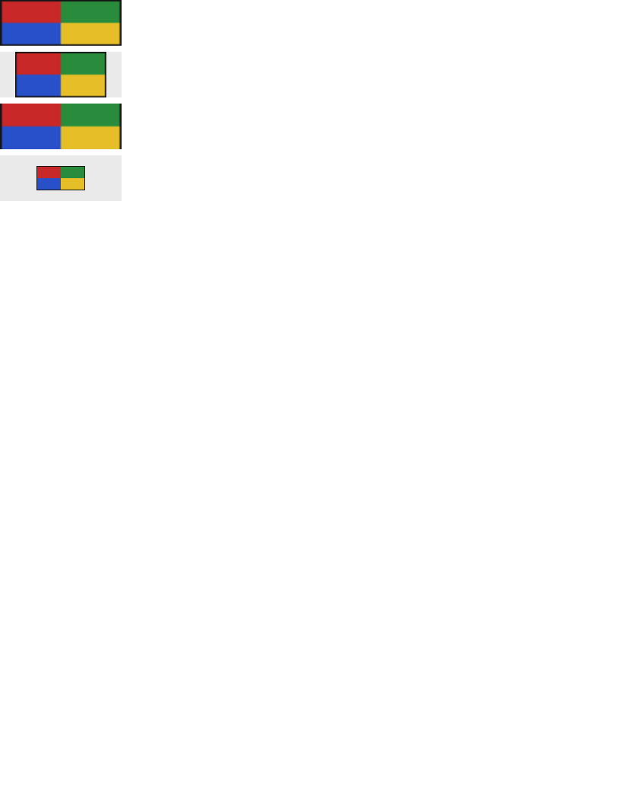 |  |


## image/object_position

# image/object_position

Pixel-identical to Chrome. The last of the four properties named in the diagnostic audit as read by
nothing, and the smallest: it was silently the centre for every document that asked for anything
else.

`object-position` follows exactly the rule `background-position` follows, which is worth stating
because it is not the rule the syntax suggests. A percentage does not offset by a fraction of the
box: it aligns that fraction of the CONTENT with the same fraction of the box, so `25%` of the 96px
left over is 24px rather than 40. `left`/`top` are `0%`, `right`/`bottom` are `100%`, and the
initial `50% 50%` is the centring that was already there.

Every box is the same 160x60 and the image the same 64x32, so the geometry comparison confirms for
free what `object-fit` established: the property changes what is drawn inside the box and never the
box. `object-fit: none` on the first five rows keeps the content at its intrinsic size, which is
what makes the offsets readable as offsets.

`#covered` is the row that needs the property to apply AFTER the fit rather than before. Under
`cover` the content is scaled to 160x80 in a 60px box, so the vertical slack is negative and
`bottom` resolves to -20 — choosing which band of the image survives the clip. Applying the position
to the unscaled content instead would put it nowhere near.

What to look at: the left edge of `#proportional` at 24px, and `#lengths` at 20px. Equal values
there mean percentages are being treated as fractions of the box.

**Boxes**: 8 matched, worst offset 0.00px, worst size 0.00px.

| Reference (Chrome) | Krilla.Html |
| --- | --- |
| **Page 1** | **Page 1. AE 0.0000 · SSIM 1.0000** |
| 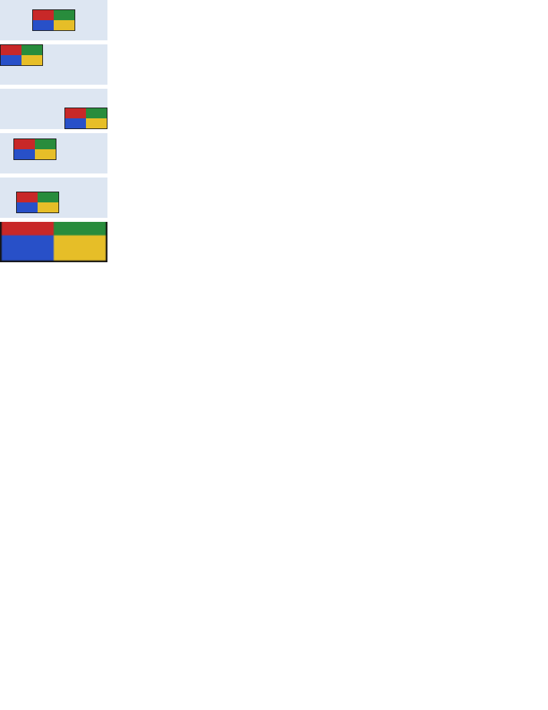 |  |


## image/percent_width

# image/percent_width

A percentage width on a replaced element, with a surround thick enough to tell the two mistakes
apart.

`#plain` is 330 wide: the 50% resolves against the container's 600 and gives 300px of picture, then
the padding and border are added. The tempting reading — take the element's own surround off the
container first, then halve what is left — gives 315, and it is wrong in the direction that makes a
padded image narrower than an unpadded one asking for the same share.

`#inside` is `border-box`, so the 300 is the whole box and 270px of it is picture.

The heights are the check that the ratio is applied to the CONTENT box in both cases. The swatch is
64x32, so `#plain` is 150px of picture inside 180px of box and `#inside` is 135 inside 165 — a
box-sizing bug that only touched the width would leave both heights at 150.

`#ratio` declares a HEIGHT instead, under `border-box` and with padding that is not uniform — 10px
top and bottom against 30px left and right. Its 120px box holds 90px of picture, which the ratio
turns into 180px of width and 250px of box. It is here because the vertical surround has to be its
own quantity: deflating the declared height by the horizontal pair instead gives 50px of picture,
100px of width and a 170px box, and the error arrives on the axis nobody declared. That is exactly
the bug this scenario caught while it was being written.

**Boxes**: 6 matched, worst offset 0.00px, worst size 0.00px.

| Reference (Chrome) | Krilla.Html |
| --- | --- |
| **Page 1** | **Page 1. AE 0.0000 · SSIM 1.0000** |
| 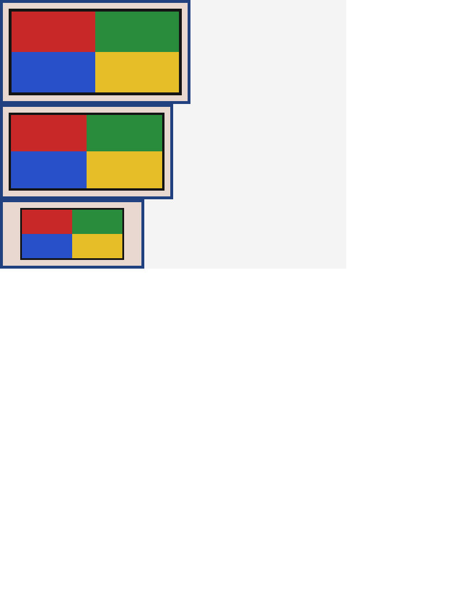 |  |


## image/sized

The three sizing paths. Width alone gives 192x96 from the 2:1 ratio; height alone gives 192x96 the
other way; both given wins over the ratio and the image is deliberately distorted to 150x150. The
width and height content attributes are presentational hints, which AngleSharp does not surface as
declarations, so they are applied after the cascade.

**Boxes**: 5 matched, worst offset 0.00px, worst size 0.00px.

| Reference (Chrome) | Krilla.Html |
| --- | --- |
| **Page 1** | **Page 1. AE 0.0000 · SSIM 1.0000** |
| 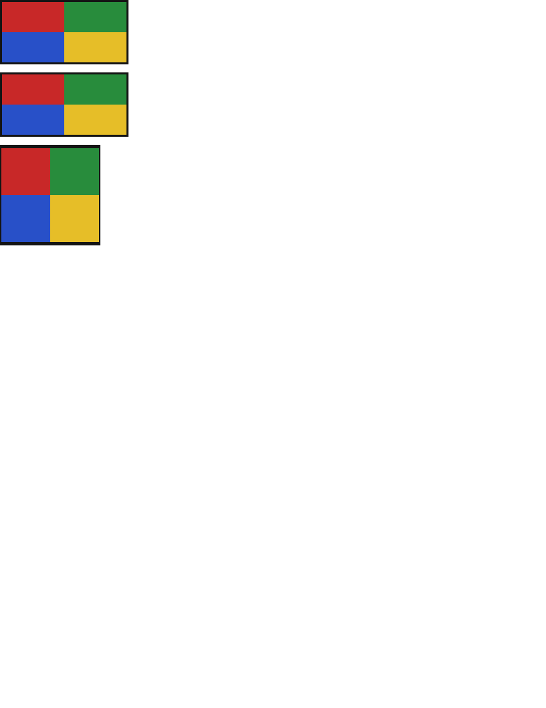 |  |


## image/svg

The first vector image in the corpus. Six rows, and the middle three measure things a raster image
cannot be asked.

`#intrinsic` takes its size from the root element's `width` and `height` attributes, exactly as a
PNG takes its from the IHDR chunk. `#wide` gives a width alone and the height follows from the
ratio — the same sizing path `image/sized` measures, the point here being that the ratio came out
of the SVG's header rather than out of a decoded bitmap.

`#viewbox` and `#inline` are the rows with no raster equivalent, and they found the rule. Their
documents declare no `width` or `height` at all, only a `viewBox`, and SVG's own specification
defaults those attributes to `100%` rather than leaving them absent — so such an image has an
aspect ratio and NO intrinsic size, and the percentage resolves against the containing block.
Chrome makes `#viewbox` 816 wide, the full content width, and `#inline` 400, the width of the `p`
that holds it. Neither is the 40 its viewBox names, and neither is the 300 of the default object
size that CSS 2.1's rule for a replaced element with no intrinsic width would give. That it holds
for the inline row as well as the block one is what says this is a percentage resolving, rather
than a block box's `width: auto` filling its container.

`#fitted` is `object-fit: contain` over a box whose ratio differs from the image's, where a vector
image and a raster one have to behave identically: the property never changes the box, only what is
drawn inside it, so the grey background shows the letterboxing.

`#tall` is 800px inside a page whose content is 1056, placed 884 down, so it straddles a boundary.
It found a defect that had nothing to do with SVG: a block-level replaced element was not treated
as an unbreakable unit, so the page break landed inside the picture and its top was drawn on the
page before. Chrome moves it whole. No raster scenario could reach this — it needs an image close
to a page tall, and every other image in the corpus is a 64x32 swatch. `Paginator.Unbreakable` now
lists it alongside a table row and a `break-inside: avoid` box.

`#text` is the row that says SVG text draws at all. usvg resolves text while it PARSES and matches
families itself, so it cannot be handed the face `FontSet` would pick — `ImageStore` loads every
registered face into a database of its own and makes the fallback's family the default. Without
that the label is silently absent, which is the worst way for a chart to convert. It reads 0.9988
rather than 1.0000, the sub-pixel glyph positioning every text-bearing scenario in the corpus
carries; the flat-fill rows either side of it are exact.

One limit worth recording, not measured here. An INLINE image taller than a whole page is still
sliced at the page edge rather than moved to a fresh page the way Chrome moves it, because that
path goes through the line breaker rather than through `Paginator.Unbreakable`. `#tall` is
block-level, so it takes the fixed path.

**Boxes**: 10 matched, worst offset 0.00px, worst size 0.00px.

| Reference (Chrome) | Krilla.Html |
| --- | --- |
| **Page 1** | **Page 1. AE 0.0028 · SSIM 0.9988** |
| 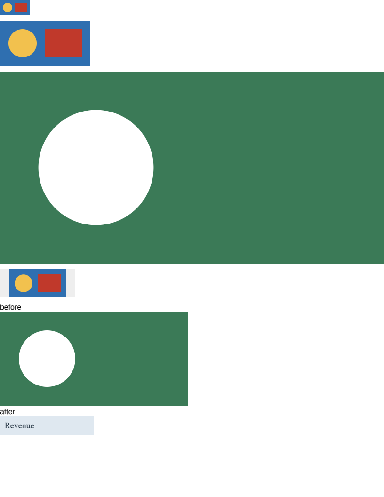 |  |
| **Page 2** | **Page 2. AE 0.0000 · SSIM 1.0000** |
|  |  |


## inline/backgrounds

# inline/backgrounds

A background on an inline element, which was read and not painted — so every highlighted phrase in
every document came out on the paragraph's colour, and nothing said so. The scenario exists because
the corpus had no way to notice: an inline element generates no box, so until text runs started
carrying their element's selector there was nothing for the geometry comparison to match and the
pixels were the only witness.

An inline element's background is **one rectangle per line fragment**, not one around the element.
`#wrapped` is the row that shows why: its highlight breaks across three lines, and a single
rectangle round the lot would colour the blank space at the end of each line and the indent at the
start of the next.

The rectangle is the **font box**, not the line box — the baseline less the whole-pixel ascent, as
tall as that ascent plus the whole-pixel descent. `#leading` gives its paragraph a 40px line height
and the fill stays 17px tall, hugging the text with the leading left uncoloured. Filling the line
box instead is indistinguishable whenever `line-height` is close to the font's own height, which is
most of the time.

`#nested` and `#sized` are the two rows about nesting, and they fail differently:

- `#nested` has a background inside a background. The inner element's text carries the INNER
  element's style, so without recording the ancestor there is nothing to paint the outer one from
  and the highlight has a hole in it exactly where the nested word sits.
- `#sized` has a 24px outer with an 11px inner that has no background of its own. The outer's fill
  behind that word has to be the OUTER element's height — measured against its own font rather than
  the run's — or the highlight narrows to 12px for one word and reads as a rendering fault.

`#clear` is the control: an inline element with no background of its own must paint nothing, which
is what keeps the block's own text from being filled twice over. Text belonging to the block rather
than to any inline element is skipped for the same reason — the block already painted it, and
filling it again is invisible while the colour is opaque and wrong the moment it is not.

The fill is snapped to whole pixels, which is the browser's construction rather than a rounding
convenience. A fragment from 49.81 to 127.21 is filled over columns 50 to 126 with hard edges at
both ends; left as a fractional rectangle it picked up one whole extra column of colour on the
right, because the rasteriser reading the PDF snaps outward where the browser snaps to nearest.
That single column was the whole of the difference between 0.9999 and 1.0000.

Padding and a border on an inline element are still not drawn, and are reported. That is a layout
question rather than a painting one: horizontal padding advances the text after it.

Geometry is exact on all sixteen boxes and the page reads SSIM 1.0000, with the residual confined
to glyph edges at 24px.

What to look at: the left and right ends of each highlight, and the gap between the fill and the
paragraph edge in `#leading`.

**Boxes**: 16 matched, worst offset 0.00px, worst size 0.00px.

| Reference (Chrome) | Krilla.Html |
| --- | --- |
| **Page 1** | **Page 1. AE 0.0002 · SSIM 1.0000** |
| 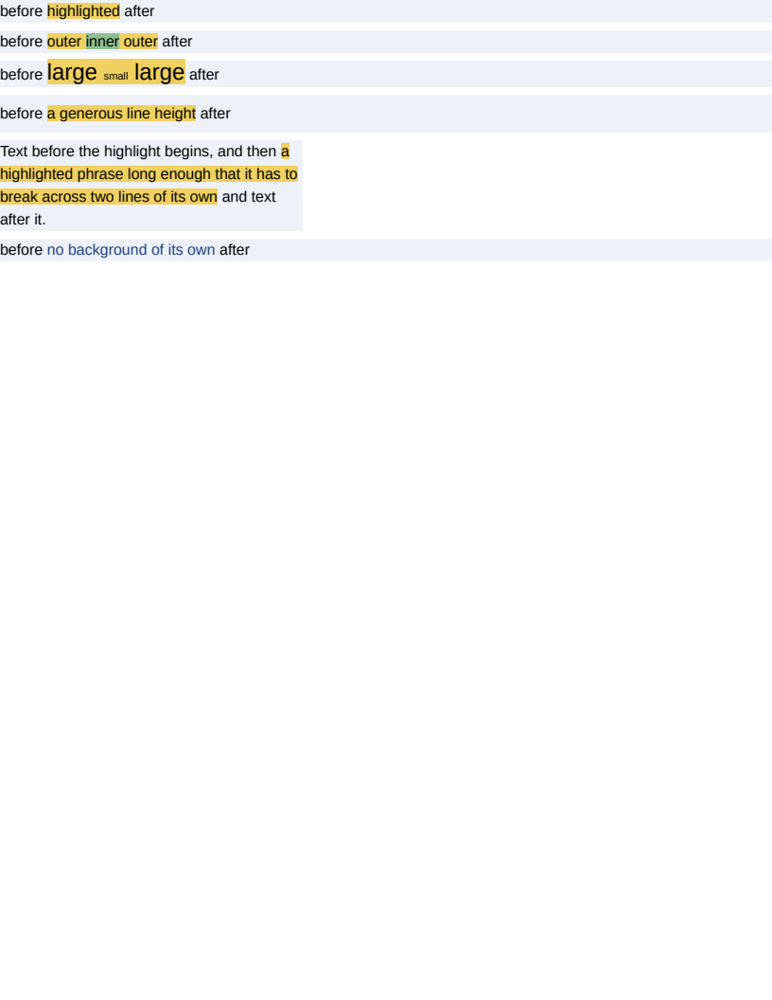 |  |


## inline/font_size_em

The em trap. A relative font-size resolves against the PARENT size, while every other em in the
same rule resolves against the size being computed. So the inner box is 16px with 8px of padding,
not 16px with 10px. A unitless line-height multiplies each element's own size.

**Boxes**: 5 matched, worst offset 0.00px, worst size 0.00px.

| Reference (Chrome) | Krilla.Html |
| --- | --- |
| **Page 1** | **Page 1. AE 0.0000 · SSIM 1.0000** |
| 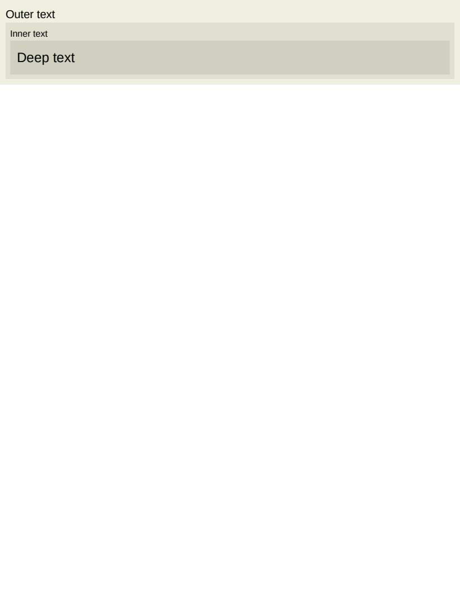 |  |


## inline/font_style

Italic resolves to the italic file. Style is matched before weight in CSS font matching, because a
wrong slant reads as a different face while a wrong weight reads as the same face rendered lighter.

**Boxes**: 4 matched, worst offset 0.00px, worst size 0.00px.

| Reference (Chrome) | Krilla.Html |
| --- | --- |
| **Page 1** | **Page 1. AE 0.0000 · SSIM 1.0000** |
|  |  |


## inline/font_weight

Weight selection resolves to a different file, not a synthesised emboldening. Liberation is
metric-compatible with Arial, so many individual glyphs have identical advances in both weights and
the difference only accumulates over a sentence.

**Boxes**: 4 matched, worst offset 0.00px, worst size 0.00px.

| Reference (Chrome) | Krilla.Html |
| --- | --- |
| **Page 1** | **Page 1. AE 0.0000 · SSIM 1.0000** |
| 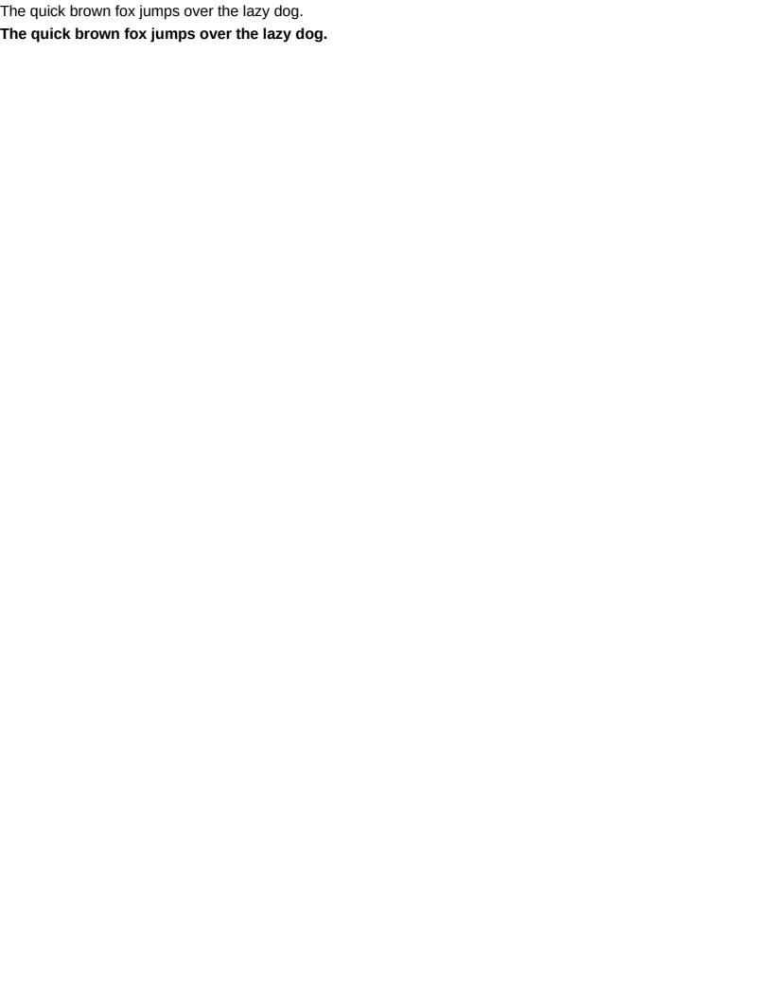 |  |


## inline/hyphen_breaks

# inline/hyphen_breaks

Where a dash offers a line break. Each box is 120px holding about 165px of text, so one line means
no opportunity was taken and two means one was — which makes every row a yes-or-no answer rather
than a measurement to interpret.

It exists because the engine had no opportunity anywhere but a space. A hyphenated word was one
unbreakable token, so `page-break-inside` in a narrow column overflowed where a browser wrapped it
after `page-`. That was found by the `page/break_inside` scenario, whose card text happened to
contain the word, and reworded out of it so that scenario measured one thing.

The rules here were measured out of Chrome one arrangement at a time rather than read off UAX #14,
and the reason to bother is that the obvious exceptions turn out not to exist:

- **A hyphen between digits breaks.** `1234567890-1234567890` wraps. There is no numeric-context
  rule to implement, which the specification's own numeric sequence rules would have suggested.
- **A LEADING hyphen breaks**, leaving the dash alone on the line above with the whole word below
  it. Suppressing that is the other exception a careful reading suggests, and it is wrong.
- **A hyphen followed by digits breaks**, likewise.
- **A run of dashes breaks after the LAST of the run**, and that needs no rule of its own. Every
  dash offers an opportunity and greedy line breaking takes the last one that fits, so `a--b` keeps
  both dashes on the line above by arithmetic rather than by special case.
- **A dash with nothing after it offers nothing.** The `trailing` row stays on one line.
- **The en and em dashes break; U+2011 and the solidus do not.** The non-breaking hyphen not
  breaking is the whole of its purpose. The solidus is worth stating because a URL is the obvious
  thing a reader expects to wrap, and Chrome does not wrap one.

`&shy;` is absent because it is not implemented. It is a break opportunity in a browser AND paints
a hyphen only when the break falls there, which is a conditional glyph rather than a break rule.

Geometry and pixels are both exact against Chrome.

What to look at: the line count per row, which is the whole assertion. `non-breaking` or `solidus`
growing to two lines means the dash set has been widened too far; `plain` collapsing to one means
splitting stopped happening at all.

**Boxes**: 13 matched, worst offset 0.00px, worst size 0.00px.

| Reference (Chrome) | Krilla.Html |
| --- | --- |
| **Page 1** | **Page 1. AE 0.0000 · SSIM 1.0000** |
| 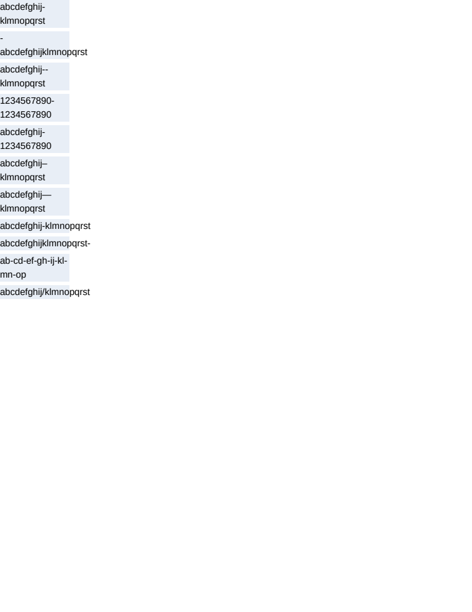 |  |


## inline/inline_block

# inline/inline_block

`display: inline-block` used to lay out as a block and report a diagnostic, so a row of anything
built out of it became a column. It is now an atomic inline: one unbreakable box on a line, with
contents laid out as a block in a formatting context of its own.

What separates it from the other atomic inline the engine already had is the baseline, and three of
these four arrangements are about that.

- **`#baseline`** — one line of content. Its baseline is its own line's, so the text inside it and
  the text beside it sit on the same baseline. An image would put its bottom edge there instead.
- **`#two`** — two lines of content. CSS 2.1 §10.8.1 takes the LAST line's baseline, so the box
  hangs upward and the text beside it lines up with its second line. Taking the first line's
  instead is the plausible reading, and puts the box a whole line too low.
- **`#empty`** — no in-flow line box at all, which is where the rule falls back to the bottom
  MARGIN edge. That is the image case, reached from the other direction.
- **`#model`** — padding, border and margins on all four sides. The horizontal margins hold the
  text away exactly as the border box does, which is why the token measures the margin box rather
  than the border box; the vertical ones do not collapse with anything, the box establishing its
  own formatting context.

What to look at when it moves: any of the four boxes on a line of its own is the atomic-inline
path being lost entirely. `#two` a line too low is the first-line baseline. `#baseline` sitting a
few pixels low with its text still aligned is half-leading, not this.

**Boxes**: 11 matched, worst offset 0.00px, worst size 0.00px.

| Reference (Chrome) | Krilla.Html |
| --- | --- |
| **Page 1** | **Page 1. AE 0.0000 · SSIM 1.0000** |
| 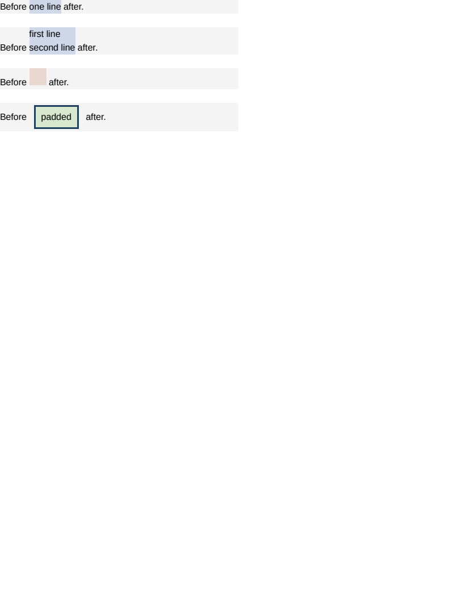 |  |


## inline/inline_block_sizing

# inline/inline_block_sizing

The other half of `inline/inline_block`: how wide an atomic inline gets, and what a line does with
a row of them.

- **`#fits`** — two boxes written with no white space between the tags, so there is no space
  between them on the page either. Each is shrink-to-fit at its max-content width.
- **`#spaced`** — the same two with a newline between the tags, which collapses to one space and
  separates them. It is the difference behind every `font-size: 0` hack in the wild, and it is
  measurable rather than a curiosity.
- **`#wraps`** — three 90px boxes with 8px margins. 294 fits and 392 does not, so the third moves
  to a second line: a line breaks before or after an atomic inline and never inside it.
- **`#squeezed`** — content wider than the container. Shrink-to-fit is
  `min(max(min-content, available), max-content)`, the same rule `BlockLayout.ShrinkToFit` gives a
  float, so the box takes the whole 300px and wraps inside itself rather than overflowing.

What to look at when it moves: `#fits` and `#spaced` rendering identically means white space
between the boxes is being dropped or invented. `#wraps` on one line means the box is being
measured to its border box rather than its margin box. `#squeezed` overflowing means shrink-to-fit
took the max-content width without clamping to what was available.

**Boxes**: 14 matched, worst offset 0.00px, worst size 0.00px.

| Reference (Chrome) | Krilla.Html |
| --- | --- |
| **Page 1** | **Page 1. AE 0.0002 · SSIM 1.0000** |
|  |  |


## inline/justify

Justification stretches the spaces on every line but the last. Distributing the slack evenly across
gaps is the simplest of several defensible rules, so some disagreement with the browser here is
expected and informative rather than a defect to chase.

**Boxes**: 3 matched, worst offset 0.00px, worst size 0.00px.

| Reference (Chrome) | Krilla.Html |
| --- | --- |
| **Page 1** | **Page 1. AE 0.0001 · SSIM 1.0000** |
| 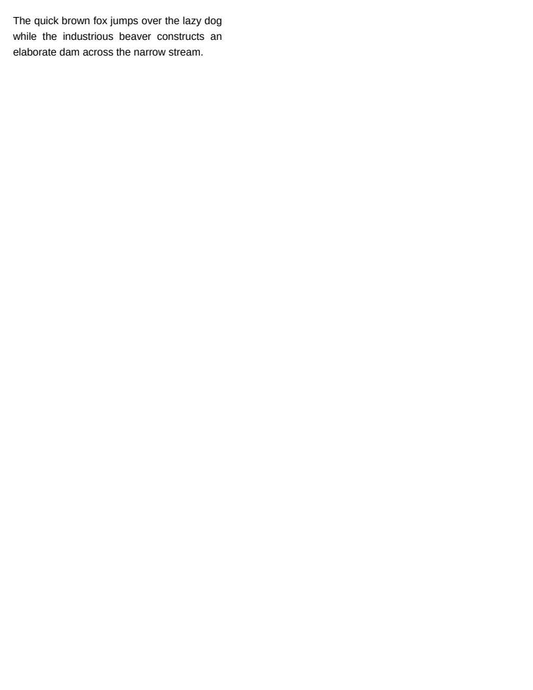 |  |


## inline/line_height

Half-leading in both directions. The extra space of a large line-height is split evenly above and
below the text rather than hung underneath, and a line-height smaller than the natural height makes
lines overlap rather than clip.

**Boxes**: 4 matched, worst offset 0.00px, worst size 0.00px.

| Reference (Chrome) | Krilla.Html |
| --- | --- |
| **Page 1** | **Page 1. AE 0.0000 · SSIM 1.0000** |
|  |  |


## inline/line_height_normal

Probes what `normal` resolves to, which no stylesheet states: it comes from the font ascent,
descent and line gap, and from whether OS/2 asks for its typographic metrics to win over hhea.
Deliberately isolated, because every other text scenario sets line-height explicitly so that this
one question cannot contaminate them.

**Boxes**: 5 matched, worst offset 0.00px, worst size 0.00px.

| Reference (Chrome) | Krilla.Html |
| --- | --- |
| **Page 1** | **Page 1. AE 0.0000 · SSIM 1.0000** |
| 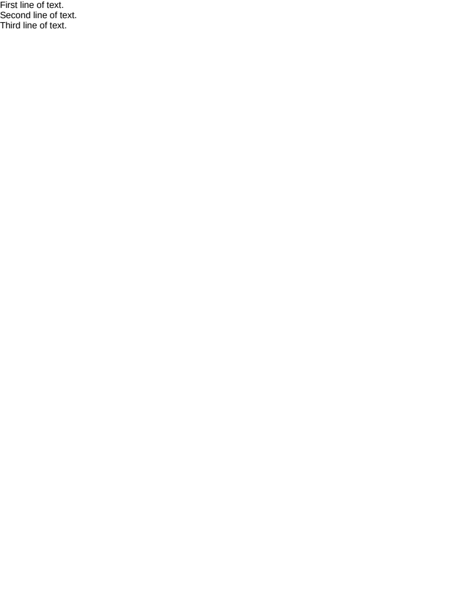 |  |


## inline/nested_inline

Runs of different faces on one line. A line takes its height from the tallest inline box on it and
its baseline from the deepest, so a mismatched face changes both the wrap points and the line
positions. Note the explicit b and i rules: the shared reset flattens the UA stylesheet, so these
elements carry no styling of their own until a scenario gives them some.

**Boxes**: 7 matched, worst offset 0.00px, worst size 0.00px.

| Reference (Chrome) | Krilla.Html |
| --- | --- |
| **Page 1** | **Page 1. AE 0.0000 · SSIM 1.0000** |
|  |  |


## inline/padded

**Boxes**: 15 matched, worst offset 0.00px, worst size 0.00px.

| Reference (Chrome) | Krilla.Html |
| --- | --- |
| **Page 1** | **Page 1. AE 0.0001 · SSIM 1.0000** |
| 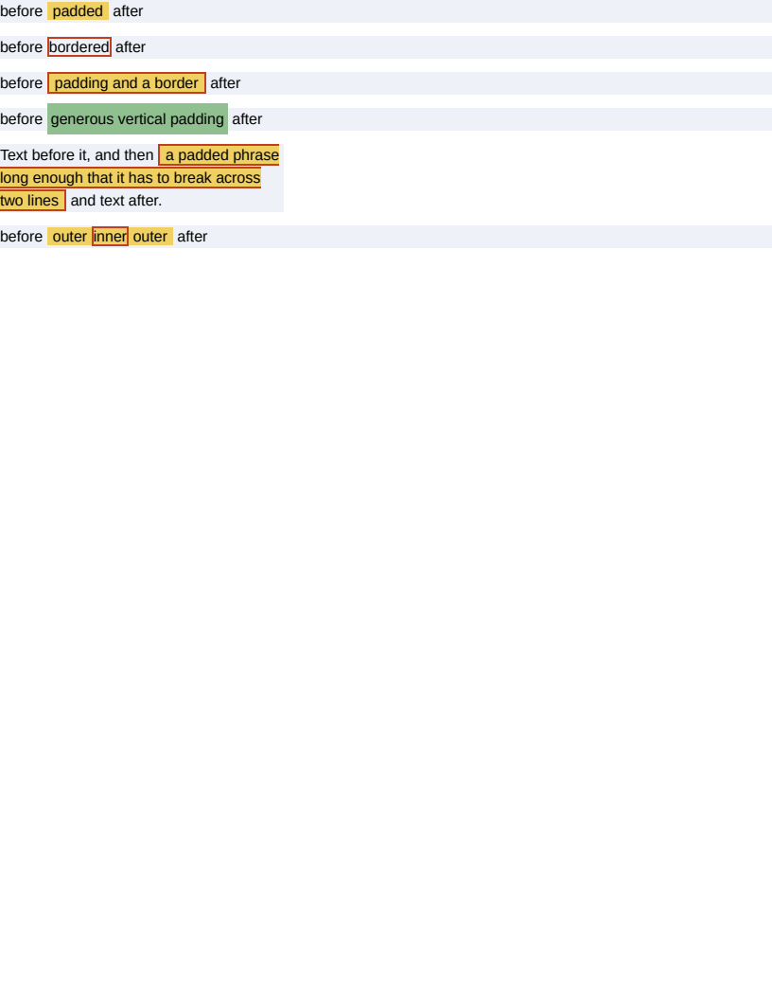 |  |


## inline/simple_text

One line, one font, one explicit line-height. The narrowest possible test of text measurement: if
the advances are wrong this line is the wrong width, and every other scenario in the category
inherits the error.

**Boxes**: 3 matched, worst offset 0.00px, worst size 0.00px.

| Reference (Chrome) | Krilla.Html |
| --- | --- |
| **Page 1** | **Page 1. AE 0.0000 · SSIM 1.0000** |
| 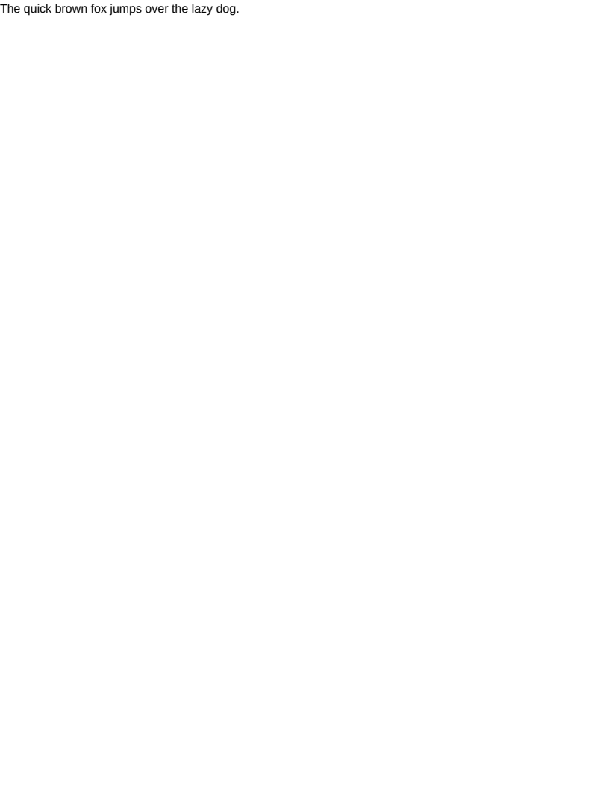 |  |


## inline/text_align

Alignment moves runs within the line box without changing the paragraph geometry, so the boxes here
should match exactly while the pixels carry the whole signal. A scenario where the two metrics
deliberately disagree about what they can see.

**Boxes**: 5 matched, worst offset 0.00px, worst size 0.00px.

| Reference (Chrome) | Krilla.Html |
| --- | --- |
| **Page 1** | **Page 1. AE 0.0000 · SSIM 1.0000** |
| 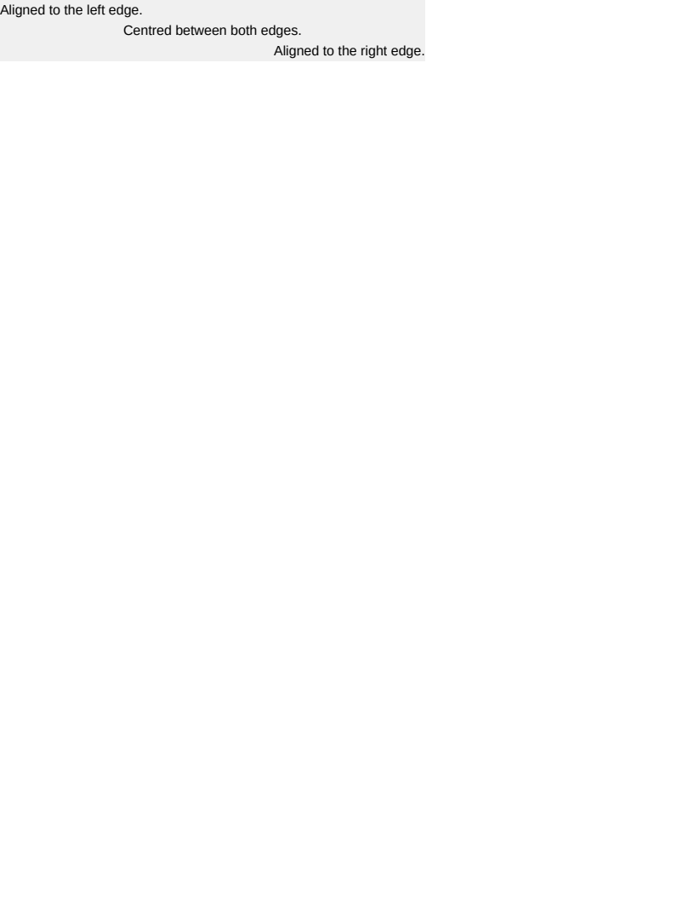 |  |


## inline/text_indent

# inline/text_indent

`text-indent` was read by nothing and reported by nothing, so every indented paragraph in a
document laid out flush and the difference was invisible to the sink. It is now applied to the
first line of a block container, which is the only line it applies to.

Three arrangements, because the property has three separable behaviours:

- **`#prose`** — declared on the container and inherited. Both paragraphs are indented, and the
  second line of each is not. Applying it where it is declared rather than where the line is
  generated indents the first paragraph only, which is the failure `body { text-indent: 2em }`
  would produce in a real document.
- **`#hanging`** — a negative value, which puts the first line outside the content box. The
  container carries a left margin so the hang has somewhere to go.
- **`#centred`** — an indent NARROWS the band rather than shifting it, so the centred first line
  is centred in what is left and not merely pushed right by the whole indent.

The intrinsic widths carry it too, which nothing here measures: a table cell or a shrink-to-fit
float would otherwise be sized without room for the indent and wrap a line that was supposed to
fit.

What to look at when it moves: the second paragraph of `#prose` flush with the first line's edge
is inheritance lost. Every line indented is the property being applied per line rather than per
block. `#centred`'s first line pushed right by the full 60px is the indent shifting the band
instead of narrowing it.

**Boxes**: 9 matched, worst offset 0.00px, worst size 0.00px.

| Reference (Chrome) | Krilla.Html |
| --- | --- |
| **Page 1** | **Page 1. AE 0.0005 · SSIM 0.9999** |
| 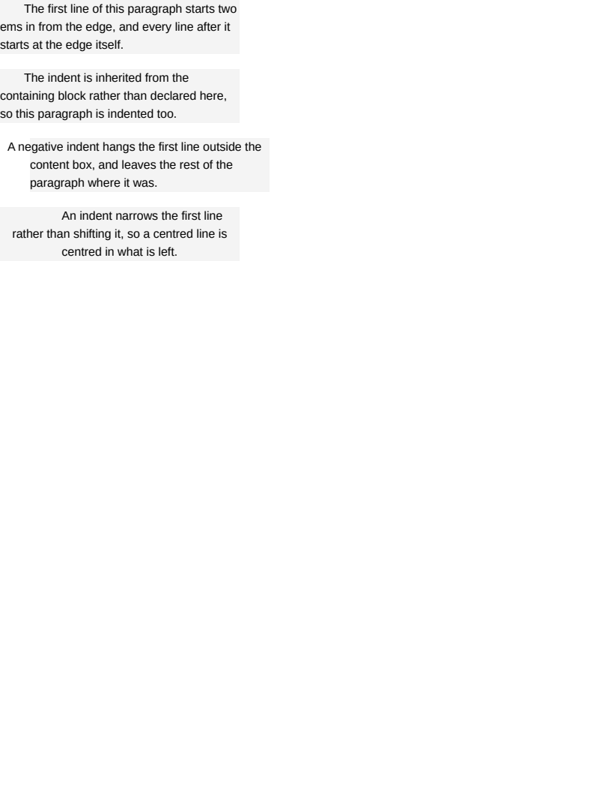 |  |


## inline/vertical_align

# inline/vertical_align

Seven keywords, each aligning an inline-block of a known height so the offset is readable straight
out of the reference geometry rather than having to be backed out of a font's ascent. The boxes are
EMPTY on purpose: an inline-block holding a line of text takes that line's baseline, which would
fold the inherited line-height into every number here, while an empty one falls back to its bottom
margin edge.

Only the table-cell half of `vertical-align` was honoured before. `<sub>` and `<sup>` sat flat on
the baseline, which is ordinary prose rendering wrongly rather than an exotic gap, and nothing
reported it.

The line is 32px on a 16px font, so the baseline sits 21px down — floor the half-leading, then add
the whole-pixel ascent, which is what this engine already did for line boxes and what the browser
turns out to agree with here. Against that baseline:

- **`text-top`** puts the box top at baseline − ascent, and **`text-bottom`** the box bottom at
  baseline + descent, both using the ROUNDED metrics. The measured offsets are exactly 7 and 4.
- **`middle`** puts the box's midpoint half an x-height above the baseline, and reads the x-height
  UNROUNDED — the ratio holds at 0.5283 of the size at 16, 24 and 32 pixels, which is this face's
  `sxHeight` over its em.
- **`top`** and **`bottom`** pin to the line box rather than the baseline, so they are resolved
  after everything else on the line has been counted.
- **`super`** and **`sub`** are user-agent defined, so — as with list markers and
  `line-height: normal` — there is no correct value to compute and agreeing with the browser is the
  only useful target.

The super and sub offsets were measured across three font sizes, and the answer is not a font
metric. They are linear in the font SIZE with an intercept of exactly one pixel: `size / 3 + 1`
raised and `size / 5 + 1` lowered. The OS/2 table's own superscript offset for this face is 7.63px
at 16px where the browser uses 6.33, so reading the font would have been confidently wrong.

Two further things were measured because they are not obvious:

- The offsets use the PARENT's font, not the aligned box's own. Giving the box its own
  `font-size: 10px` inside a 32px paragraph moves it not at all — which matters, since the default
  stylesheet makes every `<sup>` smaller than its parent.
- Chrome holds lengths on a 1/64 pixel grid and truncates onto it, so a superscript offset of
  16/3 + 1 is stored as 6.328125 rather than 6.3333. That is a fortieth of a pixel and it was still
  visible: the paragraph background painted to the line's fractional bottom row came out a
  different shade. Quantising the offsets took the page from SSIM 0.9969 to 0.9989, and snapping the
  block background fill to whole pixels — done later, for `aspect-ratio`'s fractional heights — took
  the last of it.

`vertical-align` is INHERITED here, which CSS does not do, because the user-agent sheet gives a
table `middle` and its cells `inherit` and a cell can only read the value by being handed it. The
cost is that every run of text inside a cell also arrives carrying `middle`, and line layout must
not act on it. So the inline half applies only where the value was DECLARED and only to a token
that is not the block's own text — two guards, both needed, and without them every table scenario
in the corpus moves at once.

**Residual**: none. SSIM 1.0000. It sat at 0.9989 for a while, on one row of one paragraph where a
box edge landed on a fractional pixel and the browser's background fill snapped to a whole one; that
went when block fills were snapped too. `table/spacing_borders` and `image/inline_flow` still carry
the same cause on a border and an image edge, neither of which is snapped.

What to look at: the offsets, which are the whole assertion. `super` and `sub` are the two that
cannot be derived and so are the two most likely to drift.

**Boxes**: 16 matched, worst offset 0.00px, worst size 0.00px.

| Reference (Chrome) | Krilla.Html |
| --- | --- |
| **Page 1** | **Page 1. AE 0.0000 · SSIM 1.0000** |
| 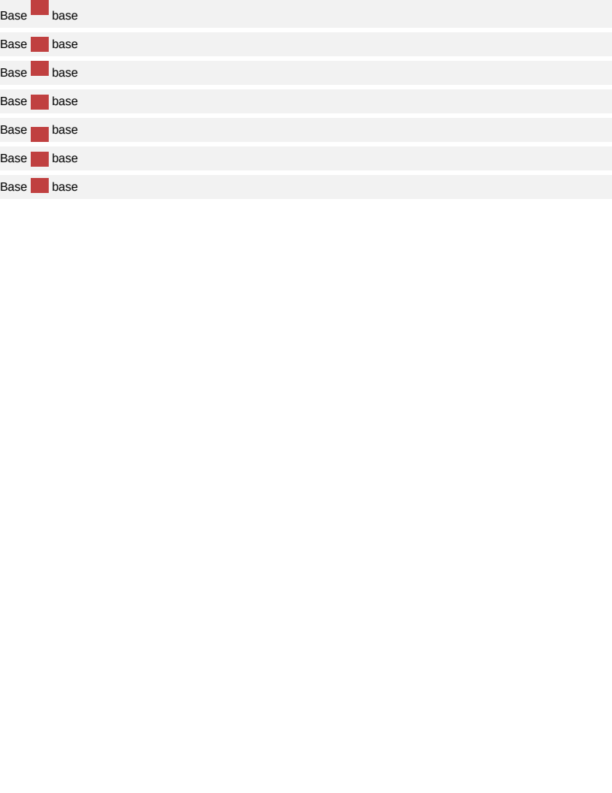 |  |


## inline/vertical_align_length

# inline/vertical_align_length

`vertical-align` given a length or a percentage, which the resolver previously read and dropped
onto `baseline` — so a document raising a footnote marker by 4px rendered it exactly where an
unaligned one goes, and nothing said so.

Two things are measured, and the second was not obvious:

- A **length** raises the box off the baseline, so a negative value lowers it. `#raised` at `6px`
  grows its paragraph from 24px to 30px, because the shifted box carries its whole leading box up
  with it and the line grows to contain both it and the strut.
- A **percentage** resolves against the element's own `line-height`, not its font size. `#proportional`
  at `25%` of a 24px line lands in exactly the place `#raised` at `6px` does — same paragraph
  height, same span position, to the pixel. Resolving it against the 16px font size instead would
  give 4px, which is close enough to look like a rounding error and wrong on every line whose
  height is not its font size.

`#relative` is the row that separates a length from the keywords. Every `vertical-align` KEYWORD in
this engine measures against the parent's font, which is what CSS says for `middle` and what
measurement confirmed for the rest. A length does not: `em` and a percentage are ordinary value
resolution against the element that declared them, so a `0.5em` on a 12px span inside a 16px
paragraph is 6px rather than 8px. Its paragraph comes out 29px tall, which is a number neither
reading of the em produces by accident.

`#none` states `0px` explicitly so the rows above have a baseline to differ from, and because
`vertical-align: 0` genuinely is the baseline — which is why an unparseable value has to fall back
to something distinguishable from zero rather than to `CssLength.Zero`, the same trap
`ResolveFontSize` records.

This is also the scenario that made inline text geometry measurable at all. Its six spans generate
no box of their own, so the comparison had nothing to match them against and reported the scenario
as passing while measuring only the paragraphs. Text runs now carry their element's selector and
the box dump unions their fragments, which took the corpus from eighteen unmatched elements to
none.

Geometry is exact against Chrome on all fourteen boxes, spans included.

What to look at: the paragraph heights — 30, 28, 29, 30, 30, 24. They encode every shift on the
page, since each is the line grown to contain a box that moved.

**Boxes**: 14 matched, worst offset 0.00px, worst size 0.00px.

| Reference (Chrome) | Krilla.Html |
| --- | --- |
| **Page 1** | **Page 1. AE 0.0000 · SSIM 1.0000** |
|  |  |


## inline/white_space

# inline/white_space

`white-space` has five values and the engine implements all of them. `inline/white_space_pre`
measures two — `pre` and `normal` — and the other three had no coverage anywhere, in the corpus or
in a unit test.

Each of the three differs from `pre` in exactly one respect, which is what makes them worth
separating:

- **`pre-wrap`** preserves the spaces and the newline like `pre` does, but also breaks a line that
  runs out of room. Under `pre` the same text would overflow.
- **`pre-line`** collapses the runs of spaces like `normal` does, and keeps the newline. The
  leading indentation on each source line disappears; the break between them does not.
- **`nowrap`** collapses like `normal` and never breaks, so the text runs past the box's right
  edge rather than wrapping at it.

Monospace at 14px, so a column of characters is countable against the reference rather than merely
comparable.

What to look at when it moves: `#wrap` losing its interior spaces is `pre-wrap` being read as
`normal`; `#wrap` overflowing is it being read as `pre`. `#line` keeping its indentation is
`pre-line` preserving what it should collapse, and `#line` on one line is the newline being
dropped. `#nowrap` wrapping at 300px is the whole value being ignored.

**Boxes**: 5 matched, worst offset 0.00px, worst size 0.00px.

| Reference (Chrome) | Krilla.Html |
| --- | --- |
| **Page 1** | **Page 1. AE 0.0002 · SSIM 1.0000** |
| 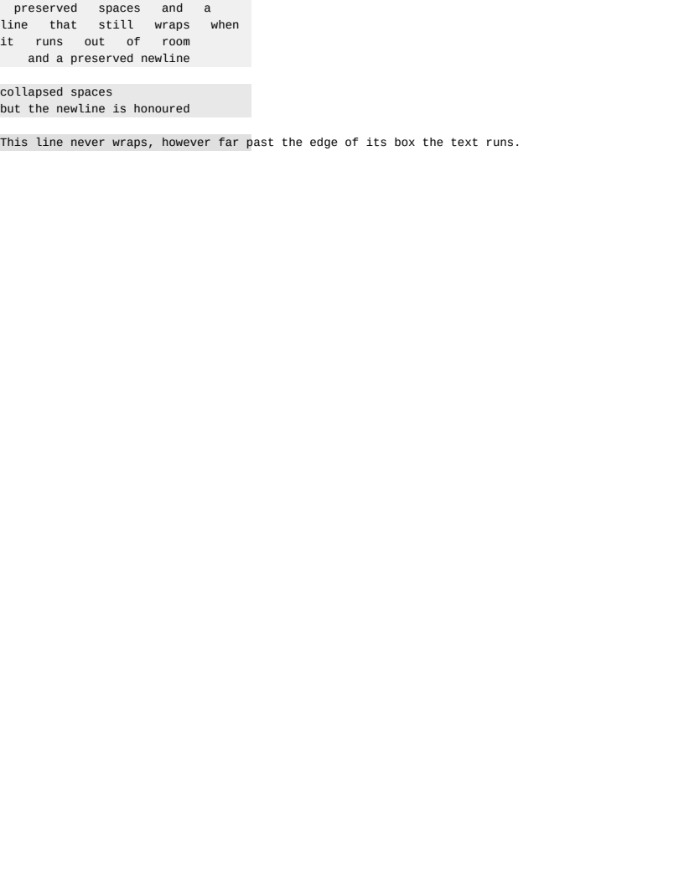 |  |


## inline/white_space_pre

The two halves of white-space processing side by side: preserved above, collapsed below. The pair
matters because collapsing is what stops indented markup from indenting the page, and getting the
phase order wrong only shows up when a newline has spaces around it, which is what all indented
markup is.

**Boxes**: 4 matched, worst offset 0.00px, worst size 0.00px.

| Reference (Chrome) | Krilla.Html |
| --- | --- |
| **Page 1** | **Page 1. AE 0.0000 · SSIM 1.0000** |
|  |  |


## inline/word_joins

# inline/word_joins

The other half of `inline/hyphen_breaks`, and the defect it found. Line breaking used to treat
ADJACENCY as a break opportunity: any two tokens with nothing between them could be split, because
a space was the only thing that ever produced two tokens in the first place. That assumption is
invisible until something else produces two.

`adjacent` is the case that shows it. `<span>abcdefghij</span><span>klmnopqrst</span>` is one word
as far as a browser is concerned — Chrome overflows the 120px box on a single line — and this
engine broke it at the element boundary into two. The same defect covered `<b>` around the first
half of a word, which is ordinary markup rather than a contrived case.

So the fix for hyphens could not be "emit more tokens and let adjacency do the rest": that would
have inherited the bug and rendered `dash-at-join` correctly by accident. A break opportunity is
a property of a token instead — `Token.BreaksBefore` — and every one of the five rows here is a
separate answer to what sets it:

- **`adjacent`** — no opportunity. Two words from two inline elements are one word.
- **`dash-at-join`** — an opportunity, because the first element's text ENDS in a dash. So
  breakability carries across the element boundary even though the boundary itself is not one.
- **`space-at-join`** — an opportunity, from the space, as it always was.
- **`image`** and **`inline-block`** — an opportunity, with no space present. Measured: Chrome
  breaks before an atomic inline that follows text directly. This is the row that keeps the fix
  from over-correcting, since "adjacency is never an opportunity" would wrongly glue an image to
  the word before it.

Geometry and pixels are both exact against Chrome. The `<span>` elements report as unmatched in
the box comparison, which is the corpus's standing behaviour for inline elements rather than
anything this scenario introduced — they generate no box in this engine's tree.

What to look at: `adjacent` is the assertion. Two lines there is the old adjacency rule returning.
Two lines on `image` or `inline-block` becoming one is the over-correction.

**Boxes**: 15 matched, worst offset 0.00px, worst size 0.00px.

| Reference (Chrome) | Krilla.Html |
| --- | --- |
| **Page 1** | **Page 1. AE 0.0000 · SSIM 1.0000** |
|  |  |


## inline/wrapping

Greedy line breaking at spaces. Where each break lands is decided by accumulated advances, so a
measurement error of a fraction of a pixel per glyph eventually moves a word to the next line and
changes the paragraph height. The box comparison catches that far more sharply than the pixel one.

**Boxes**: 3 matched, worst offset 0.00px, worst size 0.00px.

| Reference (Chrome) | Krilla.Html |
| --- | --- |
| **Page 1** | **Page 1. AE 0.0000 · SSIM 1.0000** |
| 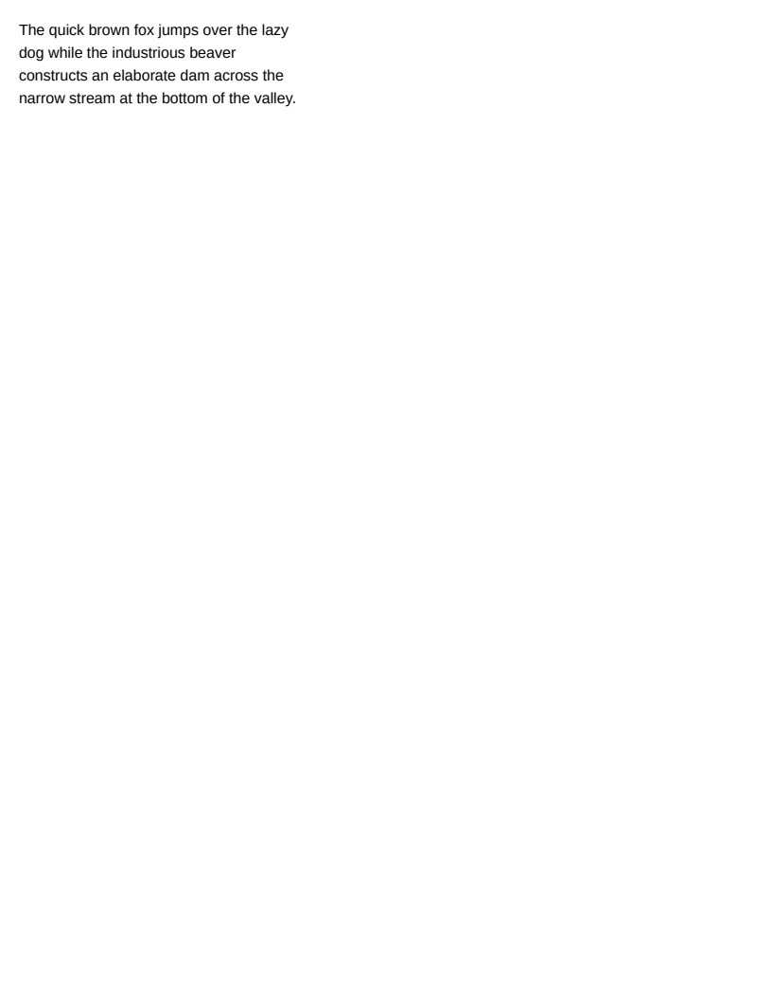 |  |


## link/external

Two external links. Neither the pixel nor the box comparison can see a link annotation — it paints
nothing and is not an element box — so the annotations are read back out of the PDF and recorded in
the snapshot instead. Those two metrics staying at zero is the separate check that adding links
disturbed no layout.

The rectangle covers the text's em box rather than the whole line, so a generous line-height does
not make blank space clickable.

**Boxes**: 6 matched, worst offset 0.00px, worst size 0.00px.

| Reference (Chrome) | Krilla.Html |
| --- | --- |
| **Page 1** | **Page 1. AE 0.0003 · SSIM 1.0000** |
|  |  |


## link/fragment

An internal link, and a broken one. The filler pushes the target onto the second page, so resolving
the fragment has to happen after pagination — a fragment names an element while a PDF internal link
names a page and a point on it.

The second anchor points at an id no element carries. It produces no annotation at all, rather than
one aimed at page one: a link that silently goes somewhere wrong is worse than a link that is not
there. Expect exactly one annotation.

**Boxes**: 8 matched, worst offset 0.00px, worst size 0.00px.

| Reference (Chrome) | Krilla.Html |
| --- | --- |
| **Page 1** | **Page 1. AE 0.0001 · SSIM 0.9999** |
|  |  |
| **Page 2** | **Page 2. AE 0.0000 · SSIM 1.0000** |
|  |  |


## link/wrapped

An anchor spanning several lines. A PDF link is a rectangle, so one that wraps needs one annotation
per line fragment rather than a single box around the lot — a single box would make the blank space
at the end of each line clickable, and on a centred or short line would cover text that is not part
of the link at all.

Expect one annotation per line the anchor touches, each covering only its own fragment.

**Boxes**: 4 matched, worst offset 0.00px, worst size 0.00px.

| Reference (Chrome) | Krilla.Html |
| --- | --- |
| **Page 1** | **Page 1. AE 0.0000 · SSIM 0.9999** |
|  |  |


## page/absolute_break

# page/absolute_break

An absolute box is painted from the root rather than where it was declared, and it is placed in
continuous coordinates by a second pass that runs after flow and knows nothing about pages. Which
page it lands on is therefore decided last, by the painter, from a position computed by neither of
the two stages that produced it.

`#pinned` is declared at the top of a frame that begins on page one and offset to y=1150, which is
past the 1056 boundary. It belongs on page two, 94px down, and appears on page one not at all. The
frame's own line of text is what keeps page one from being a single flat colour, which
`BaselineHealthTests` reads as a page that rendered nothing.

What to look at: the box on page one is the hoisted absolute being assigned to its declaring
parent's page. The box missing entirely is it being clipped against the first page's box after
being assigned correctly — the same distinction `PdfPainter` draws between the page box and
`pageEnd`.

**Boxes**: 5 matched, worst offset 0.00px, worst size 0.00px.

| Reference (Chrome) | Krilla.Html |
| --- | --- |
| **Page 1** | **Page 1. AE 0.0003 · SSIM 1.0000** |
|  |  |
| **Page 2** | **Page 2. AE 0.0000 · SSIM 1.0000** |
| 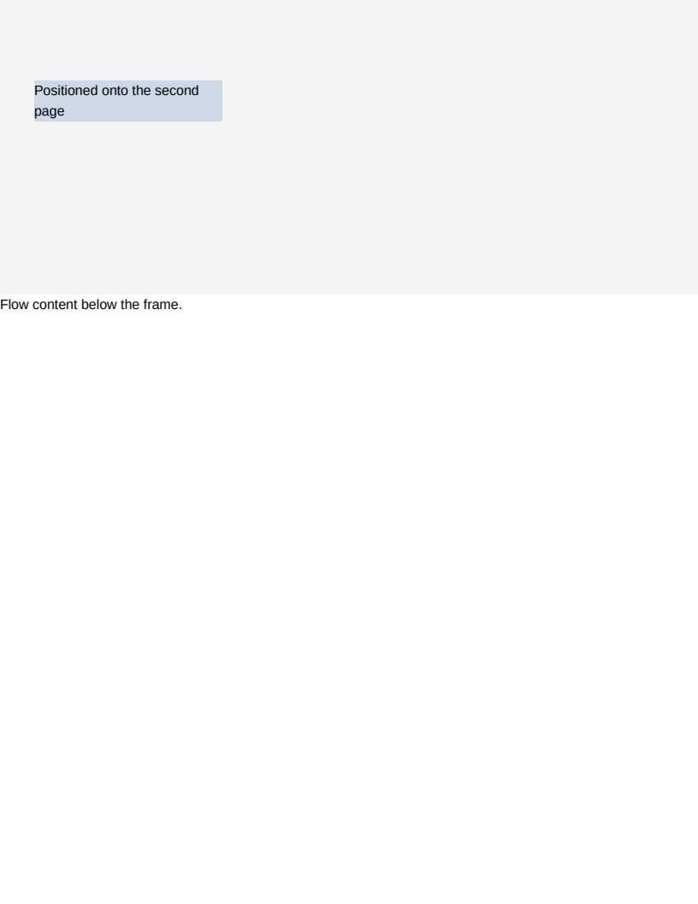 |  |


## page/break_after

# page/break_after

`page-break-after` on the box BEFORE the break, where `page/break_before` declares it on the box
after. The two are the same page in the end, and the scenario exists because getting there is not
the same calculation.

`#one` carries a 40px bottom margin, which is what makes the scenario discriminating: its border
box ends at 48 and `#two` begins at 88, so "break after this box" has two plausible readings that
are 40px apart. Measured out of Chrome before anything was implemented — it starts page two at
`#two`'s top and the margin is gone entirely, never drawn at the foot of page one and never drawn at
the head of page two.

Breaking at the declaring box's own bottom edge instead is the mistake this catches, and it is the
more obvious of the two readings to write: every box on page two lands 40px low, beneath a band of
margin at the top of a page that should open with content. `Paginator.ForcedBreaks` resolves a
`break-after` to the top of the next in-flow box in document order for this reason, which makes
both properties the same thing to the slice — a page starts at some box's top border edge.

A margin is the only thing that separates the two readings, so a version of this scenario without
one would pass against either implementation.

Both pages are pixel-identical to Chrome.

What to look at: whether `#two` sits flush at the top of page two, and whether any part of the
margin appears at the foot of page one.

**Boxes**: 5 matched, worst offset 0.00px, worst size 0.00px.

| Reference (Chrome) | Krilla.Html |
| --- | --- |
| **Page 1** | **Page 1. AE 0.0000 · SSIM 1.0000** |
|  |  |
| **Page 2** | **Page 2. AE 0.0000 · SSIM 1.0000** |
| 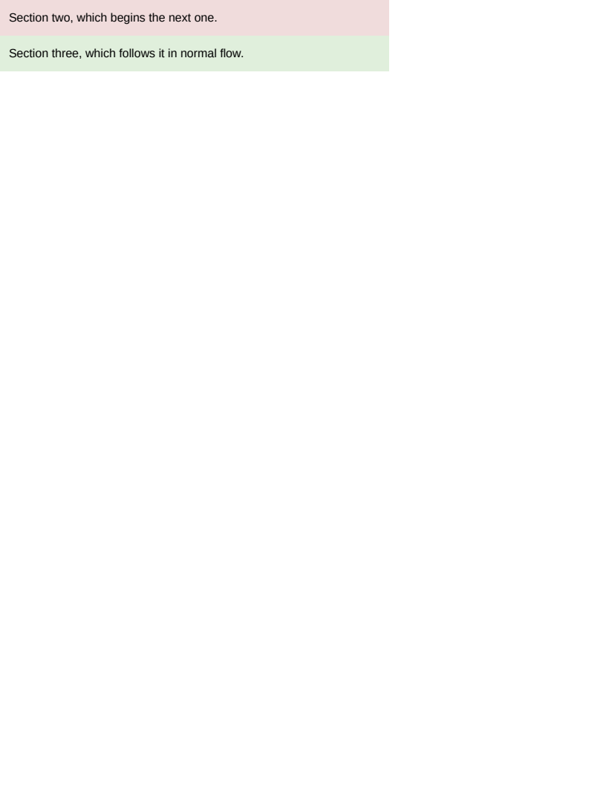 |  |


## page/break_avoid

# page/break_avoid

`break-after: avoid`, which asks that a page not begin directly after the box declaring it — the
property every print stylesheet is written around, since a heading stranded at the foot of a page is
what it exists to prevent.

It was recognised and reported rather than honoured, and the reason was structural: `Paginator`
chooses where a page ends by scanning FORWARD from the unbreakable units below it, and `avoid` asks
for a candidate to be rejected in favour of an earlier one. `break-inside: avoid` was already done,
because that one names a rectangle to keep together and the slice already moves rectangles whole.

The scenario is two headings in the same predicament, and the second is what keeps the first honest:

- **`#kept`** carries the property. Its filler ends at 960 and the heading occupies 960 to 1020, so
  the natural break falls at 1020 — the first line of the paragraph after it, which is where the
  page would end with nothing asking otherwise. Chrome moves the break to 960 and the heading
  travels with its paragraph, leaving page one holding the filler alone.
- **`#loose`** is in exactly the same position on page two, with no constraint, and Chrome leaves
  it at the foot of the sheet. Without it an implementation that moved every break away from every
  heading would pass.

## Where the break goes

To the DECLARING box's own top edge, rather than to the nearest earlier break opportunity. Those
two are not the same thing and the difference matters: the nearest earlier opportunity is a LINE
inside the heading, which splits the very box the property was written to keep whole — its
background above the break and its text below.

So the destination is recorded rather than searched for. `break-after: avoid` on a box points at
that box's own top edge; `break-before: avoid` points at whatever precedes the box in document
order. The two chain, so a run of headings each kept with what follows walks back to the first of
them, and a move that would leave a page holding nothing is refused — `avoid` is a preference and a
break has to happen somewhere.

**Residual**: pages one and three are pixel-identical and page two differs only on glyph edges.

What to look at: the PAGE COUNT and where each page begins, which is all this measures — the box
harvest runs against one continuous layout, so the geometry says the same thing whether the property
was honoured or not. Page one holding the heading is the property being ignored; page two holding
no heading is it being over-applied.

**Boxes**: 8 matched, worst offset 0.00px, worst size 0.00px.

| Reference (Chrome) | Krilla.Html |
| --- | --- |
| **Page 1** | **Page 1. AE 0.0000 · SSIM 1.0000** |
|  |  |
| **Page 2** | **Page 2. AE 0.0045 · SSIM 0.9991** |
| 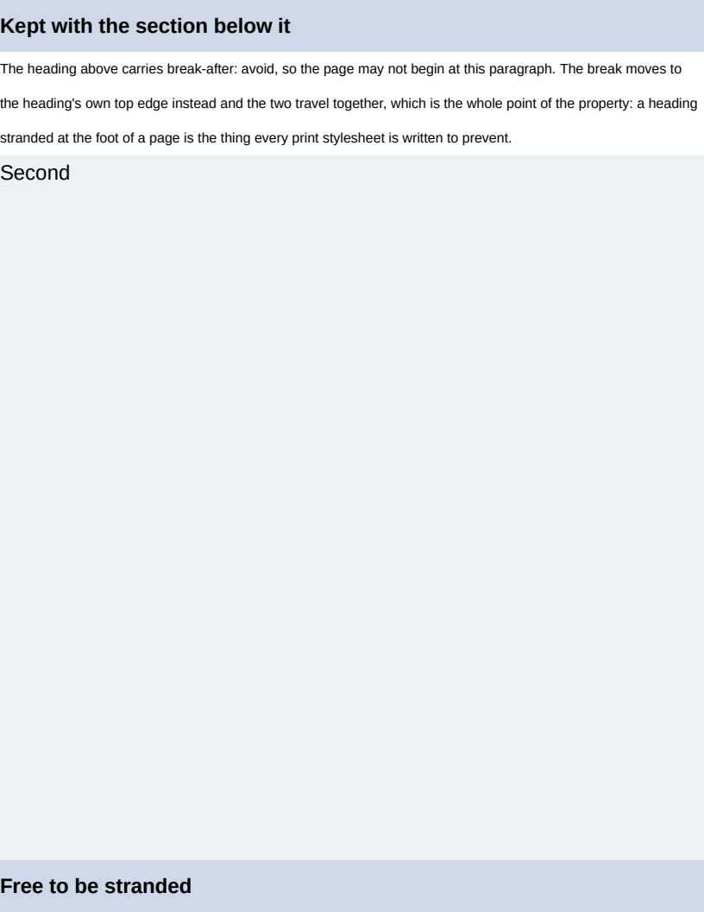 |  |
| **Page 3** | **Page 3. AE 0.0000 · SSIM 1.0000** |
| 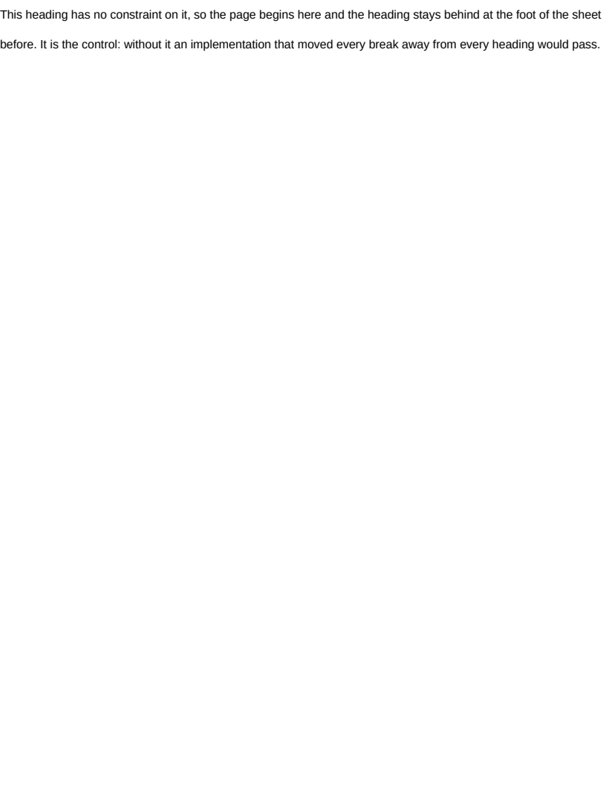 |  |


## page/break_before

# page/break_before

The first scenario in the corpus whose page COUNT is decided by a declaration rather than by how
much content there is. Three boxes of 48px each on a 1056px page: the document is 144px tall and
fits five times over, and Chrome still prints two pages because `#two` asked to start one.

That is the whole of what it isolates. `Paginator` used to run its loop while content remained
below the boundary — `top + pageHeight < documentHeight` — which is exactly the condition a forced
break in a short document fails. So the property could be read, resolved and looked up correctly
and still produce one page, with nothing in the box geometry to say so.

The break lands at `#two`'s top border edge, which is also where the box after it would have gone,
so nothing here can distinguish a break taken at the declaring box's top from one taken at the
previous box's bottom. `page/break_after` is where those two are pulled apart.

Both pages are pixel-identical to Chrome.

What to look at: the page count first — one page means the forced break never reached the loop
condition. Then whether page one ends after `#one`, and whether page two holds both `#two` and
`#three` rather than only `#two`.

**Boxes**: 5 matched, worst offset 0.00px, worst size 0.00px.

| Reference (Chrome) | Krilla.Html |
| --- | --- |
| **Page 1** | **Page 1. AE 0.0000 · SSIM 1.0000** |
|  |  |
| **Page 2** | **Page 2. AE 0.0000 · SSIM 1.0000** |
|  |  |


## page/break_between_lines

A break landing inside a paragraph. The spacer leaves 76px of the first page, which fits two lines
of 32 but not three, so the third line must move to page two whole. A renderer that slices at the
page height instead would cut it in half.

**Boxes**: 4 matched, worst offset 0.00px, worst size 0.00px.

| Reference (Chrome) | Krilla.Html |
| --- | --- |
| **Page 1** | **Page 1. AE 0.0017 · SSIM 0.9996** |
| 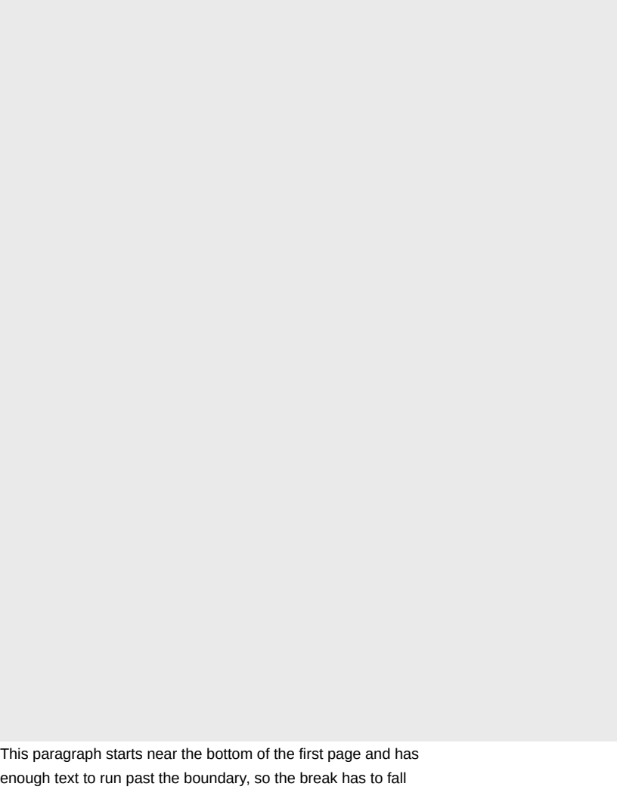 |  |
| **Page 2** | **Page 2. AE 0.0000 · SSIM 1.0000** |
| 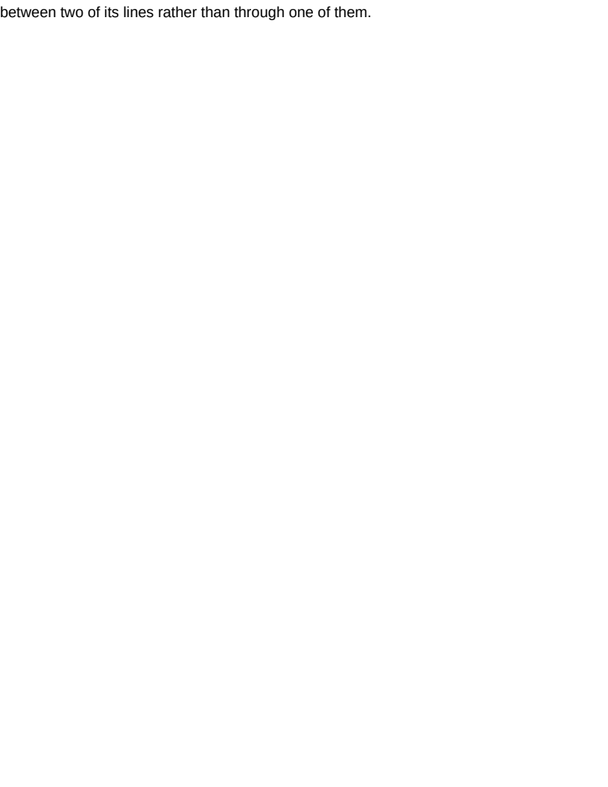 |  |


## page/break_inside

# page/break_inside

A box that would otherwise be split, asking not to be. The card runs 950..1070 with the boundary at
1056 falling inside its fourth line, so a break taken between lines lands at 1034 and leaves three
lines on page one and one line overleaf. `page-break-inside: avoid` moves the whole card instead,
and Chrome puts the break at 950 — the card's top border edge.

This is `page/table_break` reached from the other direction. A table row is one unbreakable unit by
rule, and a box carrying `break-inside: avoid` is one by request, so `Paginator.Unbreakable` yields
the box's border box in place of the lines inside it for both. Which means the case where the box
does not fit was already answered: a card taller than the page overflows rather than descending
forever looking for room, by the same guard in `NextTop` that a too-tall row uses.

Nothing here needed the painter. `PdfPainter.PaintBox` already culls a box whose top edge is at or
after the break, so the moved card paints nothing on page one — the distinction `page/table_break`
drew between a box moved WHOLE and a box the break falls inside.

It found something incidental on the way. The card's text originally contained the word
`page-break-inside`, and Chrome broke the line INSIDE it — `page-` ending one line and
`break-inside` opening the next — where this engine treated a hyphenated word as one unbreakable
token. The text was reworded to take the hyphen out, because a scenario measuring two things
reports one number for both.

That gap is now closed, and `inline/hyphen_breaks` is where it is measured. The wording here stays
hyphen-free anyway: this scenario is about where a page breaks, and a word that also decides where
a LINE breaks would put two features behind one number again.

**Residual**: SSIM 0.9998 on page two, from sub-pixel glyph positioning on the card's first line
and on the paragraph. Page one is pixel-identical.

What to look at: whether page one ends with the spacer alone. Three lines of the card at the foot
of page one is the break-between-lines behaviour returning; a sliver of the card there with the
whole card also overleaf is the painter culling on the wrong edge.

**Boxes**: 5 matched, worst offset 0.00px, worst size 0.00px.

| Reference (Chrome) | Krilla.Html |
| --- | --- |
| **Page 1** | **Page 1. AE 0.0000 · SSIM 1.0000** |
|  |  |
| **Page 2** | **Page 2. AE 0.0012 · SSIM 0.9998** |
| 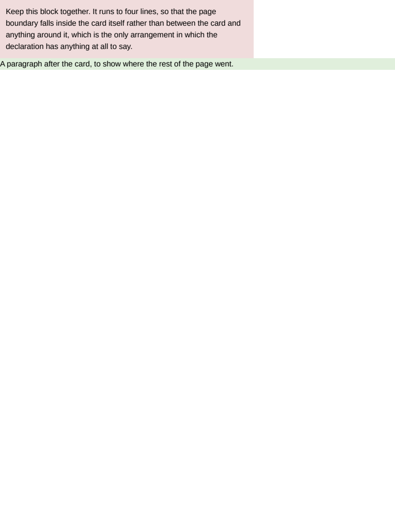 |  |


## page/fixed_repeat

# page/fixed_repeat

`position: fixed` on a document long enough to paginate.

CSS 2.1 §9.6.1 says a fixed box in paged media is repeated on every page, and Chromium's printer
agrees: all three boxes here appear at the same place on each of the three sheets. That is the
whole of what this scenario measures, and it can only be measured in PIXELS — the geometry harvest
runs against one continuous layout, so the browser reports each of these boxes exactly once, and a
converter that drew them on page one alone would match the box comparison perfectly.

`#header` and `#footer` are the two halves of the rule. A `top` offset is indistinguishable from
an absolute box anchored to the start of the document, since the two coincide on page one;
`bottom: 0` is not, because measured against the document it would land after the last paragraph
on the last page and appear nowhere else. `#tab` sits at neither edge, so its position is
arithmetic rather than somewhere it could have arrived at by accident.

## Measured, and deliberately not matched

A fixed box with `top` and `bottom` both auto sits at its STATIC position, and Chromium's printer
does something with it that is not worth reproducing: it draws the box once where flow put it —
across a page boundary if that is where it falls — and then ALSO repeats it, at that same
page-relative offset, on every later page but on no earlier one. A box straddling a break
therefore appears twice on the page after it.

This engine paints such a box once, where flow put it, which is what it did before repetition
existed. The alternative is worse than the divergence: a static position is a position in the
DOCUMENT, so repeating it would add each page's own top to a coordinate that already includes it,
and a box whose flow position is on page three would fall off the bottom of every page and vanish
from a document it currently appears in. No row here carries one, because a corpus scenario cannot
record a difference it has decided not to match.

**Boxes**: 19 matched, worst offset 0.00px, worst size 0.00px.

| Reference (Chrome) | Krilla.Html |
| --- | --- |
| **Page 1** | **Page 1. AE 0.0039 · SSIM 0.9992** |
| 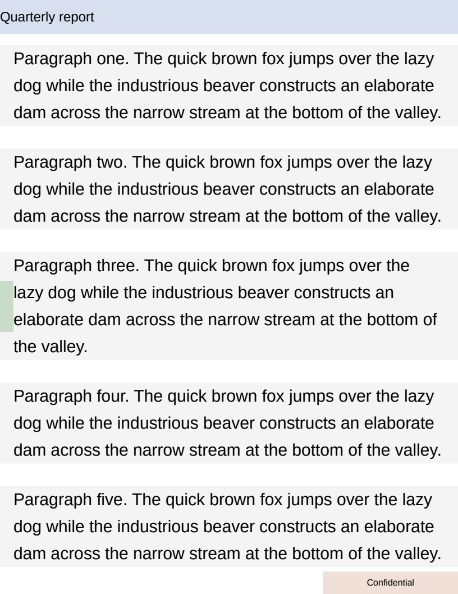 |  |
| **Page 2** | **Page 2. AE 0.0015 · SSIM 0.9994** |
| 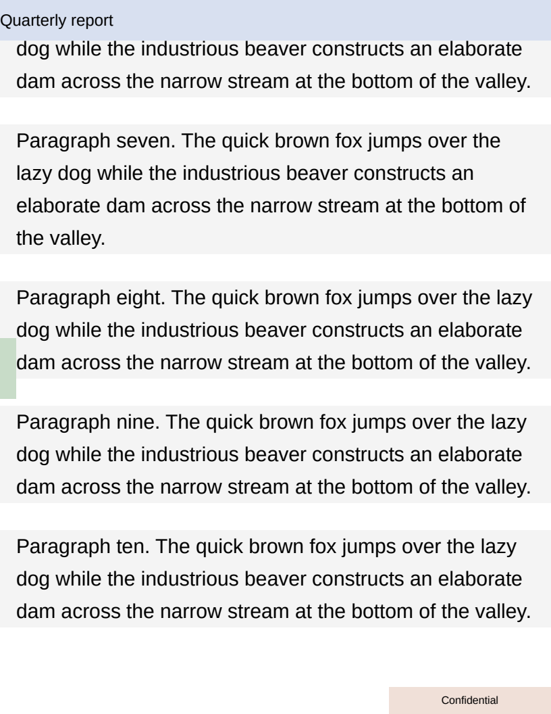 |  |
| **Page 3** | **Page 3. AE 0.0012 · SSIM 0.9998** |
| 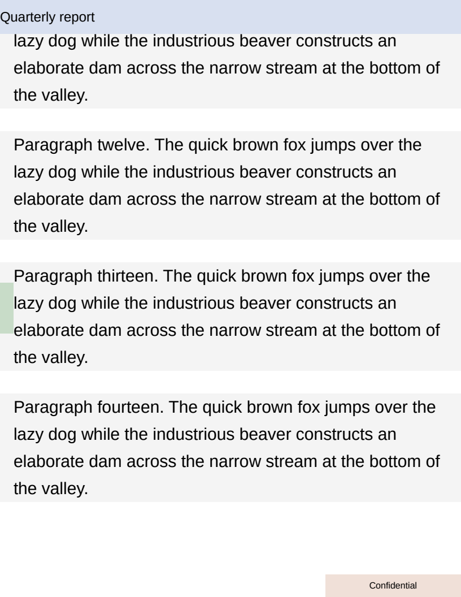 |  |


## page/float_break

# page/float_break

A float is out of flow but not out of the page, and no scenario had one crossing a page boundary.
`#tall` runs 900..1200 with the boundary at 1056, so it has to be painted on both pages — its
upper 156px on the first and its lower 144px on the second — and the lines beside it have to keep
being shortened after the break.

The two halves of that are independent and can fail separately: the float's own box is painted by
`PdfPainter` per page, while the band the lines are laid against comes from `FloatContext` in
continuous coordinates, before pagination exists.

What to look at: the float's colour reaching the bottom edge of page one and resuming at the top
of page two, and the paragraph's first lines on page two still starting 120px in. Full-width lines
on page two are the band being lost at the break; a float painted on one page only is the box
being clipped to where it was declared.

**Boxes**: 5 matched, worst offset 0.00px, worst size 0.00px.

| Reference (Chrome) | Krilla.Html |
| --- | --- |
| **Page 1** | **Page 1. AE 0.0023 · SSIM 0.9997** |
|  |  |
| **Page 2** | **Page 2. AE 0.0000 · SSIM 1.0000** |
|  |  |


## page/multi_page_flow

Enough text to run past one page. Both engines break between lines rather than through them, which
is why the reference is printed rather than screenshotted and sliced: a sliced screenshot would cut
a line in half at every boundary and report a difference that came from how the reference was made
rather than from anything either engine did.

**Boxes**: 8 matched, worst offset 0.00px, worst size 0.00px.

| Reference (Chrome) | Krilla.Html |
| --- | --- |
| **Page 1** | **Page 1. AE 0.0016 · SSIM 0.9998** |
| 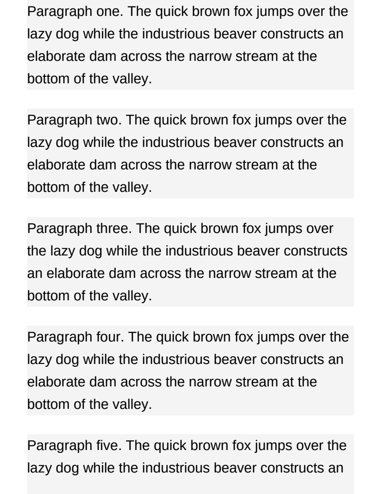 |  |
| **Page 2** | **Page 2. AE 0.0004 · SSIM 1.0000** |
| 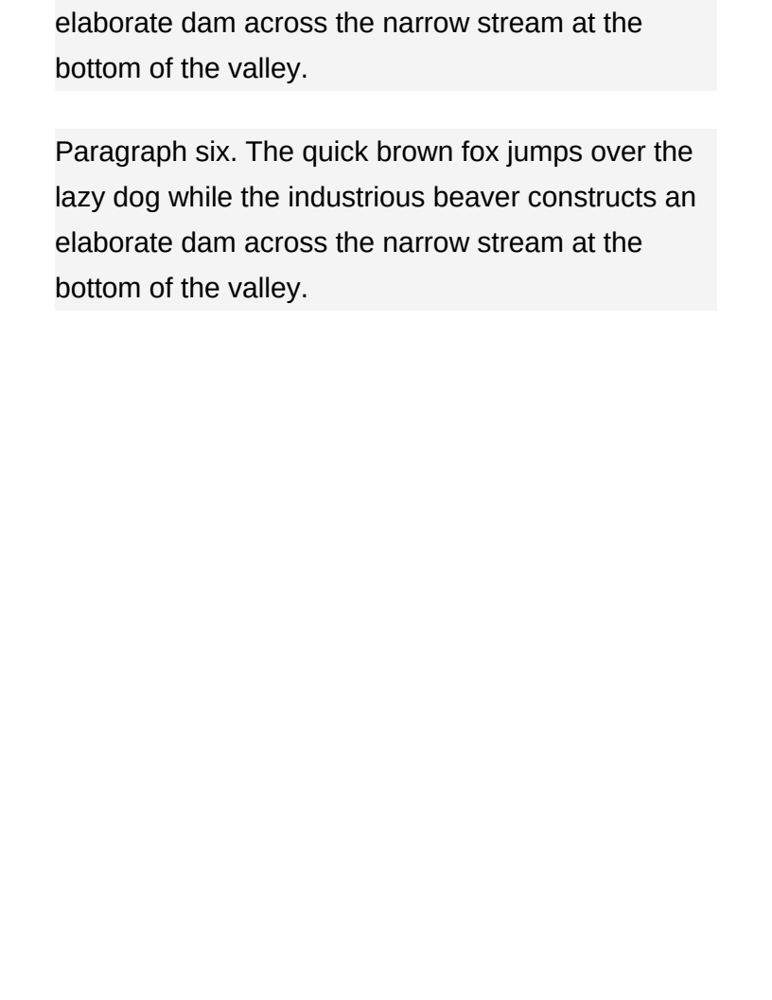 |  |


## page/orphans_widows

# page/orphans_widows

Two paragraphs caught at a page boundary, one violating `orphans` and one violating `widows`, under
the initial counts of two and two.

This is the scenario the corpus did not have, and its absence is why a wrong note stood for so long:
`HtmlOptions.HonourOrphansAndWidows` was off by default on the stated grounds that **Chromium does
not implement the properties**, and nothing here could tell. Every scenario that broke inside a
paragraph happened to break somewhere both counts permit, so the constraint changed nothing whether
it was on or off.

It is not a fine distinction. With the constraint off this engine produces **two pages against the
browser's three** — the sharpest signal the corpus has, and it was there to be measured the whole
time.

## The two halves

- **`#orphan`** starts 1012px down, so only one of its four lines fits on the first page. That is
  one short of `orphans: 2`, and moving the break earlier only takes more lines off the top — so
  nothing but moving the whole paragraph fixes it, and Chromium moves the whole paragraph. Page one
  ends 44px short of the sheet.
- **`#widow`** straddles the second boundary with one line left below it, one short of `widows: 2`.
  Here the run IS long enough to give a line up: moving the break one line earlier leaves three
  above and two below, which satisfies both. Chromium moves the break rather than the paragraph.

The two are the whole rule between them. A test with only the first would pass an engine that moved
every constrained run whole and wasted a page each time; a test with only the second would pass one
that never moved a run at all.

## The case this deliberately does NOT contain

A run too short to satisfy both counts at once — which under the initial two and two means any
paragraph of three lines. `page/break_between_lines` holds that one, and Chromium splits it two and
one rather than moving it whole, leaving a widow the property forbids. Reproducing that was the
whole of the work here: this engine moved the run overleaf, which is the tidier answer and is not
what the browser does.

**Boxes**: 6 matched, worst offset 0.00px, worst size 0.00px.

| Reference (Chrome) | Krilla.Html |
| --- | --- |
| **Page 1** | **Page 1. AE 0.0000 · SSIM 1.0000** |
|  |  |
| **Page 2** | **Page 2. AE 0.0019 · SSIM 0.9998** |
| 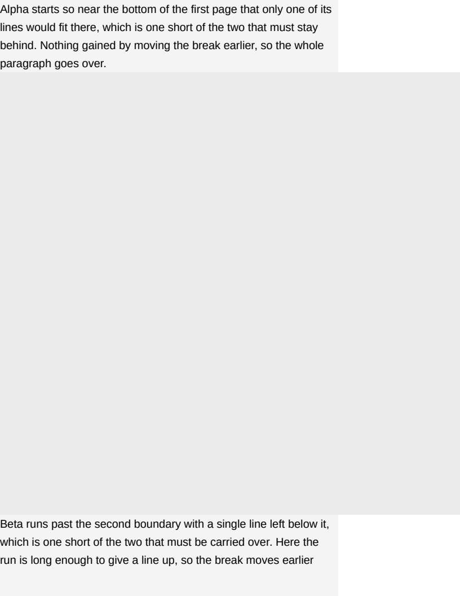 |  |
| **Page 3** | **Page 3. AE 0.0000 · SSIM 1.0000** |
| 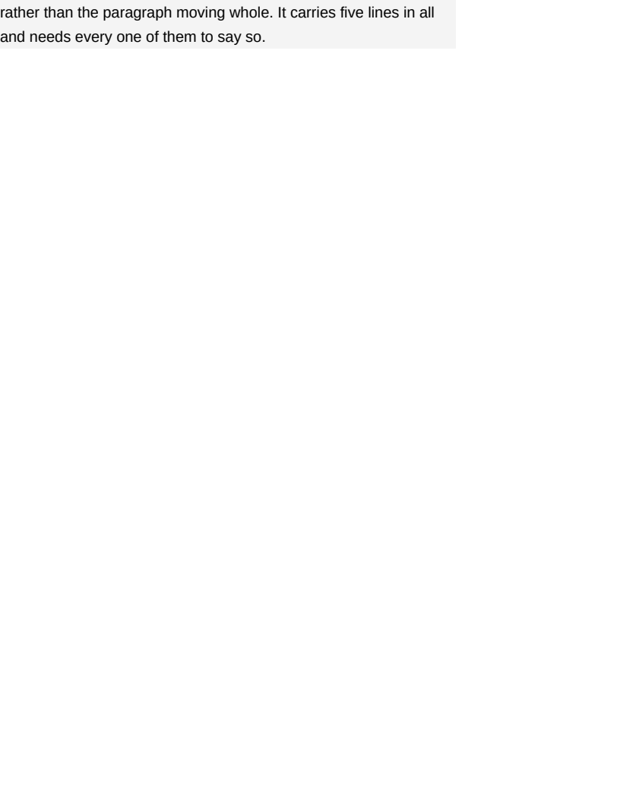 |  |


## page/page_size

A box that exactly fills one Letter page at 96 DPI: 816 x 1056 CSS pixels, here as 1040px of
content inside an 8px border. If this paginates to two pages the page height is off by a rounding
step somewhere, and every multi-page scenario will be wrong in the same way.

**Boxes**: 3 matched, worst offset 0.00px, worst size 0.00px.

| Reference (Chrome) | Krilla.Html |
| --- | --- |
| **Page 1** | **Page 1. AE 0.0000 · SSIM 1.0000** |
| 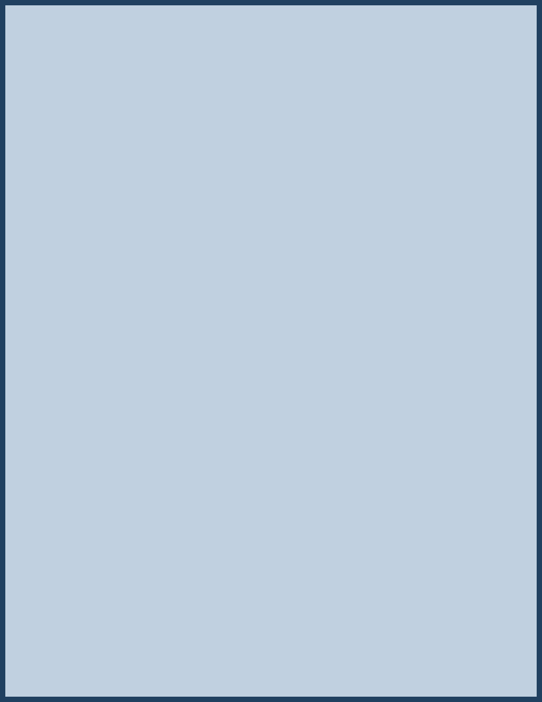 |  |


## page/table_break

# page/table_break

Every multi-page scenario in the corpus was plain paragraphs, so pagination had only ever been
measured against the one construct it was written for. A table is the first case where the break
candidates and the boxes disagree: `Paginator` breaks before a LINE that would straddle the
boundary, and a browser's printer moves a whole ROW.

Six 36px rows starting at y=950, so the table runs 950..1166 and the boundary at 1056 falls inside
the third row rather than between two of them. A break taken at the line inside that row splits
the row's background and border across the two pages; a break taken at the row moves the whole
thing overleaf.

It found two defects, and they compounded. The break went to the top of the LINE inside row
three rather than to the row's own top edge, six pixels lower, so everything on page two sat six
pixels high — 0.9659, the lowest SSIM the corpus has recorded. And the row it left behind still
painted its cell backgrounds down to the paper, stranding a sliver of the moved row at the foot of
page one.

`Paginator.Unbreakable` now treats a table row as one unit, the way a line is one everywhere else,
and `PdfPainter.PaintBox` culls a box whose top edge is at or after the break — which is a
different test from clipping at the break, and deliberately so: a box the break falls INSIDE is
fragmented, and a browser fills the rest of the page with that fragment. `page/multi_page_flow` is
the scenario that says so, and clipping cost it 1.6% of its pixels before the distinction was
drawn.

The geometry stays at zero throughout, because it is measured in continuous coordinates where
there is no break at all — which makes this a difference only the pixels could ever report.

What to look at: the vertical offset of page two's first row, and any part of it appearing at the
foot of page one. Six pixels of either is the line-based break returning.

**Boxes**: 23 matched, worst offset 0.00px, worst size 0.00px.

| Reference (Chrome) | Krilla.Html |
| --- | --- |
| **Page 1** | **Page 1. AE 0.0000 · SSIM 1.0000** |
| 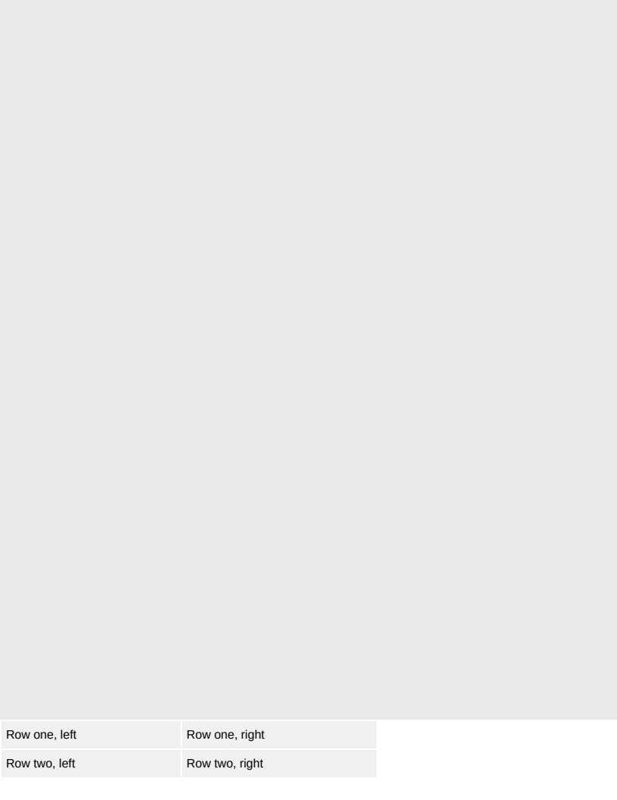 |  |
| **Page 2** | **Page 2. AE 0.0002 · SSIM 1.0000** |
| 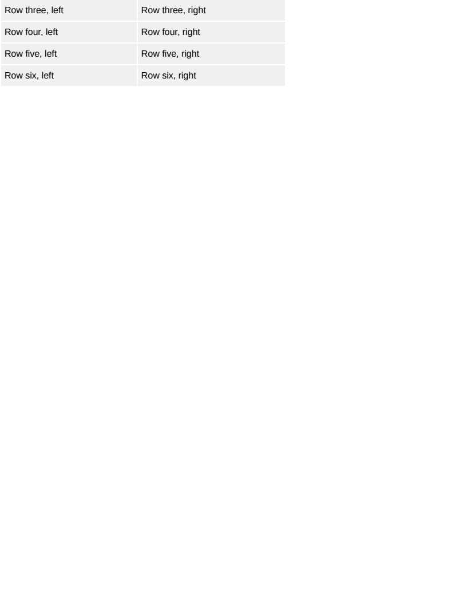 |  |


## page/table_footer

# page/table_footer

A `tfoot` re-drawn at the foot of every page its table continues onto — the mirror of
`page/table_header`, and the half that was left undone when the header landed. A ledger long enough
to need three sheets, with no header group at all, so nothing here is measuring the header path by
accident.

Three sheets, and each says something different:

- **Page one** carries the repeated footer, and where it sits is the finding. Chromium draws it
  IMMEDIATELY BELOW the last row that fitted, not flush with the paper: the last row ends 941px
  down, the footer occupies the 60px after that, and the remaining 55px of the sheet is blank. So
  the band is reserved out of the page's height — which is what moves the break earlier — and then
  drawn at the position the break landed on rather than at the page's bottom edge.
- **Page two** holds the end of the table, where the real footer is drawn in place by ordinary
  painting. Nothing repeats here, and a converter that repeated unconditionally would draw the
  footer twice on one sheet.
- **Page three** is the closing paragraph alone. The rule is the table's own extent rather than the
  page count: a page beginning past the last row carries nothing, and a converter that repeated for
  as long as the document lasted would put a totals row on a sheet with no table on it.

The reservation is circular in appearance and not in fact. Whether a footer repeats depends on
where the page ends, and where the page ends depends on what is reserved — but reserving can only
move the end EARLIER, and a table that continued past the later end continues past the earlier one
too. One refinement settles it.

## What page two found

The first render put every pixel on page two half a pixel out, and the cause was not the footer.

A page begins at an unbreakable unit's top edge, and under `border-collapse` a row's top edge is
half a rule below a whole pixel — so this page's content started at document y 940.5. Every
rectangle this engine fills is snapped, but in LAYOUT units, and a layout-unit snap only lands on a
device pixel when the page's own offset is a whole number of them. It was not, so every edge on the
sheet was drawn antialiased down both sides: SSIM 0.9286 with the geometry exact, which is the
signature of a rasterisation-level problem rather than a layout one.

`PdfPainter` snaps the page's own shift now. It was invisible before this scenario because a
repeated HEADER's band runs from the table's top edge to the group's bottom, which carries the same
half pixel and cancels it — so `page/table_header` was already integral and had nothing to say.

**Residual**: page three is identical, and pages one and two differ only on glyph edges at 24 and
30px — the same sub-pixel glyph positioning `page/table_header` records. Every rule, fill and edge
agrees.

What to look at: whether the footer appears on page one at all, and whether it sits directly under
the last row rather than at the foot of the sheet. A footer flush with the paper is the reservation
being drawn in the wrong place; a footer missing from page one is the reservation not happening; a
footer on page three is the table's extent not being consulted.

**Boxes**: 99 matched, worst offset 0.00px, worst size 0.00px.

| Reference (Chrome) | Krilla.Html |
| --- | --- |
| **Page 1** | **Page 1. AE 0.0044 · SSIM 0.9992** |
| 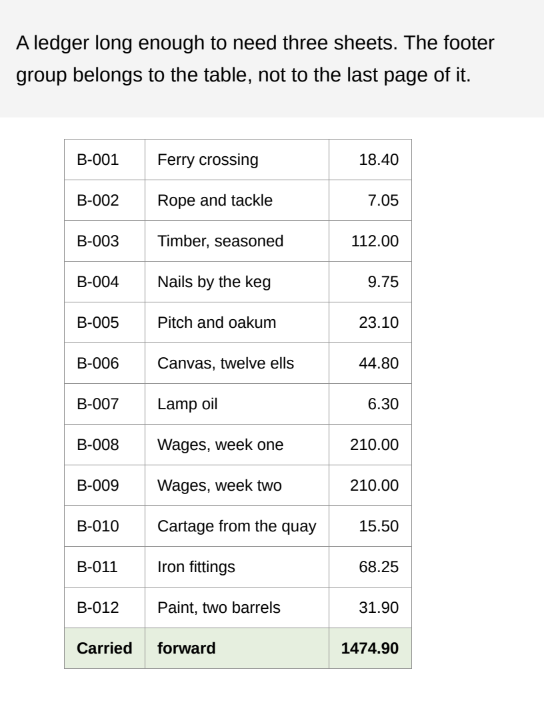 |  |
| **Page 2** | **Page 2. AE 0.0114 · SSIM 0.9984** |
| 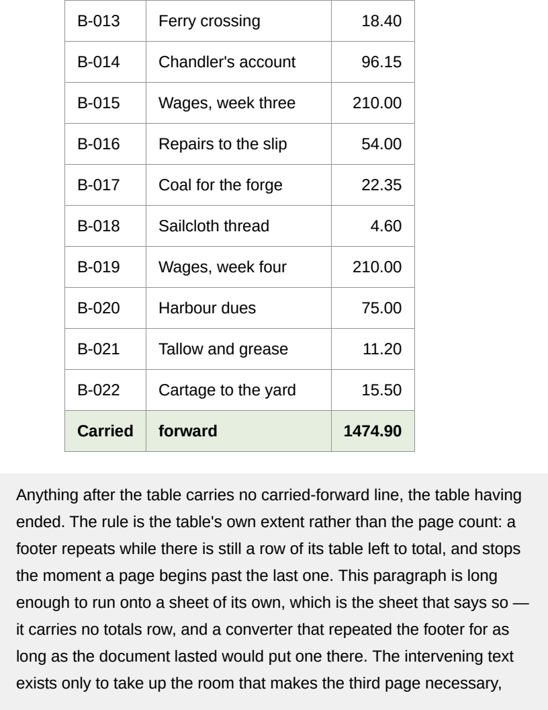 |  |
| **Page 3** | **Page 3. AE 0.0000 · SSIM 1.0000** |
| 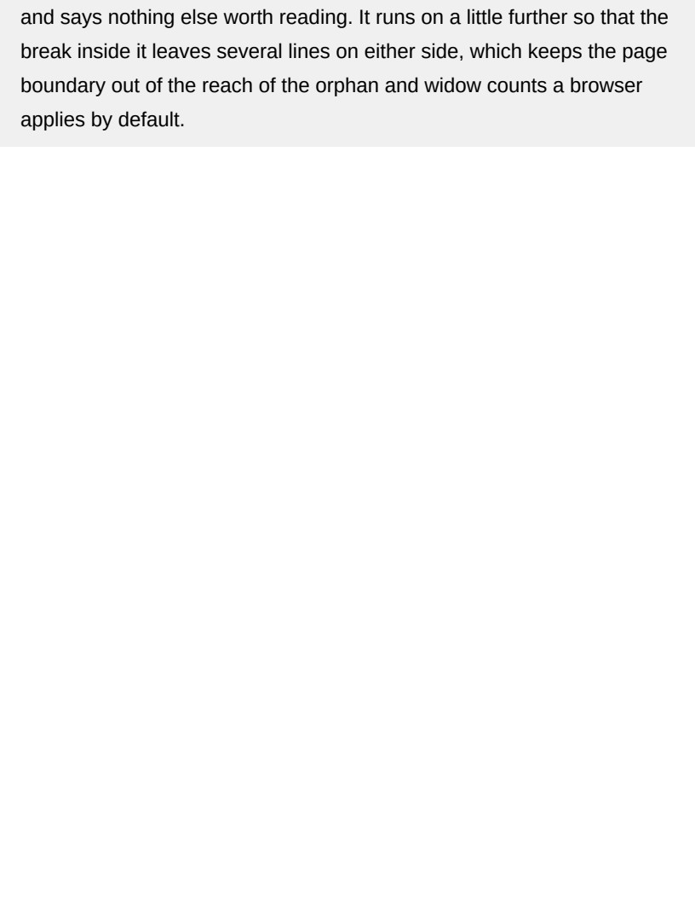 |  |


## page/table_header

# page/table_header

A twenty-two row ledger over three sheets, with a `<thead>`.

A browser's printer re-draws the header group at the top of every page the table continues onto and
moves the rest of the table down to make room, which is the one thing people expect from
HTML-to-PDF conversion of a long table: without it, page two of a report is a grid of unlabelled
columns. Chromium does it here, and so does this engine.

Like `page/fixed_repeat`, the repetition is a PIXEL measurement and only that. The geometry harvest
runs against one continuous layout, so the browser reports the `thead` exactly once — an engine
that drew it on page one alone would still match all 99 boxes.

## What each part of the arrangement is for

- **The 96px left margin.** A repeated header keeps the TABLE's left edge, not the page's. The two
  coincide at zero and nowhere else, so an indented table is what tells them apart.
- **The tall intro paragraph.** It pushes the table's start well down page one, so the first repeat
  is at a different place on the sheet from the original rather than at the same one.
- **`border-collapse: collapse` with a filled header row.** The two together found a defect on the
  first render, below.
- **The long closing paragraph.** Page three begins past the table's bottom edge and carries no
  heading row at all, which is the other half of the rule: a header repeats while there is still a
  row of its table to label and stops the moment there is not. That page is pixel-identical.
- **Its length in particular.** The break inside it leaves several lines either side. An earlier
  version left ONE line on page three, and Chromium moved a second down to join it — its `widows`
  handling, which this engine has switched off by default. The scenario is not asking that
  question, so it stays clear of it.

## The defect it found

A collapsed table's grid lines were painted with the TABLE's own decoration, which in tree order is
before every one of its cells' backgrounds — and a cell's background reaches the middle of the line,
because under the collapsing model a cell's border box includes half of every rule around it. So the
rule between the header row and the first body row was painted and then covered, and the header
came out with no line under it.

Invisible until now because no collapsed table in the corpus had a cell background: `table/collapse`
measures six arrangements of rules and fills none of its cells. CSS 2.1 Appendix E says the
collapsed borders go down after the backgrounds of all the table's elements, so the fix is one move
— out of `Decorate` and into the end of the `Backgrounds` walk — and it left every other scenario
identical.

## The band, and where it starts

The strip re-drawn at the top of a continuation page starts at the TABLE's top edge rather than at
the header's. Measured: Chromium lands the first continued row 61.5px down a page whose header
group is 61px tall, and the half pixel is the top rule the table draws above it. Reserving the
header's own height instead puts every horizontal rule on the page one device pixel high, which is
what page two looked like before it was measured — 0.9185, against 0.9934 after.

## Residuals

Sub-pixel glyph positioning, at 24 and 30px, and nothing else: no pixel on any of the three pages
differs by more than 81 of 255, so no glyph is in a different place, only antialiased differently at
its edges. Page three has none at all.

**Boxes**: 99 matched, worst offset 0.00px, worst size 0.00px.

| Reference (Chrome) | Krilla.Html |
| --- | --- |
| **Page 1** | **Page 1. AE 0.0049 · SSIM 0.9900** |
| 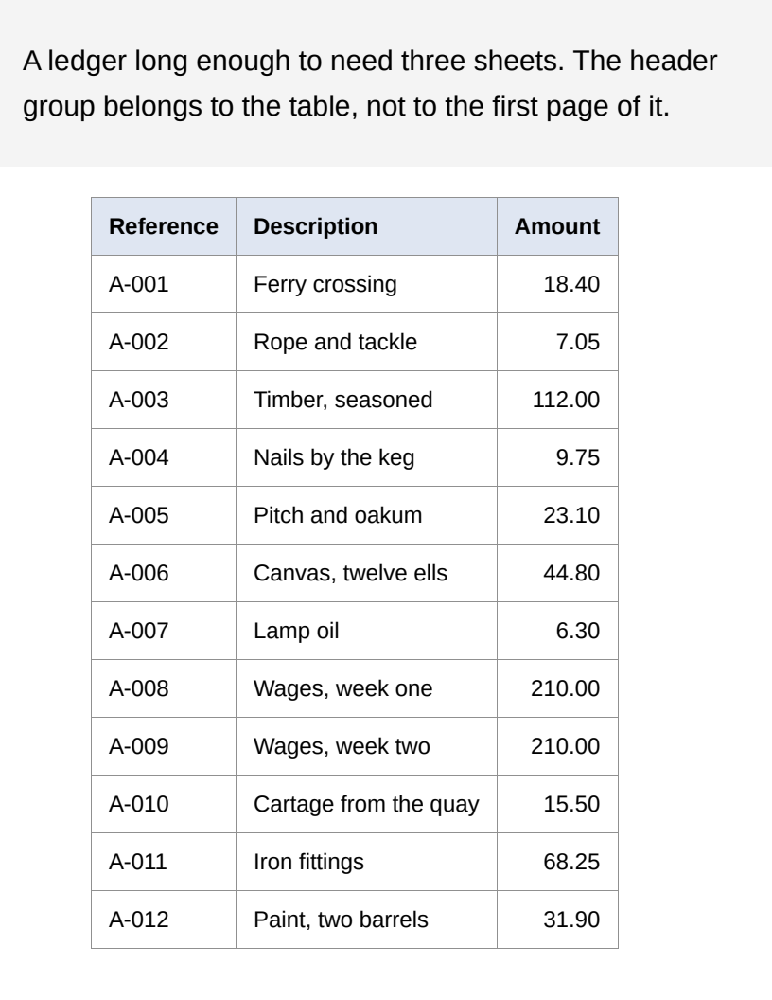 |  |
| **Page 2** | **Page 2. AE 0.0119 · SSIM 0.9921** |
| 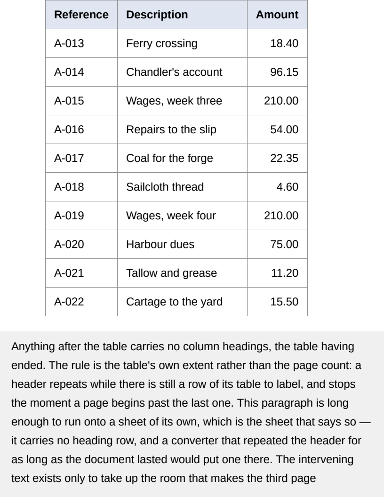 |  |
| **Page 3** | **Page 3. AE 0.0000 · SSIM 1.0000** |
| 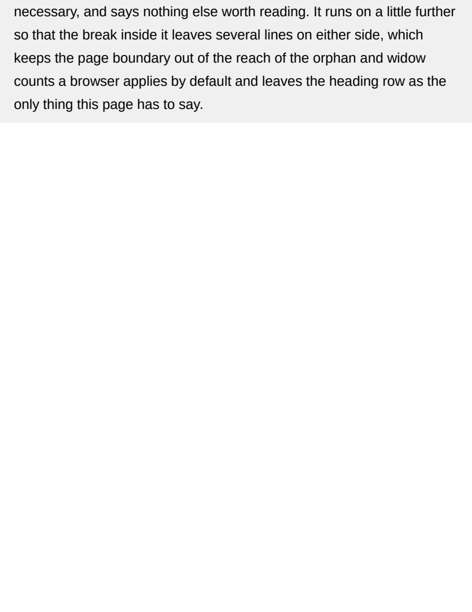 |  |


## page/tall_block

# page/tall_block

A page break can be needed where no line offers one. `Paginator` breaks before a line that would
straddle the boundary, and a block taller than the page contains no lines — so there is no
candidate inside it, the break lands after the whole block, and everything between the page edge
and the block's end is never drawn. `NextTop` falls back to breaking at the page edge for exactly
this case, and nothing measured that fallback.

`page/page_size` stops one pixel short of reaching it: its content is 1040px plus a 16px border,
which is 1056 exactly — one page, with no fragment left over. Here the block runs 0..1400, so page
one is entirely filled by it, page two carries the remaining 344px, and the paragraph follows at
y=1400, which is 344 down page two.

`#mark` is a 40px block at the top, and it is there for `BaselineHealthTests`: without it page one
is a single flat colour, which is indistinguishable from a page that rendered nothing at all. It
generates no line, so the block it sits in stays free of break candidates and the fallback is
still what produces the break.

What to look at when it moves: a second page that is blank above the paragraph means the block was
not painted past the break. A single page means the fallback did not fire at all and the overflow
was dropped.

**Boxes**: 5 matched, worst offset 0.00px, worst size 0.00px.

| Reference (Chrome) | Krilla.Html |
| --- | --- |
| **Page 1** | **Page 1. AE 0.0000 · SSIM 1.0000** |
|  |  |
| **Page 2** | **Page 2. AE 0.0004 · SSIM 0.9999** |
| 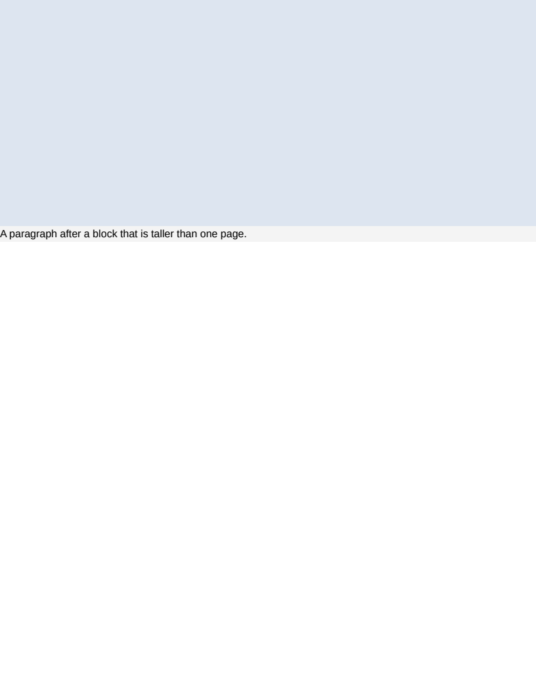 |  |


## position/absolute

Absolute positioning against a nearest positioned ancestor.

`#frame` carries a 5px border and 10px padding so that the containing block is identifiable rather
than merely plausible. The containing block is the PADDING box: `#tl` at `top: 0; left: 0` lands
inside the border and outside the padding. Using the border box puts it 5px out in both axes and
using the content box puts it 10px in, and a frame with neither border nor padding cannot tell the
three apart — which is why this scenario has both.

- `#tl` and `#br` anchor to opposite corners, so the bottom-right one also measures that a `bottom`
  or `right` offset is applied after the box has been sized rather than before.
- `#stretch` gives both `left` and `right` with an auto width, the one arrangement where an
  absolute box fills its containing block instead of shrinking.
- `#fit` gives only `left`, so it shrinks to fit its content, the same rule a float follows.
- `#body` is the only in-flow content, so the frame's height comes from it alone. None of the four
  absolute boxes contributes to it, though two are taller than it — which `#after` records by
  sitting where the frame ends rather than where its contents do.

**Boxes**: 9 matched, worst offset 0.00px, worst size 0.00px.

| Reference (Chrome) | Krilla.Html |
| --- | --- |
| **Page 1** | **Page 1. AE 0.0005 · SSIM 0.9999** |
|  |  |


## position/anchors

Which box an absolute box is positioned against, in the three arrangements that differ.

- `#deep` is two levels down, inside a `#static` carrying a 30px margin, and anchors to `#outer` —
  skipping the static parent entirely. Its margin, its position and its padding contribute nothing.
  This is what makes `position: relative` on an outer element the standard way to anchor something
  nested, and an implementation that walked to the DOM parent would land 30px out in both axes.
- `#half` measures which dimension a percentage offset resolves against, and the answer is not one
  of them: `left` resolves against the containing block's WIDTH and `top` against its HEIGHT. A
  single square container cannot tell those apart, so `#pct` is deliberately not square.
- `#page` has no positioned ancestor at all, so its containing block is the page rather than the box
  that declares it. It is written inside a box most of the way down the page and lands near the top,
  which looks like a bug until the rule is known.

**Boxes**: 9 matched, worst offset 0.00px, worst size 0.00px.

| Reference (Chrome) | Krilla.Html |
| --- | --- |
| **Page 1** | **Page 1. AE 0.0000 · SSIM 1.0000** |
| 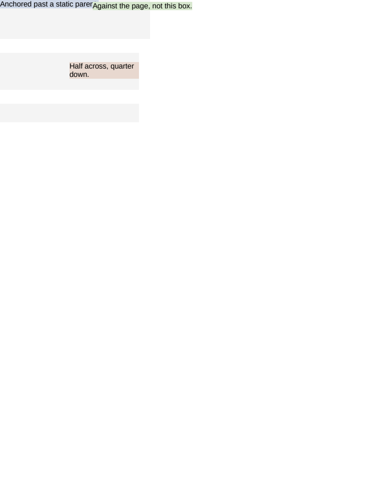 |  |


## position/auto_margins

# position/auto_margins

An auto margin on an absolutely positioned box, which is the one place such a margin means anything
other than zero.

CSS 2.1 §10.3.7 states the horizontal equation:

```
left + margin-left + border-box-width + margin-right + right = containing block width
```

With all of `left`, the width and `right` given, that is over-constrained — and it is the auto
margins that absorb the difference. Both auto splits it, which is what centres a box given
`left: 0; right: 0; margin: 0 auto`, one of the two standard centring idioms. §10.6.4 says the same
thing vertically with `top`, the height and `bottom`.

It used to resolve to zero unconditionally, with a comment saying centring "is not a case this
distinguishes yet". Nothing in the corpus measured it.

## The rows

- **`#centred`** centres between the OFFSETS, not against the containing block. The offsets are 20
  and 100, so the two readings are 40px apart — a scenario with symmetric offsets would pass either.
- **`#pushed`** has one auto margin, which takes the whole remainder rather than half of it.
- **`#middled`** is the vertical case, which needs a declared height for the same reason the
  horizontal one needs a declared width.
- **`#wider`** overflows the gap its offsets leave. The slack is negative and is NOT split: the box
  stays against the start edge and hangs out of the far one. Splitting would pull it 60px left of
  the offset, which reads as a centring bug in exactly the case where centring was impossible.
- **`#filled`** and **`#left`** are the two rows where an auto margin still means zero — an auto
  width already spans the offsets so there is no slack, and a single offset does not over-constrain
  anything. Both render identically with the property implemented and without it, and they are here
  so that an over-eager reading has somewhere to fail.
- **`#stretched`** is `#filled`'s vertical mirror, and it is the row that says an auto HEIGHT spans
  `top` to `bottom`. Its auto margins are zero for the same reason: the box already fills the gap.
  Its single line of text stays at the TOP of the box rather than being stretched or centred, so
  what says the box grew is its background reaching the frame's bottom edge — a stretch that was
  not applied leaves a 24px box where a 45px one belongs.
- **`#inset`** is the same with a border and padding inside it. The gap the offsets leave is a
  MARGIN-box extent, so the surround comes OUT of the height rather than being added to it: 70px of
  frame less a 10px top offset, a 15px bottom offset and a 5px top margin leaves a 40px border box,
  and 10px of border and 15px of padding leave 15px of content. Adding the surround instead gives a
  box 25px too tall, which overflows the frame and is the mistake this row exists to catch.

**Boxes**: 18 matched, worst offset 0.00px, worst size 0.00px.

| Reference (Chrome) | Krilla.Html |
| --- | --- |
| **Page 1** | **Page 1. AE 0.0000 · SSIM 1.0000** |
| 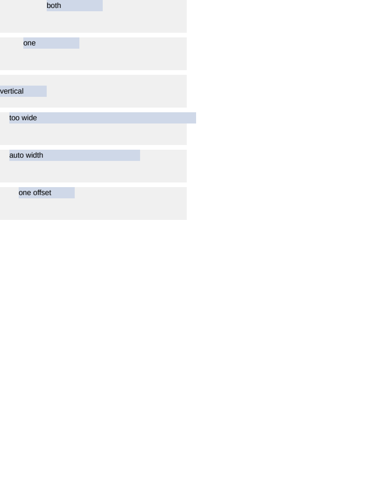 |  |


## position/fixed

# position/fixed

`position: fixed` is implemented, and reported as a diagnostic because its geometry is right
while only its paged-media behaviour is not: CSS says a fixed box repeats on every page, and
this places it on the one page its position falls on. Nothing checked the first half of that
claim.

One page, deliberately, so the repetition question does not arise and what is left is purely where
the box lands.

- **`#corner`** has no positioned ancestor, so both readings of "containing block" give the page
  and this measures the offsets alone, resolved against the page's edges.
- **`#inner`** is inside a `position: relative` ancestor. A fixed box's containing block is the
  page regardless, which is the single property that distinguishes it from an absolute box —
  `AbsoluteLayout` walks to the nearest positioned ancestor for both, so this arrangement is
  expected to sit at the frame's padding box plus the offsets rather than at the page's. That
  difference is the point of including it: it is a defect with a measurement rather than a comment.

It found the defect on its first render: `#inner` landed at (160, 500) rather than (40, 300),
out by exactly the frame's own margins, because `AbsoluteLayout` walked to the nearest positioned
ancestor for a fixed box as it does for an absolute one. It now carries the initial containing
block alongside the accumulated one and hands a fixed box the former. Both boxes are exact and the
page is pixel-identical.

This is still the only scenario in the corpus that reports a diagnostic, and `DiagnosticTests`
lists it by name as expected to. The report is about the construct rather than about this
document: on one page there is nothing for the repetition to do, and the reporter cannot know the
page count from the cascade.

What to look at when it moves: `#corner` shifting is the offsets or the page's own box. `#inner`
back at (160, 500) is the initial containing block being lost again on the way down the tree.

**Boxes**: 6 matched, worst offset 0.00px, worst size 0.00px.

| Reference (Chrome) | Krilla.Html |
| --- | --- |
| **Page 1** | **Page 1. AE 0.0000 · SSIM 1.0000** |
| 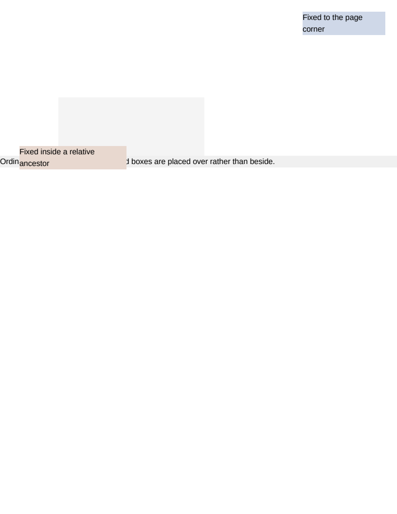 |  |


## position/relative

Relative positioning, which moves a box without moving anything else.

- `#flow` is the point of the whole value: `#b` shifts down and right, and `#c` sits exactly where
  it would have sat had `#b` never moved. The space `#b` was given stays given. An implementation
  that treated the offset as part of layout would push `#c` down and pass a scenario containing
  only one box.
- `#corners` covers the pair that reads backwards. `bottom` and `right` name the edge the box moves
  AWAY from, so `bottom: 8px` lifts a box and `right: 30px` pulls it left. Guessing the sign here is
  a coin toss and the corpus is the coin.
- `#nested` offsets a parent and measures the child, since the shift applies to the whole subtree
  rather than to one border box.

The heights are declared rather than derived so that a wrong offset shows as a moved box and not as
a reflow, which keeps the failure legible.

**Boxes**: 12 matched, worst offset 0.00px, worst size 0.00px.

| Reference (Chrome) | Krilla.Html |
| --- | --- |
| **Page 1** | **Page 1. AE 0.0001 · SSIM 1.0000** |
| 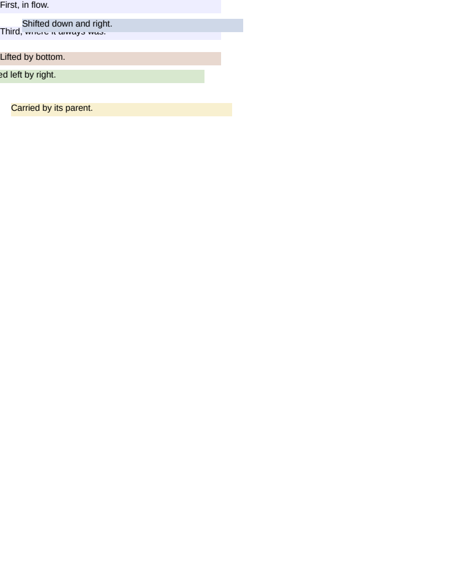 |  |


## position/z_index

`z-index`, which decides the order overlapping positioned boxes paint in.

Nothing here moves a box, so the geometry comparison confirms the property by staying at zero and
the whole measurement is in the pixels. That is the same bargain `block/opacity` strikes, and for
the same reason: paint order is invisible until two boxes overlap.

- `#order` is the property itself. `#below` is written second, so document order would put it on
  top; the levels put `#above` there instead. The engine painted every positioned box in tree
  order before this, so this row is what the whole scenario was added for.
- `#tie` shares a level between two boxes, which sends them back to tree order. It renders the same
  with or without `z-index` implemented, and exists to pin the sort as a STABLE one — an unstable
  sort is correct on every arrangement where no two boxes share a level, which is most of them.
- `#behind` is the property's most quoted surprise: a negative box goes under the in-flow content
  and over the background behind it. It is what made the painter lift a box's own background out of
  the layer walk, since Appendix E paints the negative contexts BETWEEN the two and they were one
  walk before. `#under` is deliberately wider than `#cover`, so a red surround says it was painted
  at all — dropping it entirely would leave the same green rectangle otherwise.
- `#confined` is the rule that a level is measured against siblings rather than against the page.
  `#child` asks for 100 and still sits under `#sibling`'s 2, because `#parent` took a context at 1
  and nothing inside it can climb out. Comparing levels globally is the plausible reading, and puts
  `#child` on top.
- `#zero` is why `z-index: 0` is a real declaration. It establishes a context where `auto` does not,
  so `#raised` is held inside `#context` and `#over` covers it. Treated as `auto`, `#raised` would
  flatten onto the page at 5 and cover everything in the row — which is the difference between
  `ZIndex` being null and being zero, and the only place the corpus can see it.

The two rows using `#c8c8e0` give their context box a background of its own, so the confinement
shows as a coloured frame the child sits inside rather than as a bare pair of overlapping tiles.

**Boxes**: 19 matched, worst offset 0.00px, worst size 0.00px.

| Reference (Chrome) | Krilla.Html |
| --- | --- |
| **Page 1** | **Page 1. AE 0.0000 · SSIM 1.0000** |
| 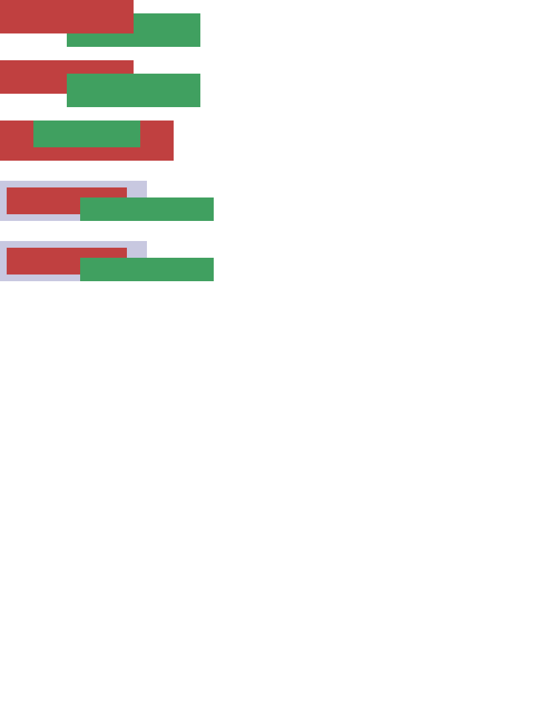 |  |


## table/anonymous

# table/anonymous

A table lays out its children by ROLE rather than in order, so a child with no table role is not
merely misplaced — without intervention it is never positioned or painted at all.
`BoxBuilder.TableFixup` wraps such children in the anonymous rows and cells CSS requires, and its
geometry had never been measured against a browser: the comment saying so is in CLAUDE.md, and
this scenario is what removes it.

Unreachable from ordinary HTML, whose parser moves stray content out of a `<table>` before the
cascade ever sees it. Reachable from `display: table` in a stylesheet, which is what this uses.

Three children, each needing a different amount of invention: a cell with no row around it, a
properly formed row, and a block with no table role at all. The first two are the common shapes; the
third is the one where content disappears entirely if the fixup is missing.

What to look at when it moves: content on the page at all is the first thing this measures. After
that, each anonymous row occupies a row of its own — the loose cell, the two-cell row, and the
loose block stacked in source order, never merged into one row.

**Boxes**: 8 matched, worst offset 0.00px, worst size 0.00px.

| Reference (Chrome) | Krilla.Html |
| --- | --- |
| **Page 1** | **Page 1. AE 0.0001 · SSIM 1.0000** |
| 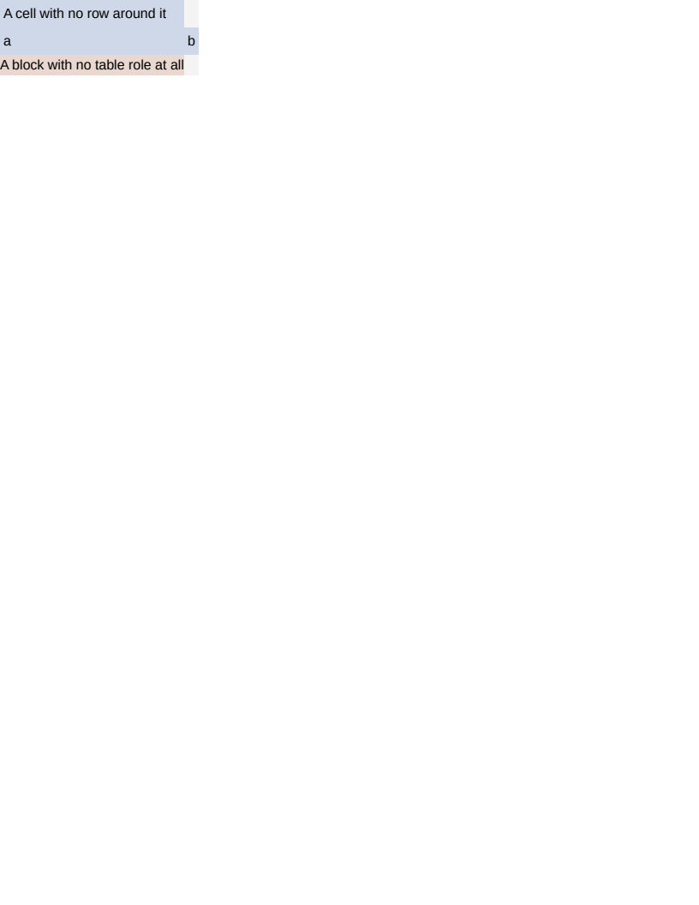 |  |


## table/auto_widths

The automatic column algorithm, which is where a table's layout is decided and where the CSS
specification stops being useful — 17.5.2 describes it as a sketch and leaves the distribution to
the user agent. Every number here was measured out of Chrome.

The four tables are the four regimes, and they are not variations on one rule:

- `#content` has no declared width, so it shrinks to fit and each column takes its max-content
  width.
- `#wide` is wider than its content wants, and the surplus goes to each column in proportion to its
  max-content width. Handing each column its maximum and giving the remainder to the last would
  also fill the row, and looks nothing like a browser.
- `#narrow` sits between the two intrinsic widths, and the rule changes: each column takes its
  min-content width plus a share of the slack proportional to how much it could grow. Applying the
  `#wide` rule here is visibly wrong.
- `#floor` declares a width narrower than the content can be broken to. The declaration loses — a
  table never renders narrower than the sum of its columns' min-content widths.

`#narrow` also measures the min-content computation itself, since the column widths depend on which
word in each cell is the longest.

**Boxes**: 25 matched, worst offset 0.00px, worst size 0.00px.

| Reference (Chrome) | Krilla.Html |
| --- | --- |
| **Page 1** | **Page 1. AE 0.0000 · SSIM 1.0000** |
| 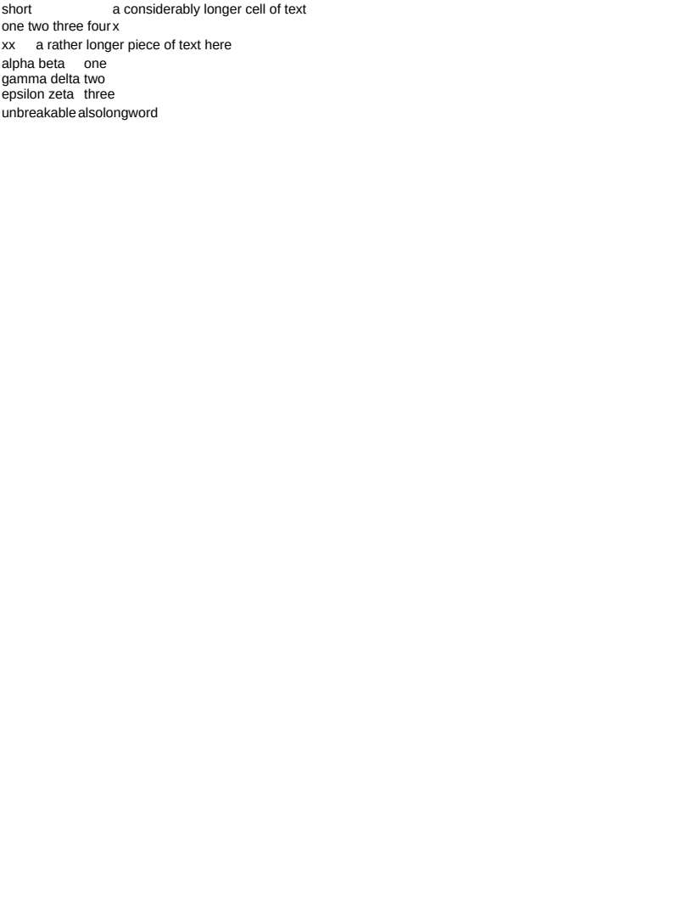 |  |


## table/caption_side

# table/caption_side

Pixel-identical to Chrome. Two tables differing in one declaration, so what is measured is the
property rather than the look of a caption.

A caption is a block laid out at the table's own width, above or below the grid, inside the table's
box. The measurement that matters is the gap: Chrome puts a bottom caption exactly as far under the
last row as a top one sits above the first, and that gap is the table's own edge spacing rather
than anything the caption carries. So the bottom caption goes after the grid's trailing edge
spacing, which the grid had already added — the alternative, adding a gap of its own, doubles it.

`#top` states the default explicitly. It is there so the two rows differ in exactly one
declaration, which is what makes a difference between them attributable.

What to look at: the 2px band between the caption and the grid in each table. Four pixels in either
one is the edge spacing being applied twice.

**Boxes**: 14 matched, worst offset 0.00px, worst size 0.00px.

| Reference (Chrome) | Krilla.Html |
| --- | --- |
| **Page 1** | **Page 1. AE 0.0000 · SSIM 1.0000** |
| 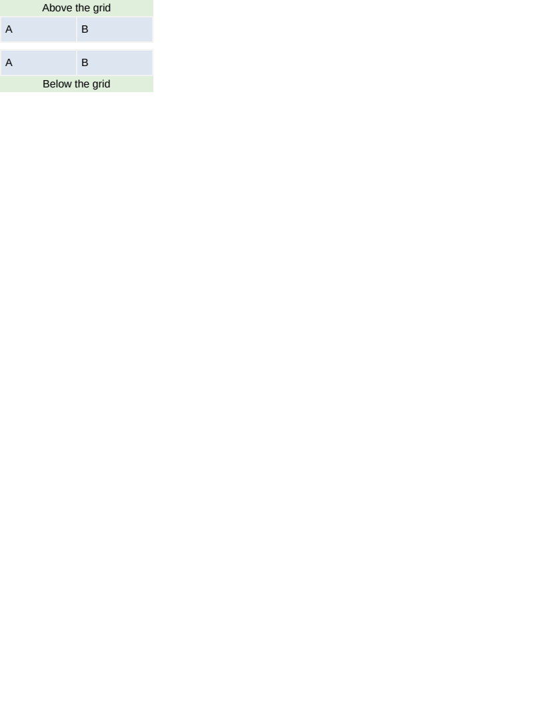 |  |


## table/cell_baseline

# table/cell_baseline

`vertical-align: baseline` on a table cell, which lines a row's cells up on their first baselines
rather than on any edge of the row. It was rendered as `top` and reported as unimplemented.

It is the property's initial value and still not the usual case: the user-agent stylesheet gives a
table `middle` and its cells `inherit`, so a cell only reaches `baseline` by asking for it. That is
why it earned a report rather than being a silent default, and why implementing it moves no other
scenario in the corpus.

Three tables, and the third is what keeps the other two honest:

- **`#mixed`** — 16px text, 32px text, and a cell with 18px of extra top padding. All three land
  their first baseline on the same line, 33px below the row's top edge. The 16px cell's content is
  moved down 16px to get there and the other two do not move at all, which is the point: the row's
  baseline is the FURTHEST any cell carries its own, so most cells sit still and one does the
  travelling.
- **`#lines`** — a one-line cell, a two-line cell and a 32px cell. The two-line cell aligns on its
  FIRST line, not its last, so its second line hangs below the row's baseline and makes the row
  60px tall where the same three cells top-aligned need 44. A row's height is therefore not the
  tallest cell: it is the furthest above the baseline plus the furthest below it, and those two
  maxima come from different cells.
- **`#against`** — `top`, `bottom` and `middle` beside a baseline cell in one row. None of them
  takes part in the baseline, and the row is sized by the tallest of them instead. Without this row
  an implementation that treated every cell as baseline-aligned would pass.

**Geometry is exact on all 33 boxes**, which is what says the rule is right — every span in every
cell lands where Chrome's layout puts it.

**Residual**: SSIM 0.9926, and it is not this engine's. **Chromium's PRINTER does not apply the
alignment, though it reserves the room for it.** The two halves of this scenario's reference
disagree: `getBoundingClientRect()` puts `#lines`'s `.one` span at y=87, and the printed page draws
that same text at y=71 — top-aligned, 16px higher — while both agree the row is 60px tall. So the
browser computes the taller row that baseline alignment demands and then leaves the content against
the top of it.

That is the same shape as `visibility: collapse` on a table row, where Chrome also disagrees with
itself and no engine behaviour can be exact on both measurements. It is resolved the other way here,
because the disagreement is one-sided rather than symmetric: the box geometry agrees with CSS 2.1
§17.5.4 and with every other browser, and the print render agrees with nothing — including its own
row height. Matching the geometry is matching the specification; matching the pixels would mean
reproducing a bug that the browser's own layout contradicts.

What to look at: the box comparison, which is the measurement that means something here. Any
non-zero offset is a real regression. The page render will differ on every baseline-aligned cell
whose content had to move, and only on those — `#against` is pixel-clean.

**Boxes**: 33 matched, worst offset 0.00px, worst size 0.00px.

| Reference (Chrome) | Krilla.Html |
| --- | --- |
| **Page 1** | **Page 1. AE 0.0031 · SSIM 0.9926** |
|  |  |


## table/collapse

# table/collapse

Pixel-identical to Chrome. `border-collapse: collapse` is what most real table CSS asks for, and
it was the last blanket entry in the diagnostic table that a document is likely to hit.

The model is one line per grid boundary rather than one border per cell. Each line's width and
colour are won by one of the boxes touching it, the line is centred on the boundary, and every
box's used border on an edge is HALF the line there — so the table's own box reaches half a line
beyond its outermost cells. Every number was measured:

- **`#basic`** — 2px uniform on 80px cells with 6px padding gives 94px cells inside a 190px table.
  Two 2px borders meeting make a 2px line, not a 4px one, and `border-spacing` stops applying.
- **`#widths`** — a 6px cell against 2px neighbours takes 3px either side of its edges and comes
  out 98px wide against their 96px. The wider border wins the shared edge outright.
- **`#frame`** — a 4px table border against 2px cells wins the outer edges, putting the cells 2px
  inside the table box.
- **`#odd`** — 3px, so every half lands on a half pixel and the cells sit at x=1.5.
- **`#separate`** — the same markup under the separated model, so the difference between the two is
  the measurement rather than the look of either.

Three things in the implementation are load-bearing.

**The halving runs before anything measures a cell.** The column algorithm sizes columns from cell
border-box widths, so the halved borders have to be in the cells' styles by the time it looks;
resolving afterwards would size the table with one set of borders and paint it with another.
Rewriting the styles is also what lets the rest of table layout stay untouched — a cell whose style
says it has a 1px left border behaves like any other such cell.

**The lines are painted once, not as two halves.** `#odd` is in the scenario for that reason: two
cells each drawing their own 1.5px half meet on a half pixel and antialias into a visible join down
the middle of every line. Drawing the boundary once has no seam at any width.

**The wider line owns a crossing.** Every line runs half a crossing line past each end so no corner
is left unpainted, which makes the junctions overlap, and the list is sorted by width so the wider
line goes down last. Measured: where `#frame`'s 4px green table border crosses a 2px red row line,
Chrome shows green. Painting the horizontals last regardless — the obvious way to fill corners —
puts red on all four corners of that table and was how this was found.

One thing it cost, and it is worth knowing because it will happen again. Replacing a cell's
`ComputedStyle` broke the reference identity that line layout uses to tell a block's own text from
an inline box of its own — a text node takes its parent's style INSTANCE, and that shared reference
is what keeps a cell's inherited `vertical-align: middle` from shifting the cell's text. Every
collapsed cell came out 0.77px too tall, which is exactly half an x-height off the line box.
`CollapsedBorders.Rewrite` repoints the inline items when it replaces a style, which restores the
invariant rather than weakening the guard.

The one gap is `border-style: hidden`, which CSS gives absolute priority at a shared edge — it wins
even against a wider border. `StyleResolver` folds `hidden` into a zero width before anything
downstream sees it, so by the time the edges are resolved it is indistinguishable from an absent
border and loses on width. It is reported rather than left silent, and only inside a collapsed
table, since everywhere else `hidden` and `none` really are the same thing.

What to look at: the corners of `#frame`, which is where the crossing rule shows, and the middle of
any line in `#odd`, which is where a seam would.

**Boxes**: 50 matched, worst offset 0.00px, worst size 0.00px.

| Reference (Chrome) | Krilla.Html |
| --- | --- |
| **Page 1** | **Page 1. AE 0.0000 · SSIM 1.0000** |
| 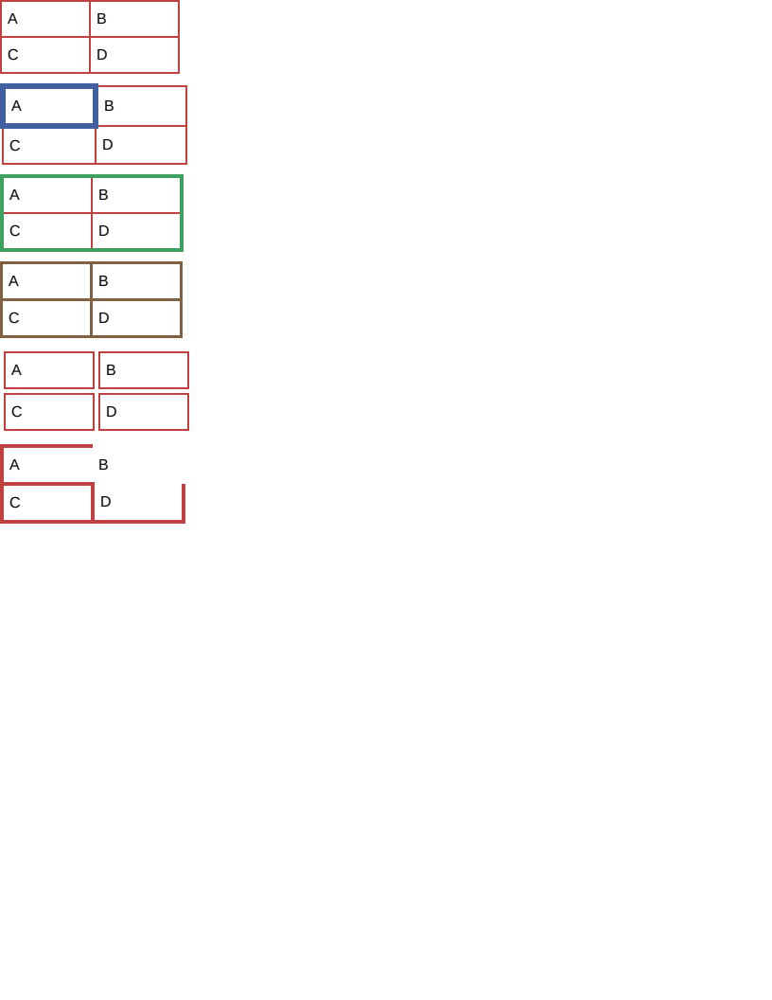 |  |


## table/columns

# table/columns

`<col>` and `<colgroup>` widths, which were reported as reaching nothing — so a table sized entirely
through its column definitions, which is how reporting tools and mail merges write one, got automatic
widths instead. Geometry is exact on all sixty-three boxes and the page reads SSIM 0.9997.

A column definition generates no box, so its width has nowhere of its own to live: it rides on the
table as a positional list, one entry per column, which is what lets the sizing algorithm read the
nth column's declared width without knowing anything about the elements that declared it. `span`
REPEATS the width rather than sharing it out, and a `<colgroup>` holding `<col>` children contributes
nothing of its own.

**The first defect was invisible in one of the two forms.** A `<colgroup span="2">` with no children
worked immediately and every `<col>` in the document was ignored, because the branch that recognises
a column definition returns before the ordinary child walk — so the `<col>` elements were never
visited. `#grouped` and `#lengths` differ in nothing but that, which is what made it findable.

**The second was a data race.** The pending widths lived in a static field on the box builder, which
is static and reached by concurrent conversions: `BoxFidelityTests` walks the corpus in a loop and
`CorpusTests` runs it in parallel, and the two reported different geometry for the same scenario from
the same reference. They now live on `DocumentContext`, beside the CSS counters, for the same reason.

Then the scenario found two rules in the column algorithm that no cell-based scenario could reach. A
table whose columns are ALL pinned needs every one of them declared, and a cell declaring a width in
every column of every row is rare enough that none had it:

- **A surplus is shared in proportion to the widths themselves.** Three columns wanting 220, 60 and
  60 with 132 left over come out 305.4, 83.3 and 83.3.
- **A shortfall is shared in proportion to what each column can GIVE UP** — its width less its
  min-content width. Three wanting 220, 220 and 60 with 28 too many come out 207.5, 207.5 and 57.0,
  where shrinking by width gives 207.7, 207.7 and 56.6. Four tenths of a pixel, and the whole of what
  separates the two readings: the wide columns give up nearly all of it either way and only the narrow
  one moves.
- **And a declared column width does not raise the floor under a table that declares its own width.**
  `#spanned` keeps its 480px and shrinks its columns; counting the declared widths grew the table to
  500 and left nothing to distribute. It still counts for a table with no width of its own, which is
  what `table/spans` caught when both cases were given the same answer.
- **The residue goes to the LAST column, on Chrome's 1/64 pixel grid.** Two identical columns come
  out 83.28 and 83.31, three hundredths apart, because the second is handed what the division left
  over. Sharing it evenly leaves them identical, which is small enough to look like noise and is the
  difference between exact and nearly exact.

`<col>` also had to become measurable. A browser reports a rectangle for one — its column's extent by
the height of the row area — so without that the comparison counted all twenty-one column definitions
in this scenario as elements the engine did not produce, and
`BaselineHealthTests.EveryElementIsMeasured` said so.

What to look at: the column widths in `#lengths` — 220, 60, 192 — and in `#spanned`, where none of
the three is the width it asked for.

**Boxes**: 63 matched, worst offset 0.00px, worst size 0.00px.

| Reference (Chrome) | Krilla.Html |
| --- | --- |
| **Page 1** | **Page 1. AE 0.0000 · SSIM 1.0000** |
| 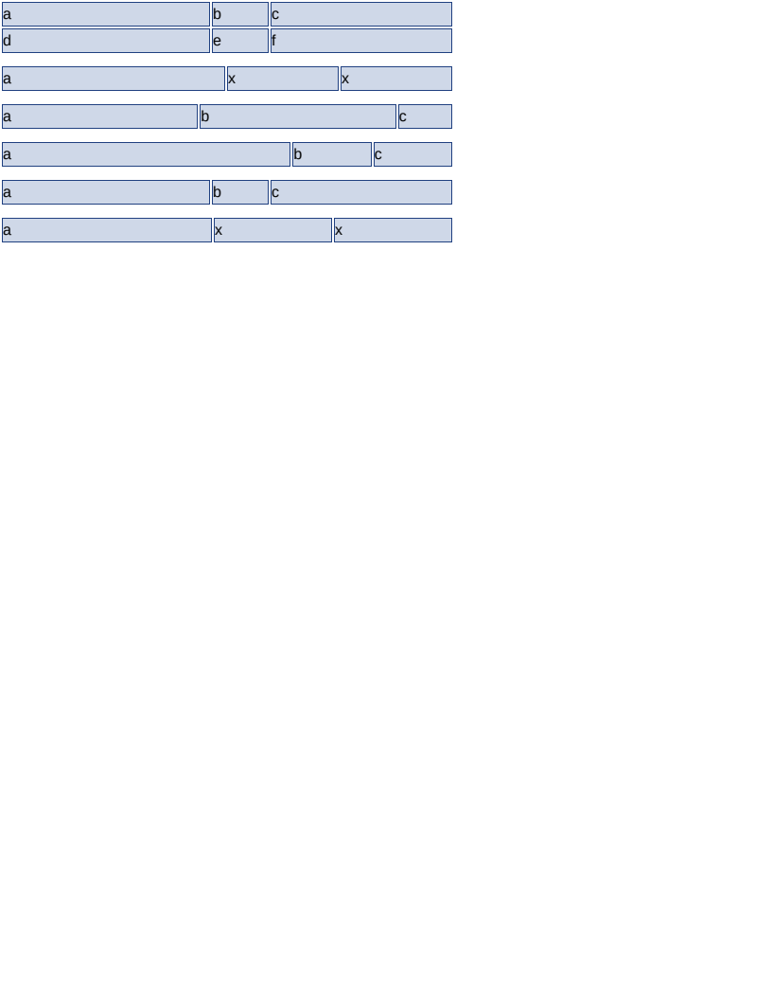 |  |


## table/empty

# table/empty

An empty table occupies nothing — not two pixels square, which is what the edge border spacing
would give it if the spacing were added unconditionally. With no columns there is nothing for that
spacing to be outside of.

The paragraphs are the instrument. Under `flatten.css` they carry no margins, so they stack
tightly and any occupancy at all by a table between them shows up as a shift of everything below
it. Four paragraphs and three degenerate tables mean each table's contribution is isolated.

`#spaced` is the arrangement that distinguishes the two readings: a table with `border-spacing: 20px`
and no cells is 0x0, not 40x40.

All three occupy nothing, and the page was pixel-identical to the reference from the start. One
box was not: `#rowless`'s `<tbody>` sat at x=2, the default 2px edge spacing applied to a section
with no columns to be outside of, where the table's own width had known to skip it all along.
`PlaceRowBoxes` now applies the same rule. It was invisible — an empty section paints nothing — so
only the geometry comparison could ever have seen it, which is the case for that comparison
leading.

What to look at when it moves: any gap between two paragraphs. A 4px one is the default 2px edge
spacing being added twice; a 40px one is `#spaced`'s own declaration being added the same way. The
`tbody` back at x=2 is the section's edge spacing returning.

**Boxes**: 10 matched, worst offset 0.00px, worst size 0.00px.

| Reference (Chrome) | Krilla.Html |
| --- | --- |
| **Page 1** | **Page 1. AE 0.0000 · SSIM 1.0000** |
|  |  |


## table/empty_cells

# table/empty_cells

Pixel-identical to Chrome, and the geometry is what confirms the property: it must not move.

`empty-cells: hide` suppresses an empty cell's border and background and nothing else. The cell
keeps its place in the grid, the rows do not close up, and every cell in `#hidden` reports the same
54x28 as its counterpart in `#shown`. That is the whole difference from `display: none`, and it is
why a scenario measuring this needs both tables laid out identically.

`#whitespace` is the row worth having. A cell containing a single space counts as empty, which
follows from something the engine already does rather than from a rule about tables: collapsible
white space generates no inline content, so a cell written with a space in it produces exactly what
a cell written with nothing produces. Measured, and what Chrome does.

The suppression is tested on the LAID-OUT box — no children, no lines, no floats, no positioned
descendants and no image — rather than on the element, because the question is whether anything
was generated rather than whether anything was written. An item that was written and then removed
by `display: none` leaves an empty cell, and a browser hides that one too.

The property is inherited and read on the cell, which is how a declaration on the table reaches
its cells: the same route `vertical-align: middle` takes, and for the same reason.

What to look at: the borders in `#hidden`. Five of the six cells should be blank paper, and the
grid should be laid out identically to `#shown` above it.

**Boxes**: 28 matched, worst offset 0.00px, worst size 0.00px.

| Reference (Chrome) | Krilla.Html |
| --- | --- |
| **Page 1** | **Page 1. AE 0.0000 · SSIM 1.0000** |
| 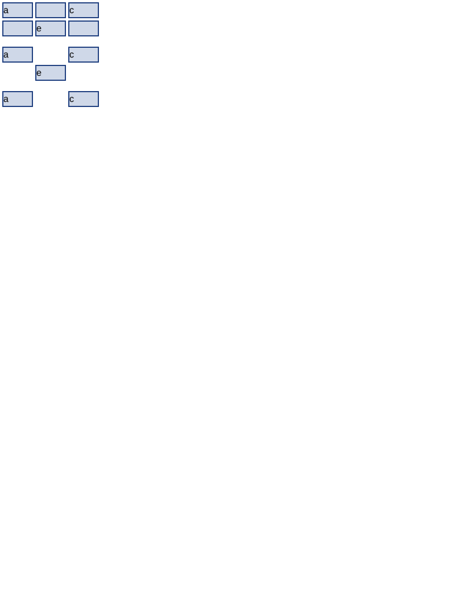 |  |


## table/fixed_layout

`table-layout: fixed` beside the automatic algorithm on the same markup, which is the only way to
see that it is a different algorithm rather than a tuning of one.

`#fixed` and `#auto` differ by one declaration and by nothing else. Fixed layout reads the first row
and stops: the pinned column takes its declared width and the two automatic columns split what is
left equally, whatever the second row contains. The automatic table reads every cell, so its second
row — the long one — decides the first column's width and the three columns come out unequal.

`#percent` measures a percentage column, which is where the two algorithms genuinely disagree about
what a percentage means. Under the automatic algorithm the percentage is the whole column, border
and padding included, because it has to compete with content widths that are measured that way.
Under fixed layout there is no content to compete with, so it is the cell's `width` under ordinary
content-box sizing and the padding is added on top. The difference is exactly the cell's padding,
which is small enough to look like a rounding error and is not one.

**Boxes**: 27 matched, worst offset 0.00px, worst size 0.00px.

| Reference (Chrome) | Krilla.Html |
| --- | --- |
| **Page 1** | **Page 1. AE 0.0000 · SSIM 1.0000** |
| 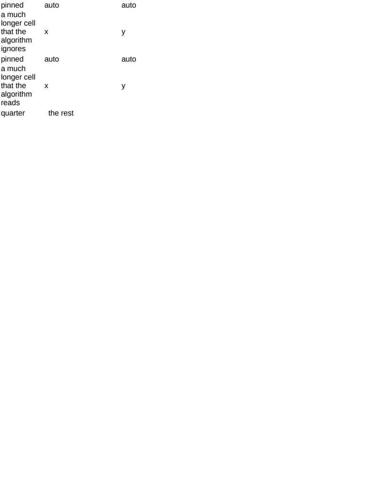 |  |


## table/hyphen_columns

**Boxes**: 12 matched, worst offset 0.00px, worst size 0.00px.

| Reference (Chrome) | Krilla.Html |
| --- | --- |
| **Page 1** | **Page 1. AE 0.0000 · SSIM 1.0000** |
|  |  |


## table/sections

Row groups, captions and vertical alignment.

- `#ordered` writes its sections in the order tfoot, thead, tbody and expects them rendered as
  thead, tbody, tfoot. That reordering is the whole point of the elements — it lets a long table's
  markup put the footer next to the data it summarises — and a table that renders sections in
  source order looks right until a document uses `tfoot` early.
- `#captioned` measures the caption's own box, which spans the table and sits above the grid with a
  border-spacing gap below it.
- `#captionwide` measures the rule that a table is never narrower than its caption's longest word.
  A caption of one long word with a single narrow cell is the case where the caption alone decides
  the table's width. It is the caption's MIN-content width that applies, not its maximum: a long
  caption wraps rather than stretching the table out.
- `#aligned` measures `vertical-align` in a row taller than three of its cells. The default is
  `middle` rather than the `baseline` the property's initial value suggests, because the user-agent
  stylesheet sets it on the table and the cells inherit — so a converter that honours only the
  initial value puts every short cell's text at the top of its row.

The render is not quite pixel-identical. Two words differ on a glyph each, which is the sub-pixel
glyph positioning difference the todo records as the engine's largest residual. A table shows it
more readily than most layouts because column widths are fractional by nature, so almost no cell
starts on a whole pixel.

**Boxes**: 33 matched, worst offset 0.00px, worst size 0.00px.

| Reference (Chrome) | Krilla.Html |
| --- | --- |
| **Page 1** | **Page 1. AE 0.0002 · SSIM 1.0000** |
| 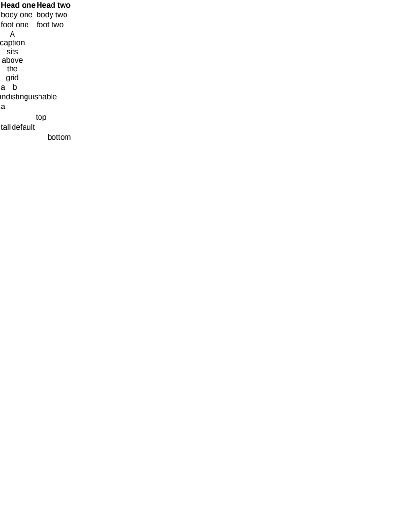 |  |


## table/spacing_borders

The separated border model: what `border-spacing` separates, and what a border and a background
land on once it has.

- `#spaced` sets both axes independently. The gap goes outside the first and last column as well as
  between them, which is what makes a table with spacing wider than the sum of its columns.
- `#framed` puts a border on the table and on two diagonally opposite cells, so the cell borders are
  measured against the table's own rather than confused with it. The cell borders are inside the
  spacing, not shared with a neighbour — that is what separated means.
- `#painted` fills a row in one table and a cell in another. A row's box spans the whole grid rather
  than only the cells in it, so a row background reaches across the spacing while a cell background
  stops at the cell.
- `#padded` gives one cell asymmetric padding, which has to widen its column and raise its row
  without disturbing the other cells.

`border-collapse: collapse` is not implemented and no scenario here asks for it. It is a different
model rather than a variation on this one — collapsed borders are shared between neighbours, and
half of each sits outside the cell it was declared on.

The render is not quite pixel-identical, and the cause is worth naming because it is not a layout
difference: the box geometry is exact. A column width is fractional, so a cell's border lands on a
fractional pixel, and the two engines resolve that differently — Chrome snaps a box decoration to
whole device pixels before painting it, while this draws the edge where the geometry puts it and
lets it antialias. The difference is a fraction of one pixel along each border edge, never more
than 40 levels of grey out of 255. It is the same effect `image/inline_flow` records for an image
edge.

**Boxes**: 31 matched, worst offset 0.00px, worst size 0.00px.

| Reference (Chrome) | Krilla.Html |
| --- | --- |
| **Page 1** | **Page 1. AE 0.0000 · SSIM 1.0000** |
|  |  |


## table/spans

Cells covering more than one slot, which is what makes a table a grid rather than rows of boxes.

- `#cols` has a spanning cell wider than the columns beneath it. The shortfall is shared in
  proportion to what those columns already wanted, so the wide cell does not put its extra width
  into a column with almost nothing in it. Sharing equally is the obvious alternative and is wrong.
- `#rows` covers two rows with one cell, which is the case that breaks naive column assignment: the
  second row's first cell belongs in the SECOND column, because the first is already taken. Getting
  that wrong shears every row below a span sideways, and it would still look plausible.
- `#stretch` forces the spanning cell taller than its rows need, and the extra is shared equally
  between them — the opposite of how a column shortfall is shared, and measured rather than assumed.
- `#mixed` combines both in one grid, so a row is entered with some columns already occupied and
  some cells spanning onward from it.

**Boxes**: 35 matched, worst offset 0.00px, worst size 0.00px.

| Reference (Chrome) | Krilla.Html |
| --- | --- |
| **Page 1** | **Page 1. AE 0.0000 · SSIM 1.0000** |
| 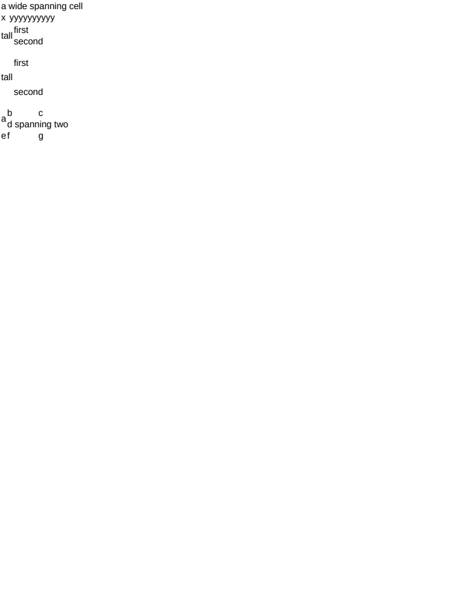 |  |


## text/decorations

# text/decorations

The three rules, alone and together. Underline was the only one painted; overline and line-through
were recognised and dropped, which is the worst of the three states — a strike that vanishes turns
deleted text back into text that still reads as current.

Every position comes from the font's own tables rather than a fraction of the size, and each was
checked against Chrome's own render before being written. At 16px Liberation Sans:

- **underline** at baseline + 1, from `post.underlinePosition` and `underlineThickness`.
- **line-through** at baseline − 5, from `OS/2.yStrikeoutPosition` and `yStrikeoutSize`.
- **overline** at baseline − 15, which is the only one with no metric of its own: it sits on the
  top of the em box, the rounded ASCENT above the baseline, with the underline's thickness.

All three land on the row the browser puts them on, and the page is pixel-identical.

The rounding is what makes that work. This font puts the strike 4.14px above the baseline and makes
it 0.797px thick; rounded, that is one whole pixel row at baseline − 5, which is what Chrome draws.
An unrounded rule straddles two rows at partial coverage and reads as a grey smear rather than a
line — the same lesson `ListMarkers` records about integer arithmetic being the point rather than a
shortcut.

`#nested` records a limit rather than a success. CSS propagates a decoration ACROSS descendants
from the element that declared it, keeping that element's colour; this engine inherits it instead,
so the strike over the red inner span is drawn red where a browser draws it black. The two models
agree everywhere else, and the difference needs a descendant that sets its own colour — which is
why the row is here at all. It costs nothing in this scenario because both engines put ink in the
same places; a scenario with a coloured strike would report it.

What to look at: whether `#all` carries three rules and `#through` one. A missing overline is the
rule with no font metric behind it.

**Boxes**: 9 matched, worst offset 0.00px, worst size 0.00px.

| Reference (Chrome) | Krilla.Html |
| --- | --- |
| **Page 1** | **Page 1. AE 0.0000 · SSIM 1.0000** |
|  |  |


## text/decoration_style

# text/decoration_style

The colour and the rule style of a text decoration, both of which were read and neither honoured: a
coloured underline came out in the colour of the text and a dashed one came out solid.

`text-decoration-color` is the simpler half and is exact. `#coloured` draws its rule in `#c02020`
and the row is one solid span of it. The colour inherits alongside the decoration itself, since a
rule declared on an ancestor is drawn through its descendants and carries the colour of that
ancestor with it. An element that starts a decoration of its OWN starts its own colour with it,
which is what keeps a nested element from picking up a colour it never asked for.

The three styles were measured out of the reference rather than derived, and none of the numbers is
obvious:

- **`double`** is two rules of the drawn thickness with twice it between them, so a 1px underline at
  baseline+1 puts its second line at baseline+4. Two lines 2px apart is the arithmetic a reading of
  the specification suggests, and it is not what Chrome draws.
- **`dashed`** is six pixels on and four off, and **`dotted`** is two on and two off, under an
  underline that is one pixel thick when solid. Both are multiples of two rather than of one, which
  is what says the patterned rule is drawn at TWICE the solid thickness. The Blink pattern is three
  widths on and two off for a dash and one width each way for a dot, and both of those land exactly
  on the measured numbers at a width of two.
- The patterned rule is CENTRED on the position of the solid rule rather than hanging below it.
  Getting that wrong put it a row low and was the whole of the difference between 0.9989 and 0.9999.

`wavy` is reported and drawn solid.

**Residual**: SSIM 0.9999, and the remaining pixels are one thing. Chrome interrupts an underline
around a descender, which is `text-decoration-skip-ink` at its default of `auto`. Sixteen pixels in
`#plain`, at the `p` of "plain", the comma, and the `p` of "comparison". Implementing it needs the
glyph outlines rather than the advances, and it is not reported: it is a default rather than a
declaration, so a report would fire on every underlined document ever converted.

What to look at: the gaps in the Chrome underline under each descender, and their absence in ours.

**Boxes**: 14 matched, worst offset 0.00px, worst size 0.00px.

| Reference (Chrome) | Krilla.Html |
| --- | --- |
| **Page 1** | **Page 1. AE 0.0002 · SSIM 0.9999** |
| 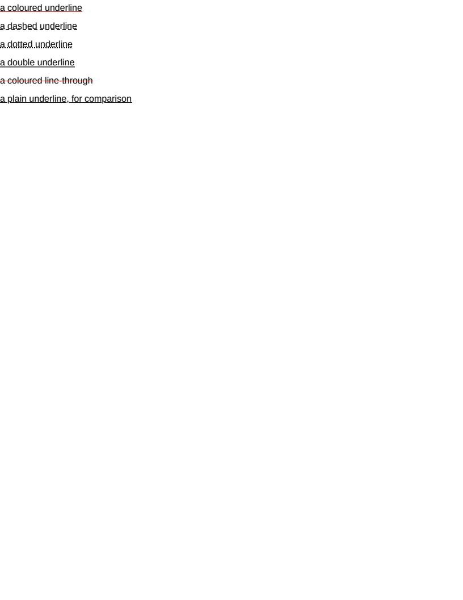 |  |


## text/ex_ch

# text/ex_ch

`ex` and `ch`, the two length units that name a glyph measurement rather than arithmetic on the
font size.

Both were approximated at half an em for as long as the value layer threaded a bare `float`: a
length parse had a size and no face, and the x-height and the advance of `0` are properties of the
glyphs. `CssFont` carries the face now, and `#half-em` is the row that says the difference is real —
it asks for `10em` against `#ex`'s `20ex`, and the two boxes are the same width only under the old
approximation.

## What the browser measures

At 20px, in the corpus's own faces:

| Row | Family | Declared | Chrome | Ratio to the em |
| --- | --- | --- | --- | --- |
| `#ex` | Liberation Sans | `20ex` | 211.33 | 0.5283 |
| `#ex-bold` | Liberation Sans Bold | `20ex` | 211.33 | 0.5283 |
| `#ex-mono` | Liberation Mono | `20ex` | 211.33 | 0.5283 |
| `#ch` | Liberation Sans | `20ch` | 222.45 | 0.5561 |
| `#ch-mono` | Liberation Mono | `20ch` | 240.03 | 0.6000 |
| `#ex-inherited` | Liberation Mono, inherited | `20ex` | 211.33 | 0.5283 |
| `#half-em` | Liberation Sans | `10em` | 200.00 | — |

Two things worth reading off that table, and the second was a surprise:

- **Neither unit is half an em**, and they are not the same quantity as each other. In one face
  `20ex` and `20ch` differ by 11px.
- **The three `ex` rows agree.** All four Liberation faces here share an x-height ratio, so `ex`
  alone cannot show that the value follows the FACE rather than the size — `ch` is what shows it,
  and `#ch-mono` is 17.6px wider than `#ch` because a monospaced advance is 0.6 of the em. So the
  rows are not redundant in the direction they look redundant: `#ex-mono` pins that a face change
  does NOT move `ex` here, and `#ch-mono` pins that it moves `ch`.

`#ex-inherited` takes its family from a wrapper rather than from its own declaration, so a
resolution that read the declaration being parsed instead of the resolved style would fall back to
the default face and be wrong by whatever that face's x-height is.

## What this cannot ask

Whether the unit resolves against the parent's face in a `font-size` declaration. `font-size: 3ex`
is the case, and its answer is the size in effect BEFORE the declaration — the same rule `em`
follows. Nothing in a box rectangle separates that from the other reading without a second element
to compare against, so it is settled in `StyleResolver` by construction instead: `ResolveFontSize`
is handed the parent's font rather than one built from a size it is still computing.

**Boxes**: 10 matched, worst offset 0.00px, worst size 0.00px.

| Reference (Chrome) | Krilla.Html |
| --- | --- |
| **Page 1** | **Page 1. AE 0.0000 · SSIM 1.0000** |
| 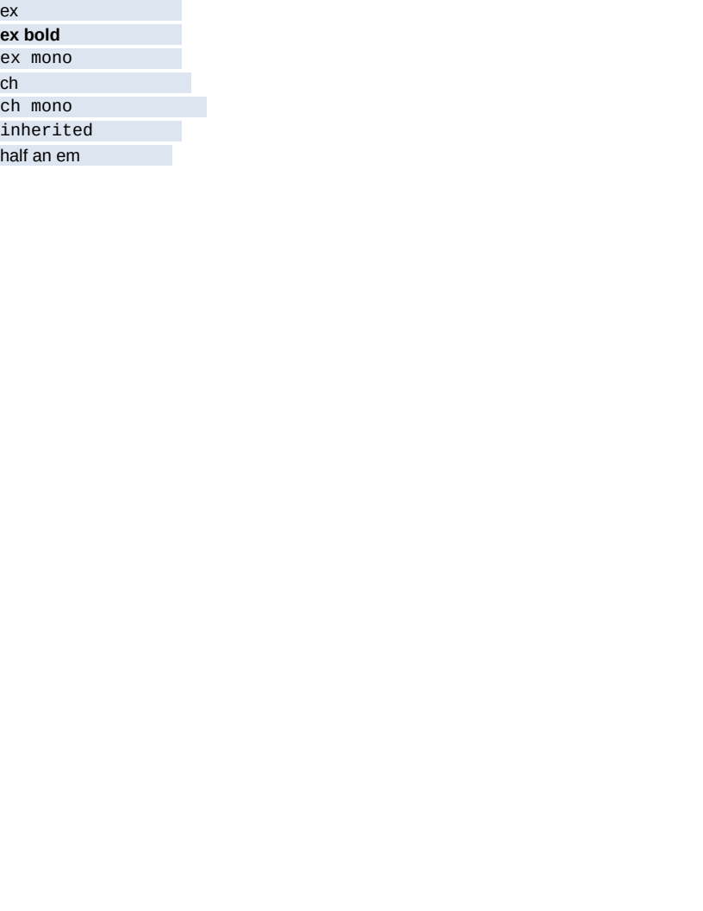 |  |


## text/font_size_keywords

# text/font_size_keywords

The seven absolute keywords, the two relative ones, and a relative one nested inside an absolute
one. Every box is an inline-block so its width is the text's advance, which turns a resolved font
size into a number the reference geometry reports directly — a keyword that quietly fell back to
the inherited size would show as an identical width rather than as a subtly different render.

The absolute table was measured rather than derived, because it is not a series any ratio produces:
9, 10, 13, 16, 18, 24 and 32 pixels. The steps at the small end are one pixel and the steps at the
large end are eight, so any single scaling factor is wrong at one end or the other.

It is anchored on a CONSTANT rather than on the root element's size. CSS says the table follows the
reader's preferred font size, which is a setting this engine has no equivalent of and which a
browser does not take from the document — so `font-size: large` is 18px whatever `html` declares.
Anchoring on the root instead would make a document setting `html { font-size: 20px }` report
`large` as 22.5px where Chrome still says 18.

The two relative keywords are the parent's size scaled by 1.2, measured and holding at every size:
16px gives 13.333 and 19.2, and `#nested` — `smaller` inside a `large` parent — gives 15, which is
18 over 1.2. That last row is what says the keyword resolves against the INHERITED size rather than
against the root's.

There is a specific failure behind this scenario. The keyword used to reach `ResolveFontSize` as an
unparseable value whose fallback was an absolute zero, so `font-size: large` resolved to a size of
0 and deleted the text of the element carrying it. `DiagnosticTests` keeps a regression test for
that, and now also pins the table above.

Geometry is exact and pixels read SSIM 0.9997, from glyph positioning across nine different sizes.

What to look at: the widths. Any two rows coming out equal means a keyword fell through to the
inherited size.

**Boxes**: 13 matched, worst offset 0.00px, worst size 0.00px.

| Reference (Chrome) | Krilla.Html |
| --- | --- |
| **Page 1** | **Page 1. AE 0.0006 · SSIM 0.9999** |
|  |  |


## text/kerning

Kerning pairs, at a size that makes a fraction of an em visible. AV, LT, Wa and To are the classic
ones: the pair is drawn tighter than the two advances would place it.

This is the scenario the corpus could not have before. Text used to be measured by summing raw hmtx
advances, which ignores kerning entirely, so `reset.css` disabled it in the browser to keep the two
sides comparable. Shaping through krilla's own rustybuzz removed that concession, and the third
paragraph checks the consequence that actually matters: with the wrong widths, a line breaks in the
wrong place.

**Boxes**: 5 matched, worst offset 0.00px, worst size 0.00px.

| Reference (Chrome) | Krilla.Html |
| --- | --- |
| **Page 1** | **Page 1. AE 0.0201 · SSIM 0.9945** |
| 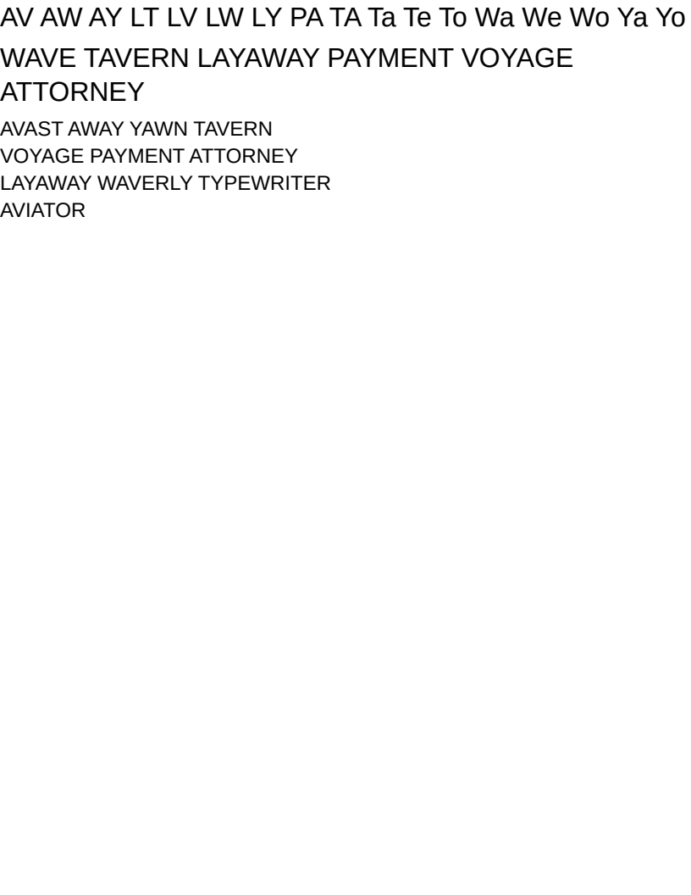 |  |


## text/letter_spacing

# text/letter_spacing

Every box is an inline-block, so its width is the text's advance and nothing else — which is what
lets this scenario ask the two questions that a full-width paragraph could not answer.

**Is the spacing after the last character counted?** `Spacing` is seven characters. At 3px it comes
back 21px wider, not 18px. So yes, and a shrink-wrapped box carries the spacing past its final
glyph. This is the measurement that decides it and it is invisible in flowing text.

**Is it per character or per glyph?** `office` with 3px comes back 18px wider — six characters —
even though the `ffi` is drawn as one ligature glyph. Per character, and the ligature SURVIVES: the
base width is unchanged at 37.95px either way. A shaper invites the other reading, since what it
hands back is glyphs, and per glyph would be 12px on four glyphs. `#ligature` and `#ligature-spaced`
are the pair that tells them apart, and the corpus can only ask because text is shaped rather than
summed.

The implementation follows from that: the extra advance is attributed to the glyph covering the
characters it is owed to, so a ligature glyph carries three characters' worth. That keeps the run's
painted width equal to its measured one however the shaper happened to group the text — the two
being computed separately is exactly how a renderer ends up drawing something other than what it
laid out.

`#spaced` shows the spacing applies to the space character too: `two words` is nine characters and
gains 27px, not 24px.

`#tight` is a negative value, which shortens rather than being clamped to zero.

Geometry is exact and pixels read SSIM 0.9999.

What to look at: the width of `#wide` against `#normal`. An 18px difference rather than 21px is the
trailing character being dropped; `#ligature-spaced` at 49.95px is spacing applied per glyph.

**Boxes**: 8 matched, worst offset 0.00px, worst size 0.00px.

| Reference (Chrome) | Krilla.Html |
| --- | --- |
| **Page 1** | **Page 1. AE 0.0005 · SSIM 0.9999** |
|  |  |


## text/ligatures

Ligatures, where shaping changes the glyph count rather than only the spacing: fi and fl become a
single glyph, so the text measures narrower than its characters would suggest.

The cluster mapping matters here as much as the width. A ligature covers several characters with
one glyph, so its text range spans them all — get that wrong and the PDF's text extraction returns
the wrong characters for the run even though the page looks right.

**Boxes**: 5 matched, worst offset 0.00px, worst size 0.00px.

| Reference (Chrome) | Krilla.Html |
| --- | --- |
| **Page 1** | **Page 1. AE 0.0099 · SSIM 0.9982** |
| 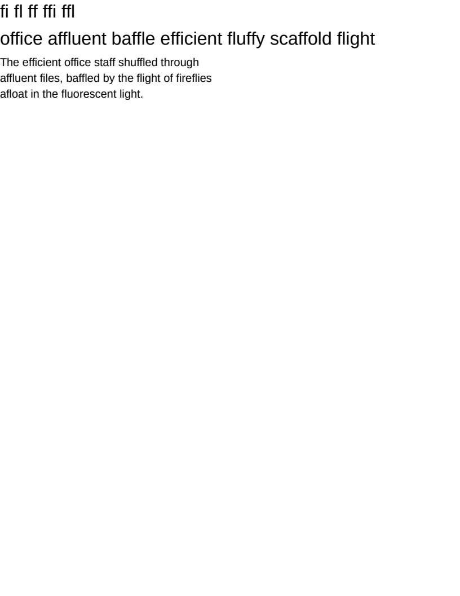 |  |


## text/soft_hyphen

# text/soft_hyphen

Pixel-identical to Chrome, and geometry-exact.

A soft hyphen is a break opportunity that draws a hyphen only where the break falls on it, which
makes it the one character in the corpus whose rendering depends on a decision taken after it was
measured. Four rows separate the parts:

- `#narrow` at 40px takes both opportunities and draws a hyphen at each, over three lines.
- `#wide` at 300px takes neither, and measures **87.19px, exactly what `#none` measures without any
  soft hyphen in it at all**. That equality is the whole property and it is what forced the
  implementation: the soft hyphens are stripped BEFORE shaping, because this face maps U+00AD onto
  a real hyphen glyph with a real advance. Left in the string, the word would measure wider than
  the same word without and would draw hyphens no break called for.
- `#late` at 70px passes over the first opportunity and takes the second, which is what a greedy
  line breaker does and what distinguishes a real implementation from one that always breaks at the
  first.
- `#none` is the same word with nothing in it, overflowing a box it cannot break in.

The drawn hyphen belongs to the ELEMENT that broke, which was measured rather than assumed: Chrome
reports the span 5.33px wider than the text inside it, exactly the hyphen advance. So the hyphen run
carries the token selector and inline ancestry, and an inline background reaches under it.

Stripping happens at tokenisation over one shaped run, the same arrangement dash breaking uses, so
the segments sum to exactly what the whole word measured and the kerning across the join survives.

**Known limitation.** The hyphen width is not part of the fit test, only of the line it ends. A line
whose last segment leaves less than a hyphen of slack therefore overruns its box by up to that much,
where a browser would move the segment down. None of the four rows here is in that condition, and
correcting it needs the line breaker to back up over a decision it has already taken.

What to look at: the hyphens at the ends of the first two lines of `#narrow`, and the absence of one
anywhere in `#wide`.

**Boxes**: 10 matched, worst offset 0.00px, worst size 0.00px.

| Reference (Chrome) | Krilla.Html |
| --- | --- |
| **Page 1** | **Page 1. AE 0.0000 · SSIM 1.0000** |
|  |  |


## text/tabs

# text/tabs

Pixel-identical to Chrome, and geometry-exact.

A tab under `pre` advances to the next tab stop rather than to a width of its own, so it is the one
token in the engine whose width is not known when it is measured: where the stop falls depends on
how far along the line the tab already sits. The token carries the STOP SPACING instead, and the
advance is settled while the line is being filled.

Measured out of Chrome across three values of `tab-size`, with Liberation Mono at 16px giving a
9.6026px advance:

- The stops sit at multiples of `tab-size` SPACE ADVANCES from the start edge of the line. At the
  default 8 that is 76.82px, at 4 it is 38.41, at 2 it is 19.20, and every span in the scenario
  lands on one.
- A tab already sitting exactly on a stop advances to the NEXT one rather than to nothing. `a` is
  one character wide and its tab reaches 8, not 1; a leading tab on an empty line reaches 8, not 0.
- Nine characters followed by a tab reach 16 rather than 12, which is what makes the second line of
  each block a different arithmetic from the first.

Two things had to be kept away from the shaper. A tab is a real character in the text of its item,
so it carries a shaped range like any other token, and a run merges with its neighbours on exactly
that contiguity. Left to merge, the tab CHARACTER was drawn as a glyph, at the advance of that glyph
rather than at the distance to the stop, which moved every glyph after it inside the same run. It is
also excluded from the unbreakable-run widths, where its width field means a stop spacing rather
than an advance and summing it measures nothing.

A `tab-size` given as a LENGTH is reported rather than honoured.

What to look at: the x of every span. Each should be an exact multiple of the stop of its block.

**Boxes**: 17 matched, worst offset 0.00px, worst size 0.00px.

| Reference (Chrome) | Krilla.Html |
| --- | --- |
| **Page 1** | **Page 1. AE 0.0000 · SSIM 1.0000** |
|  |  |


## text/text_transform

# text/text_transform

Casing, and where a word starts.

The first three rows are the straightforward half. Each box is an inline-block so its width IS the transformed
advance, which makes the reference geometry a direct measurement of the cased text rather than of
the paragraph it sits in — `hello world` upper-cased is 116.47px against 76.48px, so a transform
that silently did nothing would show up as a 40px box difference rather than only in the pixels.

`#boundaries` is the row that had to be measured. `page-break o'clock 3rd (bracketed) "quoted"`
comes back from Chrome as:

> Page-Break O'clock 3rd (Bracketed) "Quoted"

So a hyphen, a bracket and a quote each begin a word, and an apostrophe and a digit do not. The
obvious rule — a word starts after any non-letter — gives `O'Clock` and `3Rd`, which is wrong in
two places out of five. The rule that reproduces every case is per PRECEDING character: a letter
starts a word unless what comes before it is a letter, a digit, or an apostrophe. That is an
approximation of the UAX #29 word segmentation a browser runs, where the apostrophe is MidLetter
and a digit joins the letters around it — the same answer arrived at properly.

`#none` is here to be identical to `#lower`'s output, which is the check that the property is read
at all rather than that upper-casing happens to be the default.

The transform is applied after white-space processing and before shaping, which is the order that
matters: a collapsed run of spaces has already become one space when word boundaries are looked
for, and the text that is shaped, broken into lines and painted is one string throughout. It cannot
be a painting concern — upper-casing makes a line half again as wide in most faces and wraps a
paragraph a line earlier.

One limit: the boundary is found within a single text node, so a word split across two inline
elements is capitalised at the start of the second where a browser looks at the rendered text whole.
Rarer than the same limit in line breaking, since capitalising mid-word is not something markup
normally sets up.

Geometry is exact and pixels read SSIM 0.9999.

What to look at: `#boundaries`. `O'Clock` or `3Rd` is the naive boundary rule returning.

**Boxes**: 7 matched, worst offset 0.00px, worst size 0.00px.

| Reference (Chrome) | Krilla.Html |
| --- | --- |
| **Page 1** | **Page 1. AE 0.0002 · SSIM 0.9999** |
|  |  |


## text/underline_offset

# text/underline_offset

`text-decoration-thickness` and `text-underline-offset`, and the two measured rules underneath them
that had been wrong at every size but 16px without anything noticing.

The scenario is at **20px**, which is the point. `text/decorations` measures the default rules at
16px and is pixel-identical, and that agreement turned out to be a coincidence: the engine read the
face's `post` table, Chrome does not read the face at all, and the two round to the same answer at
16px and part company immediately above it.

Measured out of Chrome across nineteen sizes from 10px to 60px, exact at every one:

- **Thickness is `max(1, floor(size / 10))`.** Nothing to do with the font — Liberation Sans gives
  0.8px at 16px, and both rules give 1 there. At 20px the font gives 1 and Chrome draws 2. The FLOOR
  is the whole of it: 19px is one pixel thick and 20px is two, which no rounded expression
  reproduces.
- **The underline sits `ceil(size / 20)` below the baseline**, held clear by at least half its own
  thickness: `max(ceil(size / 20), floor(thickness / 2))`. Both halves are needed. The size term
  alone is a pixel short for a thick rule — `#thick` at 4px sits two pixels down where the size says
  one — and the thickness term alone is a pixel short at 44px. The CEILING is what puts the step at
  21px rather than at 20px, and the position is flat from 24px to 40px, where anything linear in the
  size would keep climbing.
- **A declared `text-underline-offset` REPLACES that position rather than adding to it.** CSS
  describes the property as an offset from the initial position, which reads as additive; at 20px the
  resolved position is one pixel down and `text-underline-offset: 6px` puts the rule six down rather
  than seven. `#lowered` is the row that says so and `#both` confirms it against an overridden
  thickness at the same time.

The line-through keeps the FONT's position — `OS/2.yStrikeoutPosition` — and takes the resolved
thickness like the other two. Only the position is a property of the face: a strike has to cross the
glyphs at the height that face was designed for, where a thickness is the browser's choice.

**Residual**: SSIM 0.9997 from glyph edges. Every one of the six rules lands on exactly the rows
Chrome puts it on.

What to look at: the rows each rule occupies. `#thin` is one row, `#plain` two, `#thick` four, and
`#lowered` starts six below the baseline rather than seven.

**Boxes**: 14 matched, worst offset 0.00px, worst size 0.00px.

| Reference (Chrome) | Krilla.Html |
| --- | --- |
| **Page 1** | **Page 1. AE 0.0002 · SSIM 0.9997** |
| 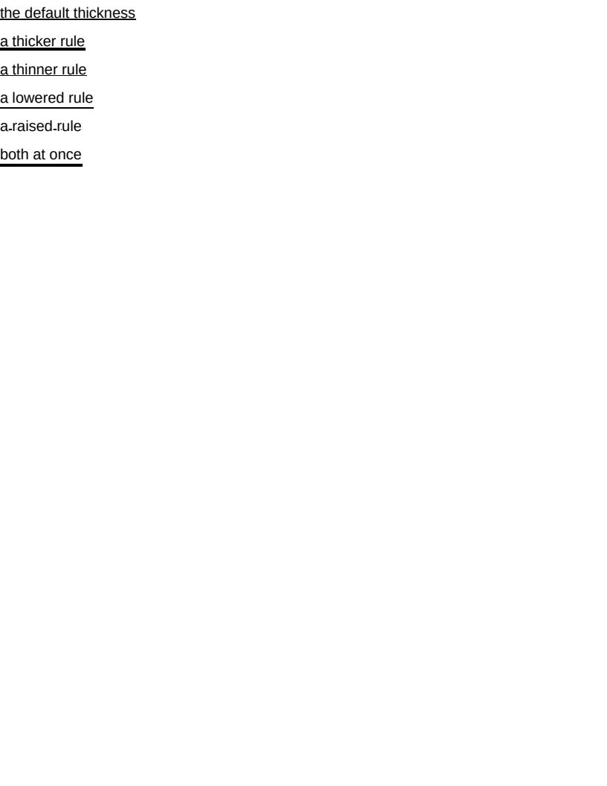 |  |


## text/word_break

# text/word_break

Pixel-identical to Chrome, and geometry-exact.

Two properties that let a line break inside a word, which every other rule in the line breaker
forbids. They collapse into one value here, because the engine cares what a value PERMITS rather
than which property asked for it. The two permissions differ, and the scenario separates them:

- `#overflow` is the control, with neither property: a word with no opportunity in it overflows its
  box by 95px and nothing breaks.
- `#wrap` has `overflow-wrap: break-word`, which breaks a word only when it fits on no line of that
  width at all.
- `#all` has `word-break: break-all`, which breaks anywhere whether or not the word would overflow.
  On a single long word the two are indistinguishable, which is why the fourth row exists.
- `#mixed` is the row that told them apart, and it found a real defect. With ordinary words before
  the long one, the long word is first MOVED to a line of its own by the ordinary break rule, and
  the code that did so added it to the new line directly, so nothing afterwards ever asked whether
  it could be cut. The paragraph came out one line short and 96px wide. A word moved to a fresh
  line now falls through to the splitting loop instead of being placed.

Splitting walks outward from the token start rather than binary-searching, because `ShapedText`
answers a sub-range by summing advances it already holds: the walk costs what one width query costs
and hands back every candidate on the way. A cut takes at least one character on an empty line
whatever the width, since a character wider than the box would otherwise loop forever.

No hyphen is drawn at the cut. The break was forced by the box rather than offered by the text, and
a browser draws nothing there, which is what separates this from `text/soft_hyphen`.

What to look at: the second line of `#mixed`. If the long word is intact and hanging out of the box,
the split is being bypassed by the ordinary break.

**Boxes**: 20 matched, worst offset 0.00px, worst size 0.00px.

| Reference (Chrome) | Krilla.Html |
| --- | --- |
| **Page 1** | **Page 1. AE 0.0000 · SSIM 1.0000** |
| 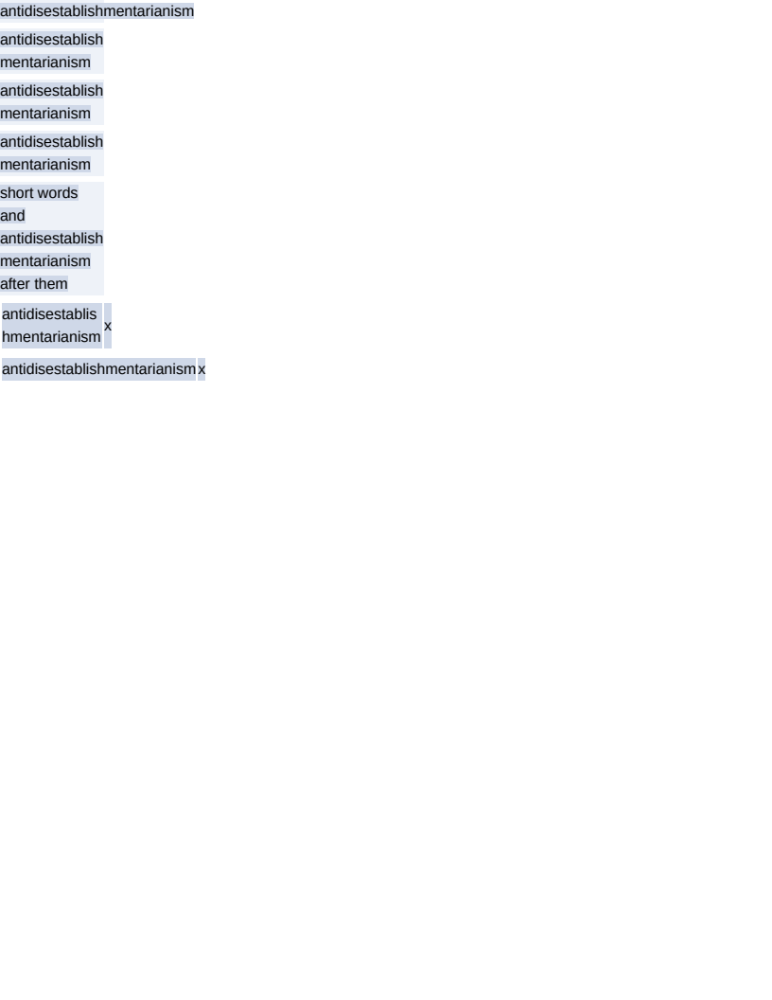 |  |


## text/word_spacing

# text/word_spacing

The companion to `text/letter_spacing`, and a simpler rule: the extra advance goes on each SPACE,
not on each word. `two words here` is three words and two spaces, and at 10px it comes back 20px
wider — a per-word reading would give 30px.

`#single` is the row that makes that unambiguous. One word, no space, and `word-spacing: 10px`
declared: the box must not change width at all. Without it, a per-word implementation and a
per-space one differ by exactly one increment everywhere and both look plausible.

`#trailing` declares `word-spacing: 0`, which has to be indistinguishable from not declaring it —
the check that a declared zero is not being treated as "unset" and inherited from somewhere.

`#tight` is negative, which pulls the words together rather than clamping.

Both spacings are applied inside `ShapedText` rather than by its callers, because they change the
answer to every question it exists to answer. A width that ignored them would break lines in the
wrong places and size a shrink-wrapped box wrongly, and adding them afterwards at some call sites
and not others is the shape that bug would take.

Geometry is exact and pixels read SSIM 0.9998, from glyph positioning across the widened spaces.

What to look at: `#single`. Any width change there is a per-word implementation.

**Boxes**: 7 matched, worst offset 0.00px, worst size 0.00px.

| Reference (Chrome) | Krilla.Html |
| --- | --- |
| **Page 1** | **Page 1. AE 0.0009 · SSIM 0.9998** |
|  |  |


## ua/acid1

Acid1, the CSS1 conformance test, from the W3C CSS1 test suite (`test5526c.htm`, dated 1998). The
only scenario here not written for this corpus, and it earns the exception: it exercises floats,
percentage widths, the box model and `clear` together, in an arrangement nobody designing a
scenario would have thought to build.

Two changes were made to the imported markup, both recorded so the import can be repeated:

- `Verdana` becomes `Liberation Sans`, since the corpus pins its fonts to the bundled faces. Text
  metrics change and no box does, which is what the test measures.
- The `<form>` and its two radio buttons are removed. Form widgets have no rendering here and the
  test itself exempts them — its own instructions say agents should match "except font
  rasterization and form widgets" — but a widget with no rendering is still a box the browser
  reports, so leaving them in would hold four boxes permanently unmatched and cost the corpus its
  property that geometry is zero everywhere.

It found two defects on its first render, neither of which any hand-written scenario had reached:

- The root element's background propagates to the CANVAS and covers the whole page rather than the
  root box alone. Acid1 paints the page blue and its content stops a third of the way down, so the error
  was two thirds of the page. `Inputs/reset.css` paints the root white over a page that was already
  white, which is why fifty-three scenarios had passed over it.
- `line-height` was not inherited, so `html { font: 10px/1 }` set the line height of the root and
  of nothing inside it. That is how nearly every stylesheet sets line spacing, and it left two
  boxes here a pixel too tall.

With both fixed it matches Chrome exactly.

**Boxes**: 14 matched, worst offset 0.00px, worst size 0.00px.

| Reference (Chrome) | Krilla.Html |
| --- | --- |
| **Page 1** | **Page 1. AE 0.0000 · SSIM 1.0000** |
| 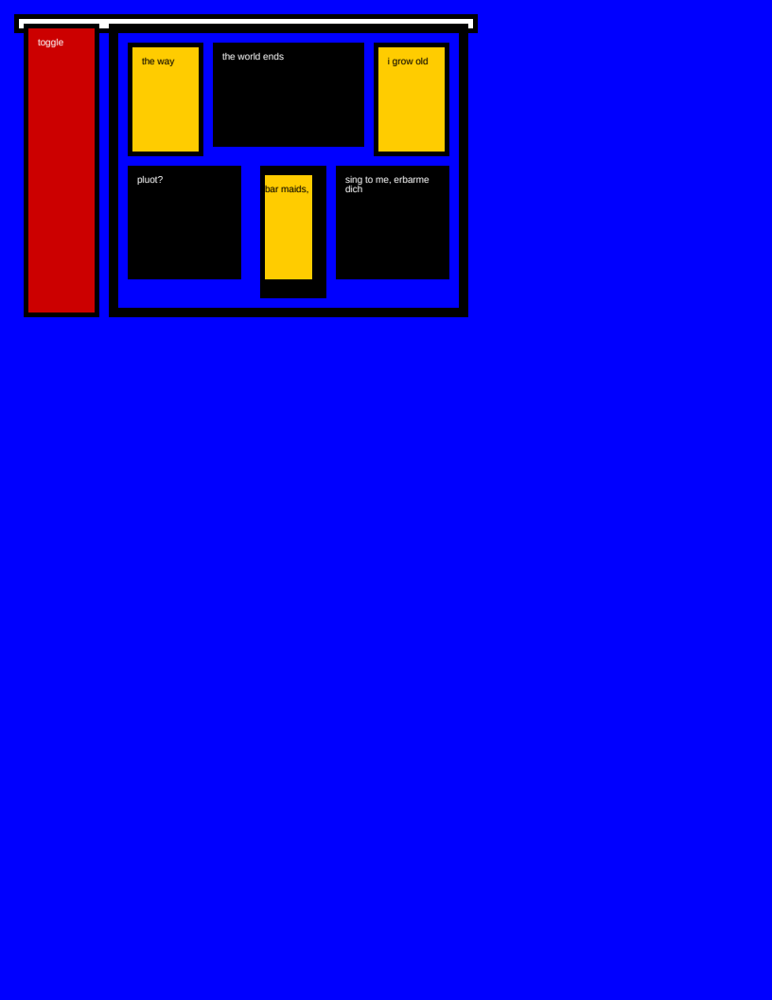 |  |


## ua/blockquote_pre

Two elements whose defaults are more than a margin: blockquote is indented 40px on both sides, and
pre switches to the monospace family as well as preserving its white space. Both were absent from
AngleSharp's sheet.

**Boxes**: 6 matched, worst offset 0.00px, worst size 0.00px.

| Reference (Chrome) | Krilla.Html |
| --- | --- |
| **Page 1** | **Page 1. AE 0.0005 · SSIM 0.9999** |
| 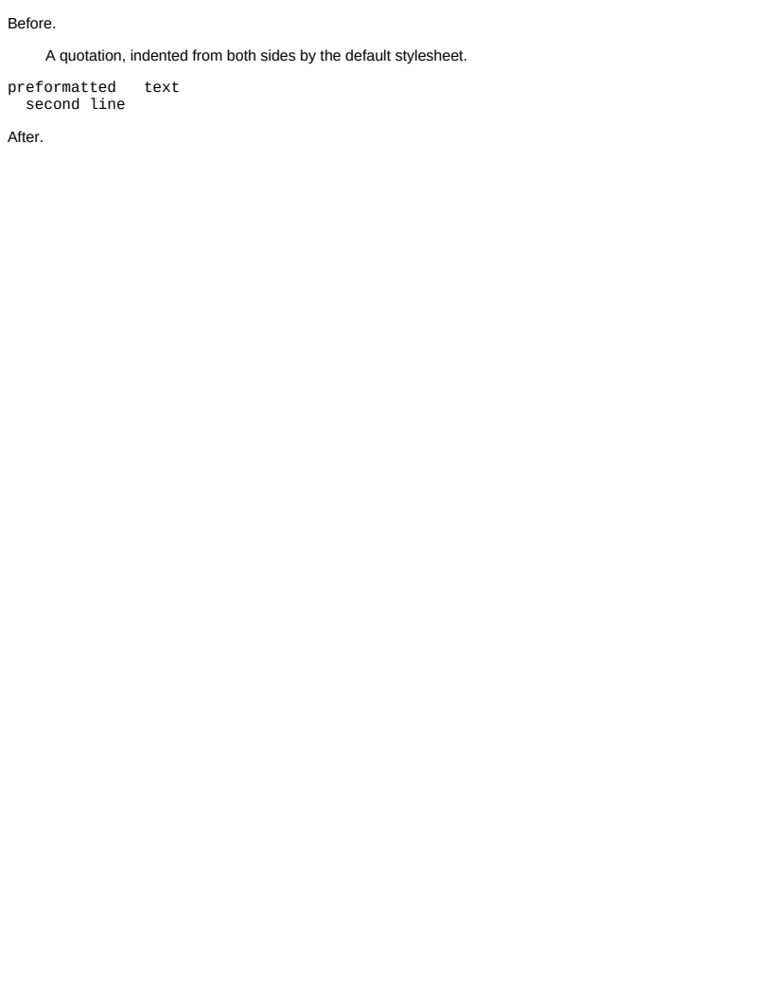 |  |


## ua/headings

The six heading defaults, with no stylesheet of their own. Each has a distinct font size and a
distinct margin, and the margins run the opposite way to the sizes: the smallest heading has the
largest one. AngleSharp ships the HTML 4.01 values, which differ from the modern ones on every
level below h1, so this scenario is the whole reason UserAgentStyles.Corrections exists.

**Boxes**: 8 matched, worst offset 0.00px, worst size 0.00px.

| Reference (Chrome) | Krilla.Html |
| --- | --- |
| **Page 1** | **Page 1. AE 0.0004 · SSIM 1.0000** |
| 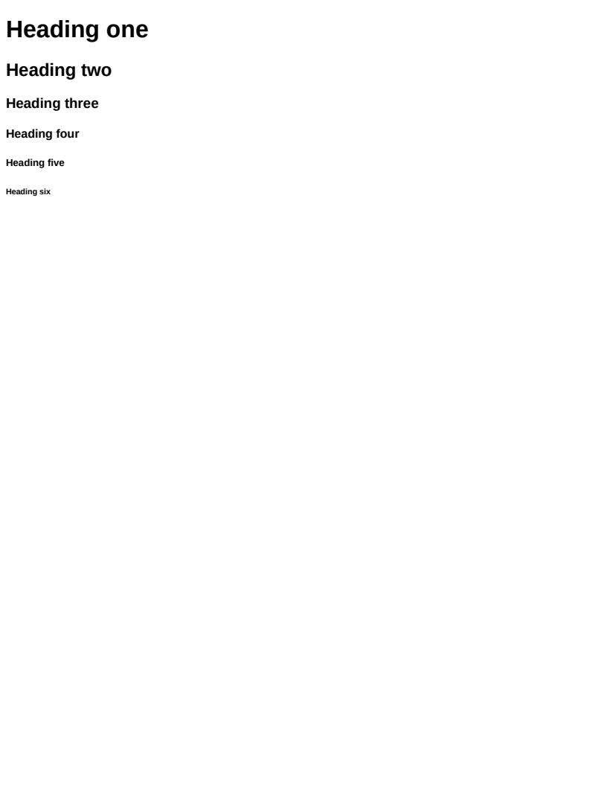 |  |


## ua/hr

# ua/hr

`<hr>` appeared nowhere in the corpus, despite having two pieces of machinery of its own:
`UserAgentStyles.Corrections` gives it `margin: 0.5em auto`, and `UnsupportedCss.BorderStyles`
exempts it by name from border-style reporting, because AngleSharp's default sheet makes every
plain `<hr>` `inset` and a page carrying no CSS at all would otherwise report four times.

Both were unmeasured. This scenario measures the first two directly — the half-em margins above
and below, and the automatic horizontal margins centring `#narrow` — and the third by having an
`<hr>` in the corpus at all, since `DiagnosticTests.TheCorpusReportsNothing` runs over every
scenario and would report a border style if the exemption were removed.

The rule itself is a zero-height box drawn entirely by its border, which is why it is visible at
all. This engine paints every border style solid, and the geometry of all seven boxes is exact, so
the 0.9911 is the shading of Chrome's `inset` against a solid line and nothing else. It is the
residual to expect here rather than a regression.

What to look at when it moves: `#narrow` against the left edge is `margin: auto` not resolving on
an `hr`. A rule touching the paragraphs above and below it is the half-em margins missing. A
change in the line's thickness or vertical position is the border, which is the whole box.

**Boxes**: 7 matched, worst offset 0.00px, worst size 0.00px.

| Reference (Chrome) | Krilla.Html |
| --- | --- |
| **Page 1** | **Page 1. AE 0.0000 · SSIM 1.0000** |
|  |  |


## ua/lists

List indentation, which AngleSharp omits entirely — before the corrections an unstyled list had no
padding-left at all and sat flush against the margin. Also covers the nested case, where the inner
list drops its vertical margins so a multi-level outline reads as one block.

List markers are not drawn, so the bullets and numbers a browser shows are absent from the render.
That is a real gap and it shows in the pixel metric; the box geometry is unaffected, because a
marker sits outside the principal box.

**Boxes**: 12 matched, worst offset 0.00px, worst size 0.00px.

| Reference (Chrome) | Krilla.Html |
| --- | --- |
| **Page 1** | **Page 1. AE 0.0001 · SSIM 1.0000** |
| 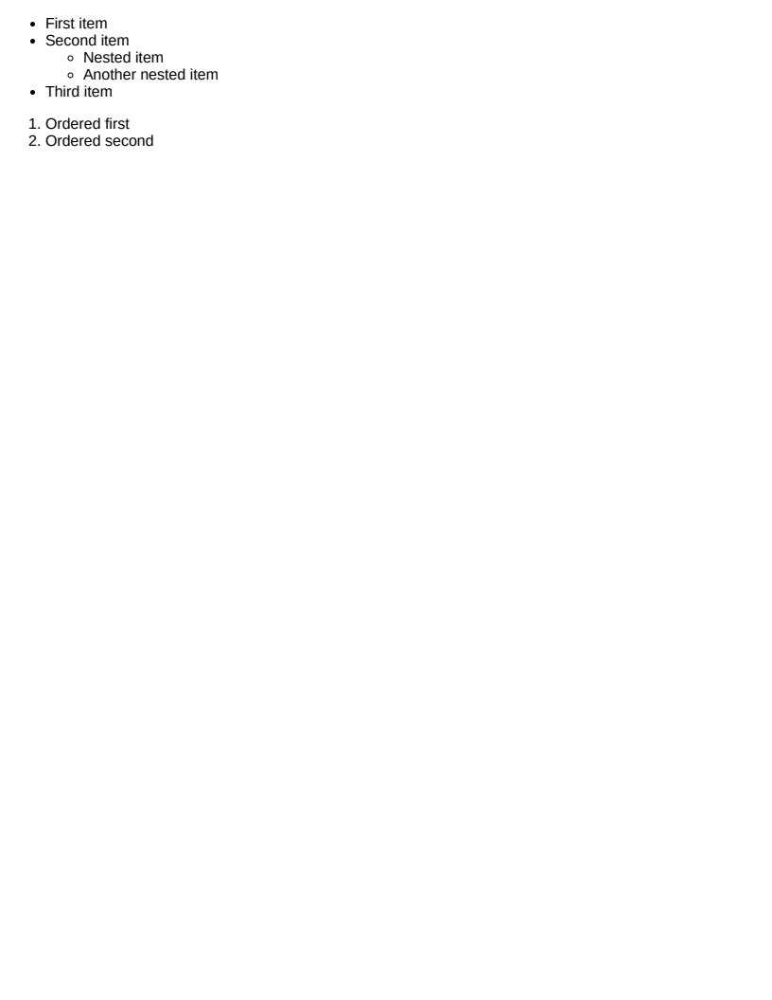 |  |


## ua/list_markers

The marker styles `ua/lists` does not reach: the third nesting level, the counter styles other than
decimal, and the three ways an ordered list can be numbered by something other than its position.

Each list isolates one rule:

- The unordered lists cycle disc, circle, square with depth, which is a user-agent rule rather than
  anything the author asked for.
- `start` and `value` both move the counter rather than only the item carrying them, so the item
  after `value="20"` is twenty-one.
- `reversed` counts down from the number of items, which is the one case that has to know how many
  items a list has before it can number any of them.
- The alphabetic list crossing 26 measures the one piece of non-obvious arithmetic in the counter
  styles. The alphabet is bijective base 26 — there is no zero digit — so 26 is `z` and 27 is `aa`,
  where ordinary base 26 would give `a` followed by nothing and skip a value at every power.
- `list-style-type: none` is here to check that it draws nothing rather than falling back to a
  marker, since an unrecognised value deliberately does fall back.
- The padded item measures what the marker is positioned against — the item's border edge, not its
  content edge — so its padding moves the text and leaves the bullet behind.
- The larger list measures the size rule, which steps in whole pixels off the item's own ascent.

Item text is deliberately short. A marker is a handful of pixels, so a scenario carrying sentences
would report mostly text rasterisation and a marker regression could hide inside the number.

Markers are invisible to the box comparison — they generate no element box, and the browser reports
no rect for them — so only the pixel metric measures anything here. The box geometry being exact
says the lists laid out correctly, not that anything was drawn.

The render is not pixel-identical, and the residual is two named things rather than a mystery:

- Every circular marker differs by a few levels of grey on its antialiased edge, because a circle
  reaching the PDF as four cubics is not bit-identical to the curve Chrome emits for the same
  circle. Largest on the 32px list, where the bullet is ten pixels across; nowhere above 14 of 255.
  The square marker and every counter marker are pixel-identical.
- The word "Twenty" differs on one glyph. That is the sub-pixel glyph positioning difference the
  todo records as the largest residual in the engine, and it has nothing to do with markers — it is
  the same effect `text/kerning` exists to measure.

**Boxes**: 32 matched, worst offset 0.00px, worst size 0.00px.

| Reference (Chrome) | Krilla.Html |
| --- | --- |
| **Page 1** | **Page 1. AE 0.0002 · SSIM 1.0000** |
| 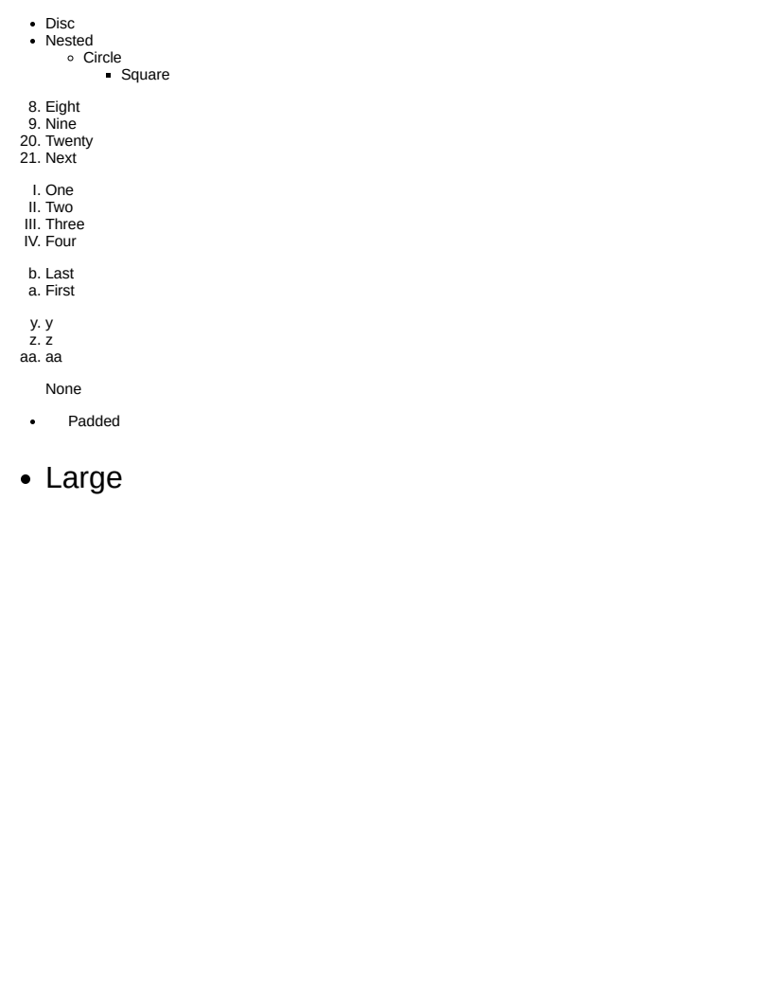 |  |


## ua/paragraphs

Paragraph spacing with no stylesheet. The default margin is 1em top and bottom, and adjacent
paragraphs collapse to one gap rather than two. AngleSharp uses the HTML 4.01 value of 1.12em, so
before the corrections every gap in an unstyled document was 12% too large.

**Boxes**: 5 matched, worst offset 0.00px, worst size 0.00px.

| Reference (Chrome) | Krilla.Html |
| --- | --- |
| **Page 1** | **Page 1. AE 0.0000 · SSIM 1.0000** |
| 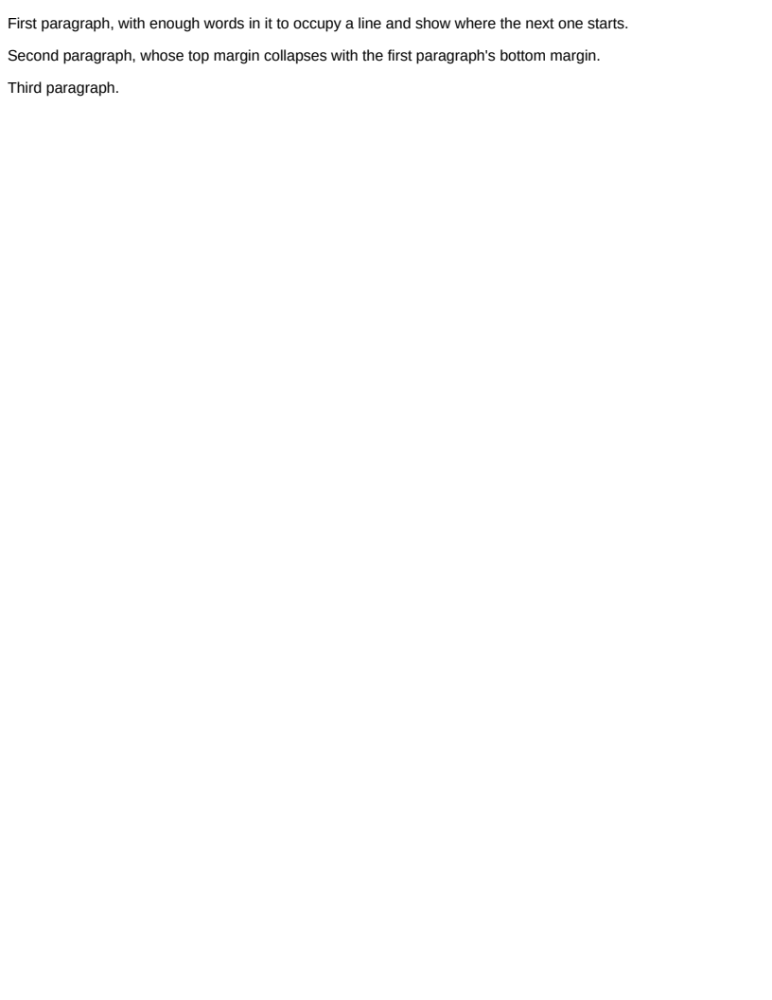 |  |


