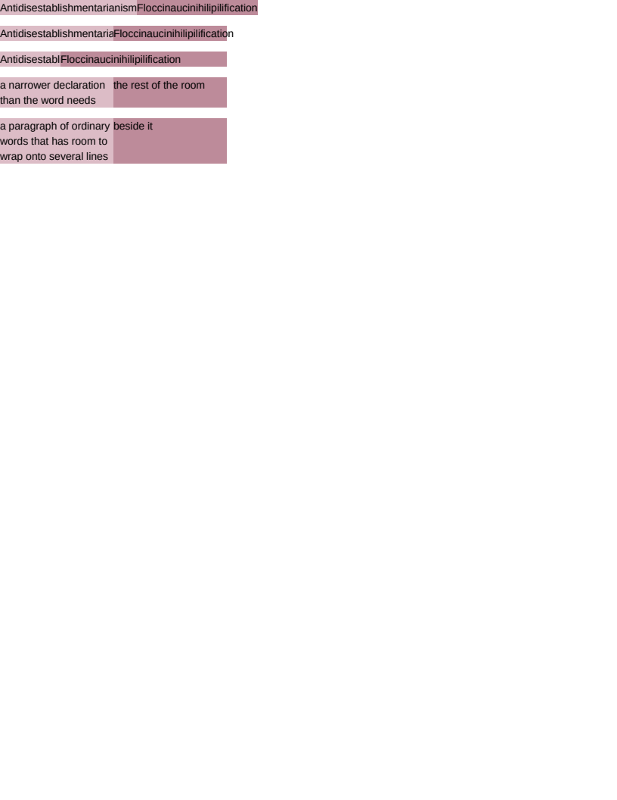

# flex/min_size

# flex/min_size

The automatic minimum size, CSS Flexbox §4.5 — the rule that makes `flex-shrink` usable at all, and
the one that has to be reached through a property whose value is `auto` rather than through anything
the document wrote. `min-width`'s initial value IS `auto`, and everywhere outside a flex container
it behaves exactly as the zero this engine used to default it to, which is why the change to the
default disturbed nothing.

- **`#floored`** is the rule itself. Both items ask for a basis of zero and a share of 150 each, and
  both are floored at their own longest word — so the row OVERFLOWS its 300px container rather than
  squeezing two unbreakable words to nothing. An implementation without the rule gives two 150px
  items with the text hanging out of each, which looks like a text-overflow difference rather than
  the sizing difference it is.
- **`#released`** is `min-width: 0`, which is how a stylesheet opts out of the floor and is the
  single most common line of CSS written to work around flexbox. Here the items really do take 150
  each.
- **`#declared`** is a declared `min-width` replacing the automatic one outright, at 80 and 220 —
  and it is the row that found the freeze defect in the flexible-length loop. Both items ask for 150
  and one is floored at 220; the 70 that floor takes has to come off the other, and the loop was
  freezing every item that had grown at all rather than the one whose own clamp had moved it, so the
  released space went nowhere and both came out at 150.
- **`#narrow`** is the SPECIFIED size suggestion: the automatic minimum is the SMALLER of what the
  item asked for and what its content needs, so an item declaring 60px against a longer word takes
  the declaration. Reading it as the content minimum alone makes a deliberately narrow item wide
  again.
- **`#wrapping`** is the control. Ordinary text has a min-content width of its longest WORD, which
  is short, so this row shrinks to its share and wraps and the floor never fires — which is what
  says the rule is about unbreakable content rather than about text in general.

**Residual**: SSIM 0.9994 on 993 pixels, all of them inside the two overflowing words in `#floored`
and `#released`. Sub-pixel glyph positioning, the same cause as `text/kerning`, and not a geometry
difference: all 17 boxes are exact.

**Boxes**: 17 matched, worst offset 0.00px, worst size 0.00px.

| Reference (Chrome) | Krilla.Html |
| --- | --- |
| **Page 1** | **Page 1. AE 0.0012 · SSIM 0.9994** |
|  |  |

