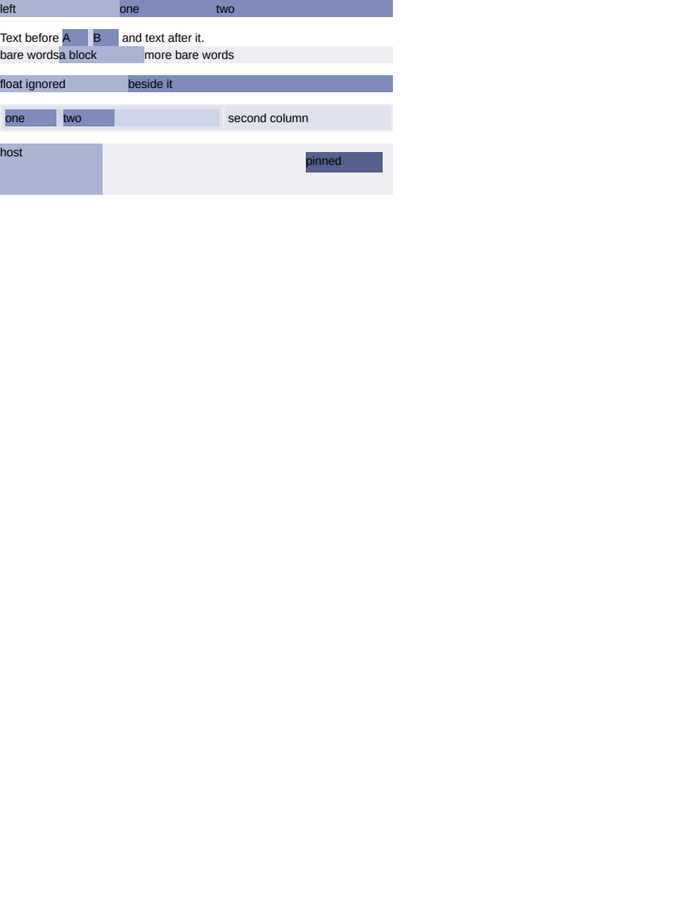

# flex/nested

# flex/nested

What a flex container does to the boxes AROUND it rather than to its own arrangement: how it nests,
how it joins a line, what it does to children that would otherwise be inline or out of flow, and how
something outside it sizes it. Geometry-exact on all 27 boxes and SSIM 1.0000.

- **`#nested`** is a flex container that is itself a flex item, which is how a real layout is built.
- **`#chip`** is `inline-flex`: an atomic inline that sits on a line the way an inline-block does
  and lays its own contents out as flex. Its width is shrink-to-fit, which goes through the flex
  container's own intrinsic sizing — the SUM of its items plus the gaps, where an ordinary block
  wants the LARGEST of its children. Reading one as the other makes this chip exactly one letter
  wide, and nothing about the arrangement inside it would look wrong.
- **`#anon`** is anonymous flex items. Every child of a flex container is an item, so a run of bare
  text becomes one — two runs here, either side of a real block, which is three items. The
  whitespace-only runs between the elements generate no item at all, or every indented document
  would grow blank columns. It needed the box builder to close a run of inline content in a flex
  container even with no block sibling to close it at; without that the container is an inline
  container, the flex layout sees no children whatever, and the text vanishes.
- **`#floaty`** is `float` on a flex item, which CSS Flexbox §3 says creates no float. Honouring the
  declaration takes the box out of `Children` and into `Floats`, at which point the flex container
  arranges everything except it and nothing places it at all — silent content loss from one
  declaration CSS says to ignore.
- **`#grid`** is a flex container inside a table cell, which has to size the cell through the
  intrinsic pass rather than by laying anything out.
- **`#anchored`** is an absolutely positioned child, which is NOT a flex item: it takes no part in
  the arrangement and its static position is the container's content-box origin.

CSS puts that static position where the child would be "if it were the sole flex item", which runs
it through `justify-content` and `align-items`; this uses the content origin instead. The two agree
wherever the container's alignment is the initial value and wherever the child declares both
offsets, which is every arrangement anyone writes — and this one declares `top` and `right`, so the
scenario cannot tell them apart. Recorded in the todo.

**Boxes**: 27 matched, worst offset 0.00px, worst size 0.00px.

| Reference (Chrome) | Krilla.Html |
| --- | --- |
| **Page 1** | **Page 1. AE 0.0001 · SSIM 1.0000** |
|  |  |

