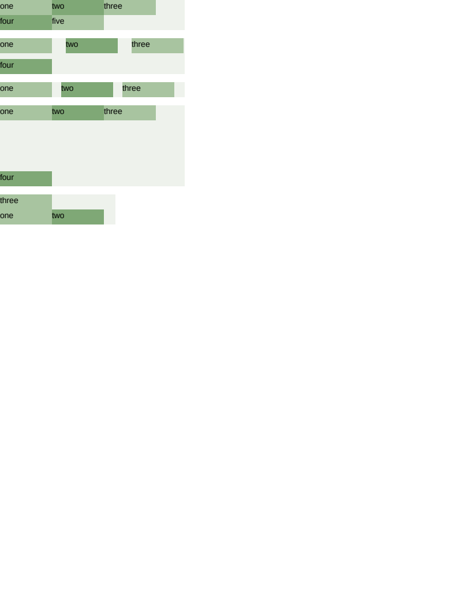

# flex/wrap

# flex/wrap

Wrapping, the gaps between lines and items, and `align-content`. Geometry-exact on all 26 boxes and
pixel-identical to Chrome.

- **`#plain`** is the line collection: three 90px items fit in 320 and the fourth starts a second
  line.
- **`#gapped`** is the row that matters, and it is here because of an AngleSharp bug rather than a
  CSS one. `gap: 10px 24px` is TEN between the lines and TWENTY-FOUR between the items — CSS writes
  the shorthand row-first — and the cascade hands it back as `column-gap: 10px` beside
  `row-gap: 24px`, which is the same picture rotated. Both numbers are present and both are wrong,
  so nothing downstream can notice; the value is recovered from the stylesheet's own text instead.
  With the transposition in force this row wraps two-up with a 10px gutter rather than three-up with
  a 24px one, which is a different arrangement rather than a different number.
- **`#single`** is the one-value form, which is the way the shorthand is nearly always written and
  the one case AngleSharp gets right — it leaves `row-gap` empty, which means "the same as the
  other" and is what the fallback reads.
- **`#spread`** is `align-content: space-between`, which shares the leftover CROSS space between the
  LINES. It needs a container taller than its content and reaches nothing without one, which is the
  single most confusing thing about the property: it is not `align-items` and it does not centre a
  lone line.
- **`#reversed`** is `wrap-reverse`, which stacks the lines the other way so the FIRST line sits at
  the bottom. The items within each line keep their order, which is the whole of what separates it
  from `row-reverse`.

This scenario is what caught the comment bug in `CssSource`. Both `#gapped` and `justify/#evenly`
are recovered from the stylesheet's own text, and both silently stopped being recovered the moment
the rules above them were commented — `Prelude` reads back from a block's opening brace to the
previous `;`, `{` or `}`, so a comment written above a rule became part of that rule's selector
list and the rule then matched nothing. Which is to say the scan worked on an undocumented
stylesheet and not on a documented one, and a stylesheet worth recovering a declaration from is
exactly the kind that carries comments. `CssSource` strips them now, and so does the `@page` scan,
which counts braces and would be moved by a `/* } */`.

**Boxes**: 26 matched, worst offset 0.00px, worst size 0.00px.

| Reference (Chrome) | Krilla.Html |
| --- | --- |
| **Page 1** | **Page 1. AE 0.0000 · SSIM 1.0000** |
|  |  |

