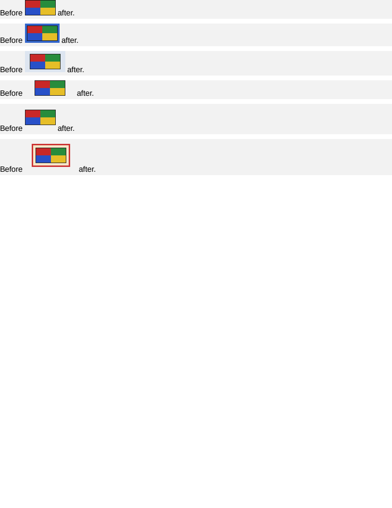

# image/inline_surround

# image/inline_surround

Pixel-identical to Chrome and exact on all 14 boxes.

An `` in a paragraph is an atomic inline, and an atomic inline is the one inline-level box that
takes its WHOLE box model. A run of text takes the horizontal half of it — vertical padding on a
`` overflows the line rather than growing it — and a replaced element takes all of it: its
margin box is what sits on the line, and the bottom of that box is what rests on the baseline.

None of it was applied. An inline image's advance was its CONTENT width and the rectangle recorded
for it was its content box, so a border reserved no space, was never drawn, and was invisible to the
box comparison as well — the geometry matched, because both the reference and this engine were
reporting a box that agreed by accident whenever there was no surround to disagree about. Every
image in the corpus before this had none.

The rows, each adding one part of the box model to the same picture:

- `#bare` — the control, and the row that says the change cost nothing where there is no surround.
- `#framed` — a 4px border. Eight pixels of advance and eight of height.
- `#inset` — asymmetric padding, plus a background, so the padding is visible rather than merely
  reserved.
- `#apart` — horizontal margins, which the line has to leave outside the border box.
- `#raised` — vertical margins, which is the half that separates a replaced element from a run of
  text: the line grows by both of them, where a ``'s vertical margins do nothing at all.
- `#everything` — all four at once, which is what catches an inset applied to the wrong rectangle.

## What to look at when it moves

Text after the image starting too far left is the advance back on the content box. The picture
drawn over its own border is the content rectangle not being deflated — it is carried on the box
rather than derived in the painter, because a list marker image shares the LIST ITEM's style and
must not be deflated by it. A soft edge down one side of `#framed` is the border rectangle no longer
being snapped to whole pixels, which an inline image needs more than most: it starts wherever the
words before it ended, so a fractional position is the normal case rather than a corner one.

**Boxes**: 14 matched, worst offset 0.00px, worst size 0.00px.

| Reference (Chrome) | Krilla.Html |
| --- | --- |
| **Page 1** | **Page 1. AE 0.0000 · SSIM 1.0000** |
|  |  |

