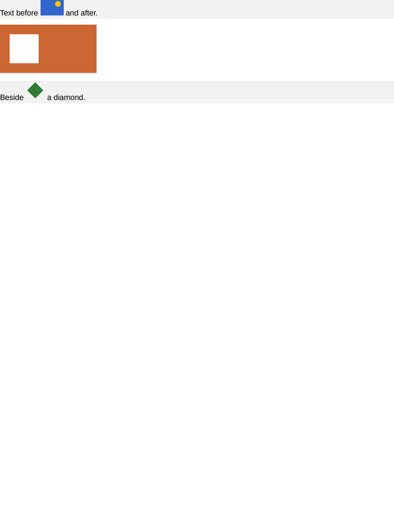

# image/inline_svg

# image/inline_svg

An `<svg>` written into the document rather than referenced through an ``. Exact on all 8
boxes and SSIM 1.0000, with a handful of antialiased pixels along the shapes' edges.

It laid out as a block full of blocks before this. `<rect>` and `<circle>` have no CSS `display`,
so each became a block box with no content, and a drawing rendered as a stack of empty rectangles
with the picture nowhere on the page. The element is a replaced one: its markup is serialised and
handed to the same krilla-svg path an `` takes, and nothing inside it is laid out
here at all.

- `#sized` — `width` and `height` on the element, in a line of text, which is where inline SVG is
  usually written: an icon beside a word.
- `#ratio` — a `viewBox` and no size. SVG's own specification defaults the root `width` and
  `height` to `100%`, so what looks like an absent size is a percentage that resolves against the
  containing block: 200px wide in a 200px frame, and 100 tall by the ratio. Reading the viewBox
  extent as a size instead gives 40, and CSS 2.1's rule for a replaced element with no intrinsic
  width gives 300 — both plausible, both wrong.
- `#scaled` — a CSS `width` and `height` that disagree with the element's own, which is what
  proves the picture is scaled into the box rather than drawn at its declared size.

## The namespace declaration

An HTML parser puts an `<svg>` into the SVG namespace by POSITION rather than by declaration, so a
document almost never writes the `xmlns` that a standalone SVG parser then requires. It is added
during serialisation when the markup does not carry one.

## The reference harvest skips what is inside

`getBoundingClientRect()` answers for an `<rect>` as readily as for a `
`, so the browser
reports a box for every shape in the drawing — and there is nothing on this side to compare them
against, the whole subtree being drawn by usvg. The generator skips any element with an
`ownerSVGElement`, which is the same argument it already makes for `display: none`: an element with
no box here should not be counted as one this engine failed to produce.

## What to look at when it moves

Empty rectangles where the picture belongs is the element back to ordinary block layout. `#ratio`
at 40px wide is the viewBox being read as an intrinsic size. And a picture drawn at 24px inside
`#scaled`'s 40px box is the CSS size no longer reaching the destination rectangle.

**Boxes**: 8 matched, worst offset 0.00px, worst size 0.00px.

| Reference (Chrome) | Krilla.Html |
| --- | --- |
| **Page 1** | **Page 1. AE 0.0001 · SSIM 1.0000** |
|  |  |

