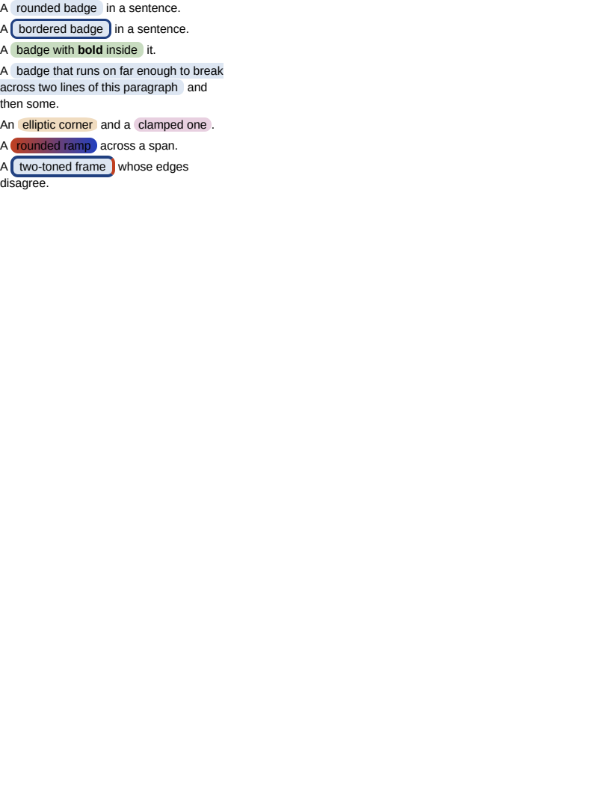

# inline/border_radius

# inline/border_radius

`border-radius` on an inline element painted square, and said so. The rounding itself was never the
difficulty — `RoundedBox` has drawn a block's corners since `block/border_radius` — the difficulty
was that an inline element's background is painted per RUN, and a corner belongs to the FRAGMENT
those runs make up.

`#three` is the row that makes the difference visible: a span holding a `<b>` is three runs, and
rounding each of them would notch the fill at every element boundary inside the phrase. So the
grouping is the whole of what the property needed, and `InlineFragments` is it — one rectangle per
element per line, spanning from the element's opening edge, or its first run where it has no
surround, to its closing edge.

- `#one` is a background alone, the common case: a badge.
- `#two` adds a uniform border, drawn as a ring — the inner corner is the outer radius less the edge
  running along it, which is what makes a thick rounded border read as a ring rather than a tube.
  The same construction a block's uniform border already takes.
- `#four` wraps. A break is not an edge of the element, so the fragment on the first line keeps its
  two LEFT corners and the one on the second its two right; neither rounds where the line ended, and
  neither draws a side border there. That is the same rule the square path already followed for the
  side borders, extended to the corners.
- `#five` measures the two shapes a radius can take: the slash form's ellipse quadrant, and an
  over-large radius, where CSS Backgrounds 3 §5.5 scales every radius on the box by one factor —
  giving a pill rather than a rectangle with two circular ends.
- `#six` is a gradient under a rounded fill. The ramp's box is the element's whole advance laid end
  to end, which the rounding does not change: the fragment shows the same slice it showed before.
- `#seven` is the case with no single ring to draw. Its four edges disagree, so they are painted as
  four rectangles cut to the rounded outline — which rounds the OUTER corner and leaves the inner
  one square. That is the one thing left, and it is what still reports.

Painting a fragment as a unit had to leave the paint ORDER alone, and does: a fragment is drawn at
the first run inside it, which is exactly where the per-run fill it replaces would have happened. So
a rounded element sits in the same place among its neighbours' backgrounds as an unrounded one, and
the pre-pass is built at all only for a box whose inline content is rounded — every other document
keeps the painting path it had, which is what the rest of the corpus staying identical says.

**Boxes**: 18 matched, worst offset 0.00px, worst size 0.00px.

| Reference (Chrome) | Krilla.Html |
| --- | --- |
| **Page 1** | **Page 1. AE 0.0018 · SSIM 0.9999** |
|  |  |

