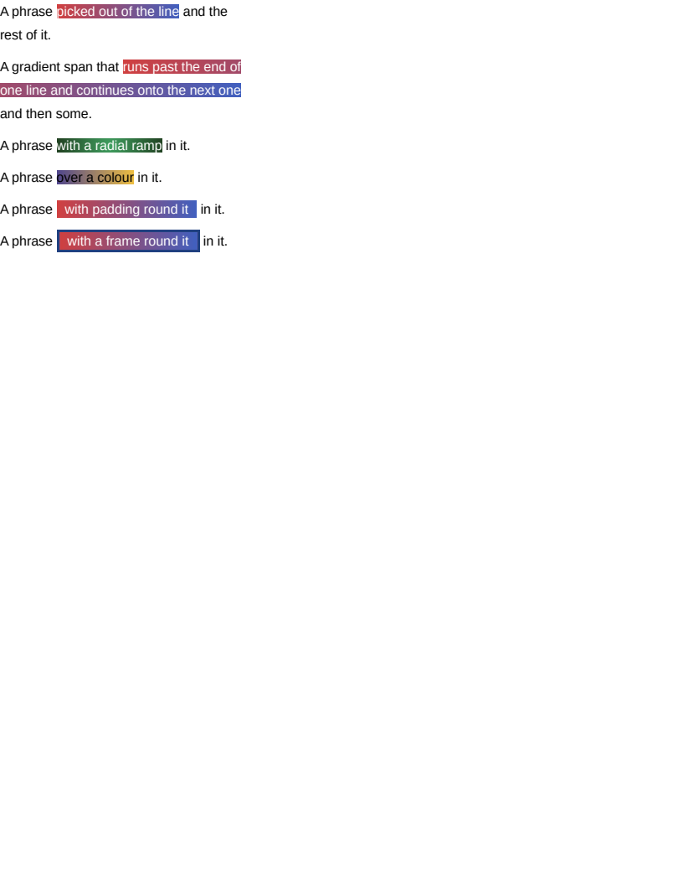

# inline/gradient

# inline/gradient

A gradient as an inline element's background. Only the background COLOUR was painted on an inline
element; a gradient was recognised and reported.

The interesting half is what the gradient's box is.

**Measured: a span that wraps continues the ramp where the previous line left off.** So the box is
the element's fragments laid END TO END — 149px of first line and 278px of second make one 427px
ramp — and each fragment shows its own slice of it. Restarting per fragment is the obvious reading
and puts a full red-to-blue ramp on every line, which is what `#wrapped` is here to tell apart.

That is why the offsets are computed in a pre-pass over the box's lines rather than accumulated
while painting: the painter reaches a page at a time, and a fragment on the second page still has
to know what stood before it on the first.

Filling is then free. A PDF shading is positioned in user space, so filling the fragment's own
rectangle with a paint built over the larger box samples exactly the part of the ramp that belongs
to it — no clipping and no second paint per fragment.

## The rows

- **`#badge`** is one fragment, the case every author writes.
- **`#wrapped`** is the same span across two lines, and the only row that distinguishes the two
  readings of the box.
- **`#radial`** is a radial ramp, which is sized `farthest-corner` against the same box.
- **`#over`** puts a translucent ramp over a background COLOUR, which are two layers rather than
  alternatives — the colour goes down first and shows through.

**Residual**: SSIM 0.9999. Two causes, both named elsewhere: the ramp is quantised a shade
differently from Chrome's, which `block/gradients` records and which is why the `AE` is high and
means nothing, and the black text around each span differs on glyph edges. No pixel of any gradient
differs by more than one of 255.

## The padding

`#padded` and `#framed` were added later, and each found the same gap. The ramp's box is the
element's PADDING box laid end to end, not its runs — so the strip under the padding is part of the
gradient rather than a hole in it, and leaving it out made the ramp that much shorter than the
browser's everywhere else as well. It was invisible while every span here had no padding, which is
what an inline gradient in a real document never looks like.

The fix was to measure the ramp off the same fragments `border-radius` needed, rather than off a
running total of run widths — which is why `InlineRamps` is gone and `InlineFragments` answers both
questions. A fragment reaches past its first and last run by whatever surround the element carries,
so the box it gives is the one the browser uses.

**Boxes**: 14 matched, worst offset 0.00px, worst size 0.00px.

| Reference (Chrome) | Krilla.Html |
| --- | --- |
| **Page 1** | **Page 1. AE 0.0111 · SSIM 0.9999** |
|  |  |

