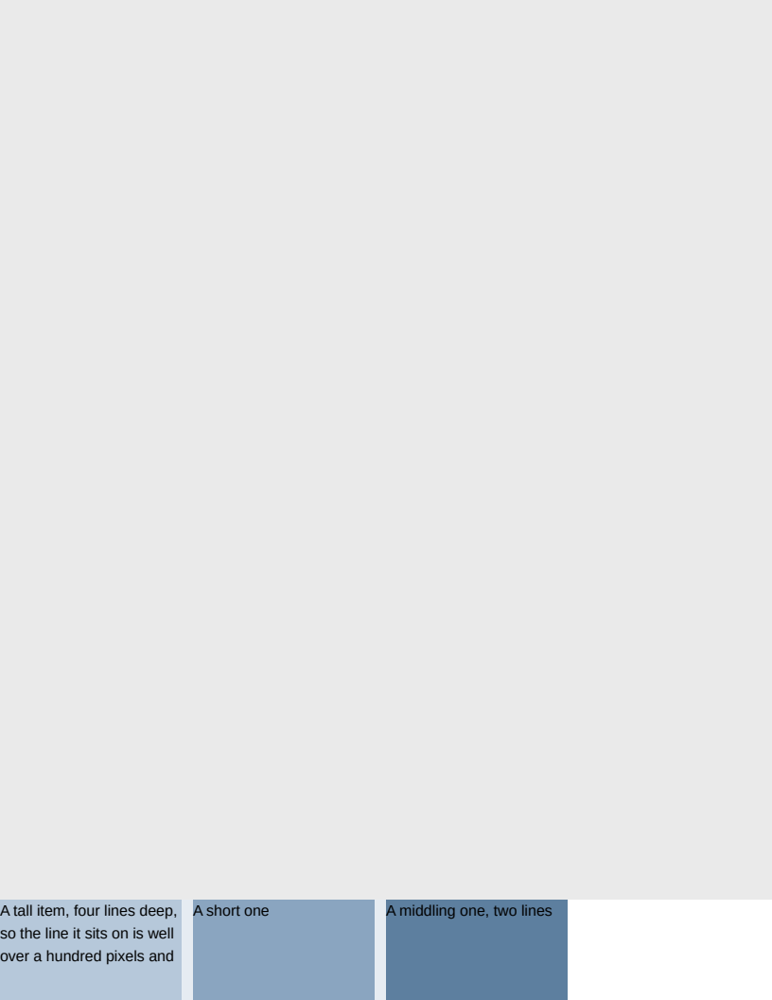

# page/flex_break

# page/flex_break

What a page boundary does to a flex container. Geometry-exact on all 14 boxes; page one is
pixel-identical and page two reads 0.9999.

The row runs 950..1070 with the boundary at 1056, so it straddles by fourteen pixels — the
arrangement `page/table_break` establishes for a table, asked of the construct that looks most like
a table row and is not one.

**It was written to confirm a rule and refuted it instead**, which is the useful outcome. A flex
line is items side by side, so a break through the middle of one seemed certain to leave the shorter
items' backgrounds on the page before and their content on the page after — the exact argument that
makes a table ROW unbreakable — and the line was recorded as an unbreakable unit on that reasoning.
Measured, Chromium does the opposite: it FRAGMENTS the container at the page edge, drawing
950..1056 on page one and the remaining fourteen pixels on page two. Which is CSS Flexbox §11's own
rule, a row flex container's items being broken in parallel.

Treating the line as a unit read 0.9683 and 0.9013 against that. Deleting the rule — the recorded
bands, the branch in `Paginator`, and the list on `LayoutBox` — took page one to identical, because
the ordinary line-based candidates already give the browser's answer: no line inside any item
straddles 1056, so the break falls at the page edge, which is exactly where Chromium puts it.

- **`#straddle`** is that row.
- **`#after`** is the line following it, which moves whole because nothing in it straddles anything.
- **`#stack`** is a COLUMN container, whose items are stacked the way a block's children are — so a
  break between two of them is an ordinary break and the container is not moved whole. It is here
  because the deleted rule recorded nothing for a column container, and the reason it gave for that
  is the reason the rule should not have existed for a row one either.

**Residual**: 0.9999 on page two, 319 pixels across one band of text. Sub-pixel glyph positioning.

**Boxes**: 14 matched, worst offset 0.00px, worst size 0.00px.

| Reference (Chrome) | Krilla.Html |
| --- | --- |
| **Page 1** | **Page 1. AE 0.0002 · SSIM 1.0000** |
|  |  |
| **Page 2** | **Page 2. AE 0.0004 · SSIM 0.9999** |
|  |  |

