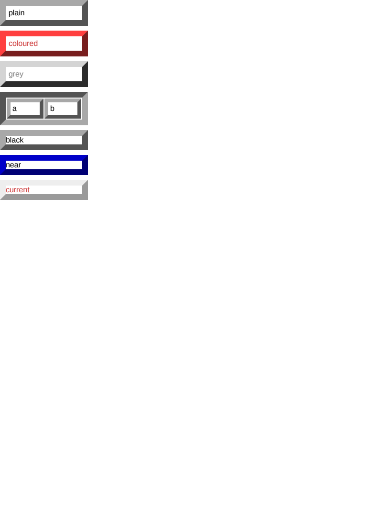

# table/bevelled_borders

# table/bevelled_borders

`border-style: outset` on a table, which is what `<table border="1">` still maps to and so is the
place the bevelled styles turn up in real documents rather than in stylesheets.

Two rules were found here, both by probing Chromium and neither derivable from the specification —
CSS leaves every shade of these four styles to the user agent.

**A table derives its shades from `currentColor`; a block does not.** A `div` whose border colour is
`currentColor` — declared or absent — is drawn in a fixed pair of greys, `#eeeeee` over `#9a9a9a`,
whatever its own `color` says; `block/bevelled_borders`' `#current` row measures that. A table in
the same state derives instead: `color: #808080` gives `#d4d4d4` over `#2c2c2c`, `color: #cc3333`
gives `#ff3f3f` over `#781e1e`, and the initial black gives `#a8a8a8` over `#545454`. Measured on a
table, a row, a cell and a header cell, and against a `div` in each of the three arrangements.
`StyleResolver` settles it, by refusing the "colour is current" flag to anything laid out by the
table algorithm.

**A colour too dark to darken steps UP.** Darkening black leaves black, so the bevel would have the
same colour on both halves and disappear. Chromium's answer is to lighten once where the dark shade
belongs and twice where the light one does, which is where `#545454` and `#a8a8a8` come from — the
first is Blink's own lightened-black constant and the second is that lightened again.

The threshold is on relative LUMINANCE rather than on the brightest channel, which took a probe to
settle: `#212121` takes the ordinary pair and `#000021` steps up, and those two share a brightest
channel of 33. Bracketed by measurement to between 0.014444 (`#202020`, which steps up) and 0.014552
(`#00007c`, which does not) — a band 0.7% wide, inside which any constant reproduces all forty-odd
colours sampled. Chromium's own number is not recoverable from outside it.

**Boxes**: 22 matched, worst offset 0.00px, worst size 0.00px.

| Reference (Chrome) | Krilla.Html |
| --- | --- |
| **Page 1** | **Page 1. AE 0.0005 · SSIM 0.9990** |
|  |  |

