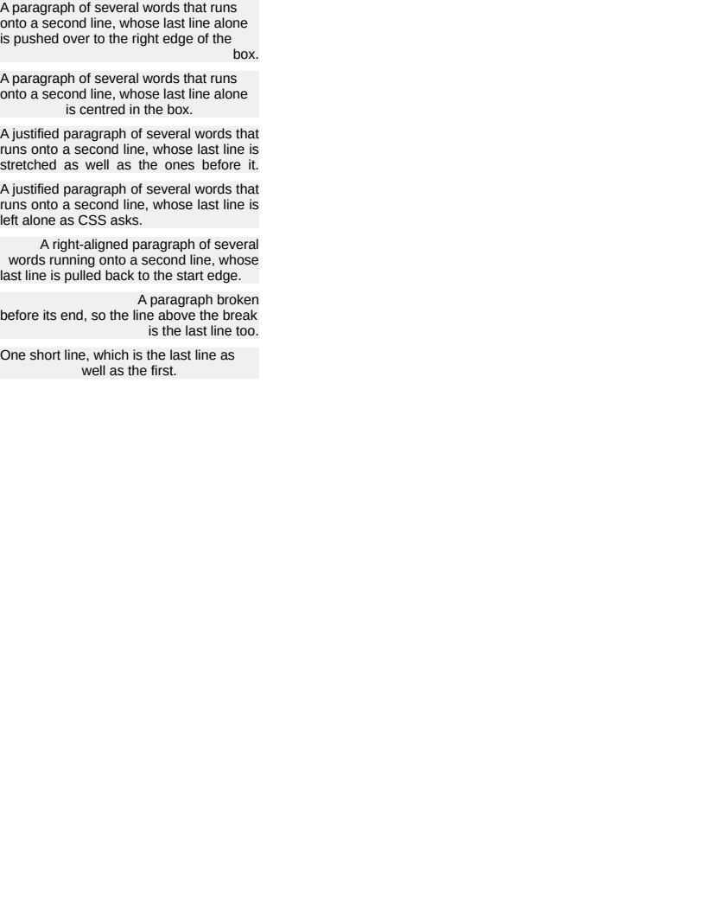

# text/align_last

# text/align_last

`text-align-last` was read by nothing. It arrives from the cascade, and a document using it — a
justified column whose last line should be stretched, a heading whose closing line sits right —
aligned that line like every other and said nothing.

The line it names is the last line of the block AND the line before a forced break, which the line
breaker already marks: `Flush`'s `forced` flag is exactly that set, so honouring the property cost
one branch rather than a pass.

`auto` is the part worth getting right. It is a value in its own right rather than a synonym for
`text-align`: it hands the decision back with the carve-out CSS makes for it — the last line of a
justified block aligns to the start edge instead of being stretched — and a declared value replaces
the whole of that rule. `#justified` and `#exempt` are the pair that separates them, identical but
for the declaration, and `#justified` is the only row in the corpus where a last line is stretched.

- `#right` and `#centred` move the last line where the rest is left-aligned.
- `#start` moves it the other way, back to the start edge of a right-aligned block, which is what
  says the property replaces the alignment rather than adding to it.
- `#broken` ends on a ` `, so the line above it is a last line too.
- `#single` is a block of one line, which is its own last line.

**Boxes**: 10 matched, worst offset 0.00px, worst size 0.00px.

| Reference (Chrome) | Krilla.Html |
| --- | --- |
| **Page 1** | **Page 1. AE 0.0013 · SSIM 0.9998** |
|  |  |

