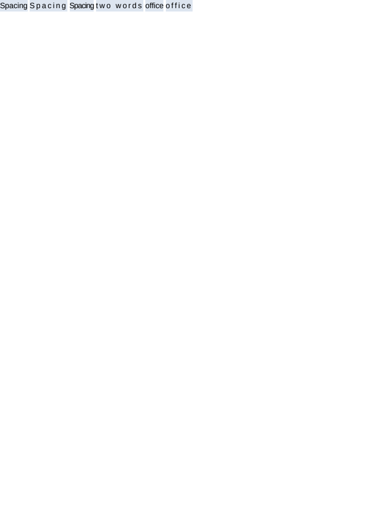

# text/letter_spacing

# text/letter_spacing

Every box is an inline-block, so its width is the text's advance and nothing else — which is what
lets this scenario ask the two questions that a full-width paragraph could not answer.

**Is the spacing after the last character counted?** `Spacing` is seven characters. At 3px it comes
back 21px wider, not 18px. So yes, and a shrink-wrapped box carries the spacing past its final
glyph. This is the measurement that decides it and it is invisible in flowing text.

**Is it per character or per glyph?** `office` with 3px comes back 18px wider — six characters —
even though the `ffi` is drawn as one ligature glyph. Per character, and the ligature SURVIVES: the
base width is unchanged at 37.95px either way. A shaper invites the other reading, since what it
hands back is glyphs, and per glyph would be 12px on four glyphs. `#ligature` and `#ligature-spaced`
are the pair that tells them apart, and the corpus can only ask because text is shaped rather than
summed.

The implementation follows from that: the extra advance is attributed to the glyph covering the
characters it is owed to, so a ligature glyph carries three characters' worth. That keeps the run's
painted width equal to its measured one however the shaper happened to group the text — the two
being computed separately is exactly how a renderer ends up drawing something other than what it
laid out.

`#spaced` shows the spacing applies to the space character too: `two words` is nine characters and
gains 27px, not 24px.

`#tight` is a negative value, which shortens rather than being clamped to zero.

Geometry is exact and pixels read SSIM 0.9999.

What to look at: the width of `#wide` against `#normal`. An 18px difference rather than 21px is the
trailing character being dropped; `#ligature-spaced` at 49.95px is spacing applied per glyph.

**Boxes**: 8 matched, worst offset 0.00px, worst size 0.00px.

| Reference (Chrome) | Krilla.Html |
| --- | --- |
| **Page 1** | **Page 1. AE 0.0005 · SSIM 0.9999** |
|  |  |

