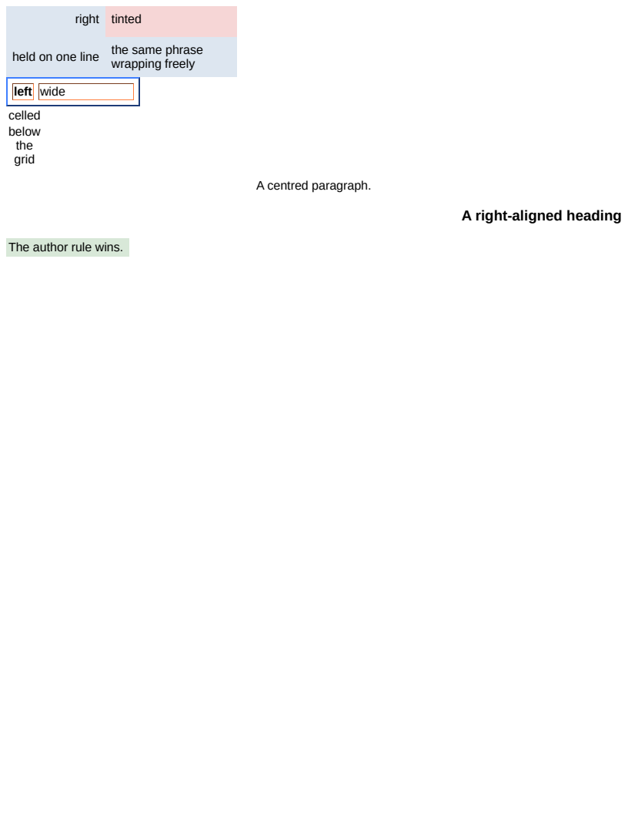

# ua/presentational

# ua/presentational

The presentational content attributes, which HTML maps onto CSS in an origin of their own —
above the user-agent sheet, below every author rule — and which AngleSharp maps not at all. Before
this they reached the cascade as nothing and were merely reported.

It is a `ua/` scenario because it has to be. `flatten.css` writes `* { margin: 0; padding: 0 }` and
a `table, td, th` rule beside it, which are author declarations and therefore beat a hint outright
— correctly, and identically in both engines, which is exactly why a flattened scenario could
measure nothing here.

What each row is for:

- `#sized` — `width`, `cellpadding`, `cellspacing` and `bgcolor` on the table, `height` and
  `valign` on a row, `align`, `bgcolor` and `nowrap` on the cells. `#held` and `#loose` hold the
  same phrase and only one of them may wrap, which is what makes `nowrap` visible in the row's
  height rather than only in its width.
- `#framed` — `border="2"`, which is the one attribute mapping onto three properties at once and
  the only one that reaches an element it was not written on: the table gets a 2px `outset` and
  every cell inside it a 1px `inset`. `cellspacing="6"` separates them so both are measurable.
  A `border-color` is declared for both in `input.css`, deliberately — see below.
- `#captioned` — `<caption align="bottom">`, which is `caption-side` and nothing else. It found
  that the property was read off the TABLE's style alone, so a declaration on the caption itself —
  which is what this attribute is — reached nothing at all. It is inherited now and read off the
  caption, so the usual spelling on the table still works.
- `#centred`, `#ragged` — `align` on a paragraph and a heading, where the same attribute means
  `text-align` rather than `float`.
- `#beaten` — the point of the whole design. Both a `width` and a `bgcolor` attribute, both beaten
  by an author rule of the lowest possible specificity. A hint applied as an inline style would
  win here, and that is the mistake this row exists to catch.

## The declared border colour

`border="2"` maps onto a width and a bevelled style and NOT onto a colour, so what colour the
bevel is derived from is a user-agent question rather than an attribute one. Chromium shades such
a table `#a8a8a8` over `#545454`, which is neither the derivation from `gray` that `Bevel` produces
nor the `#eeeeee` over `#9a9a9a` pair a plain `
` gets — so it is a third rule this engine does
not know, and a separate question from the mapping. `input.css` declares a colour for the table and
its cells to keep the two engines on the derivation both already agree about; the disagreement is
recorded in `todo.md` rather than hidden here.

## Residuals

Geometry is exact on all 26 boxes. The pixels differ in two places and neither is this feature:
twelve pixels on `#framed`'s corners, where two antialiased trapezia meet on a mitre, and the
right-aligned heading, which is sub-pixel glyph positioning. Both are general residuals recorded in
`todo.md`.

## What to look at when it moves

A table at its shrink-to-fit width rather than 300 is the `width` hint not applying, most likely
because something in the cascade now declares `width` for a table and the value test in
`PresentationalHints.defaults` no longer recognises it. Cells two pixels narrower than expected is
`cellpadding` losing to the user-agent's own `td { padding: 1px }` the same way. `#beaten` at 300px
wide is the reverse mistake: a hint that has stopped being a hint.

**Boxes**: 26 matched, worst offset 0.00px, worst size 0.00px.

| Reference (Chrome) | Krilla.Html |
| --- | --- |
| **Page 1** | **Page 1. AE 0.0016 · SSIM 0.9999** |
|  |  |

